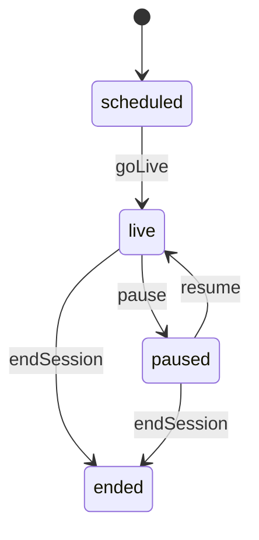
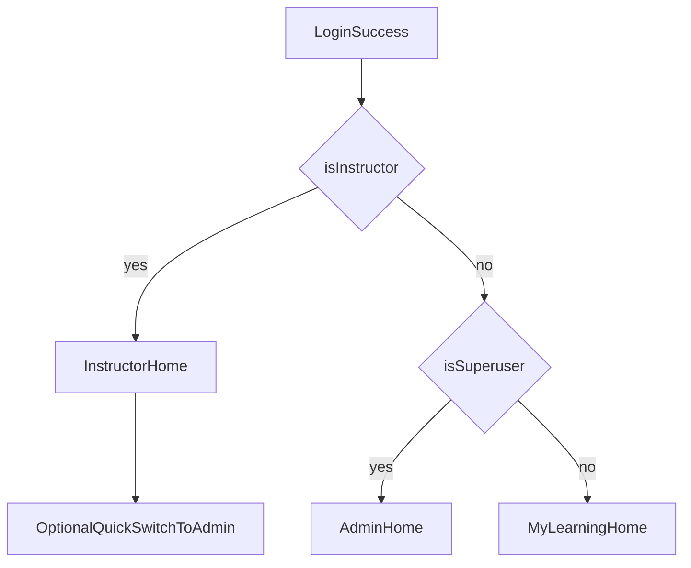
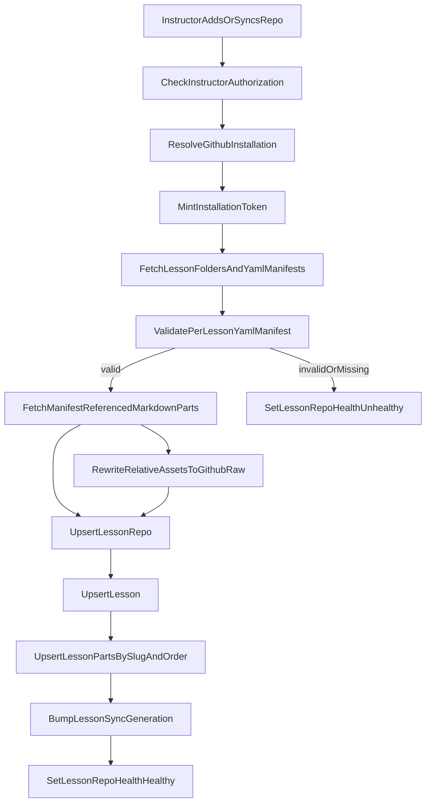
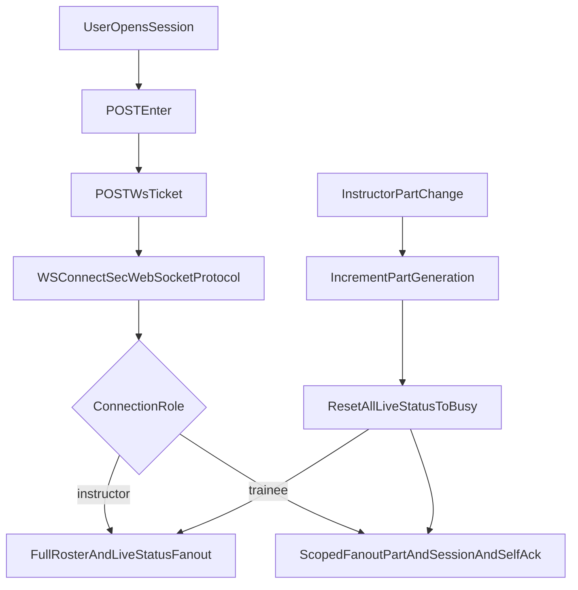
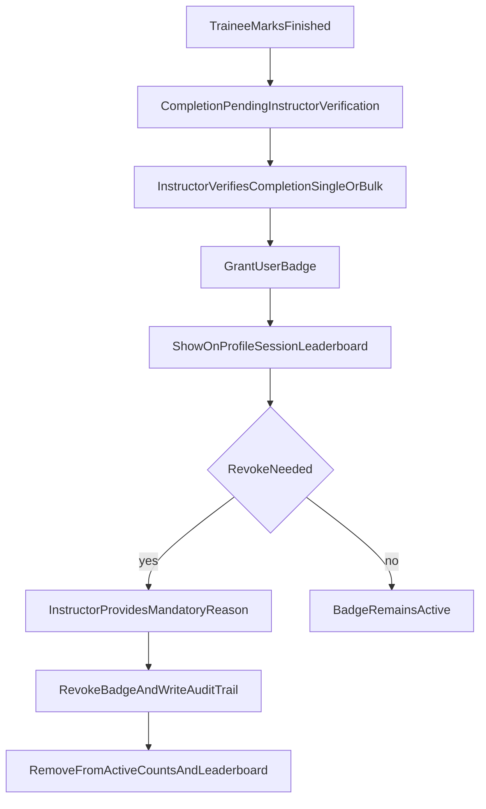

<!-- Document order: implementation tracker → remaining work → deferred polish → MVP boundaries (out of scope / Post-MVP icebox) → product constraints + locked decisions → delivery workflow (`AGENTS.md`) → code map → HTTP/WS audit → lesson source & session model (GitHub App, manifest, session lifecycle, flows) → persistence stack (domain, realtime, participant writers, markdown, notifications, migrations) → engineering bar (API discipline, security, privacy) → UX (dashboards, UI spec) → quality (testing, risks). -->

# Workshop training app — lessons + live sessions

## Implementation tracker (canonical — update whenever context would otherwise be lost)

**Purpose:** One place to resume without chat memory: **execute** **[Remaining work](#remaining-work-authoritative)** and the actionable body sections; **explicitly omit** MVP using the **[Out of scope](#out-of-scope-mvp)** table; **defer after MVP** using **[Post‑MVP backlog](#post-mvp-backlog)**—do not implement icebox items until posture changes. The **summary table** carries **`Last synced`**, **`Branch` / `PR`**, **`Integrate against`**, and **`Not done yet`**; **Deferred polish** logs non-blocking items. **`AGENTS.md`** is canonical for delivery process (TDD, Playwright gates, PR/merge workflow).

**Maintenance:** Refresh **[Remaining work](#remaining-work-authoritative)**, **[Deferred polish backlog](#deferred-polish-backlog-skip-log)**, and **`Last synced`** whenever behavior/backlog slips; update **`Branch` / `PR`** when opening or closing each slice ([**Delivery workflow**](#pr-slicing-and-branch-strategy-locked) + **`gh pr checks --watch`**, [policy](#pr-babysitting-policy-locked)). Do not grow changelog prose in **`PR`**—link to PR/issue or rely on **`Last synced`**. **API artifacts:** backend **routes + Pydantic/OpenAPI-route metadata** are the HTTP source of truth; after any change there, regenerate the committed **OpenAPI export** + **`frontend/src/client`** so the SPA types match runtime (generated spec mirrors code—it does not drive new backend work).

| Field | Value |
| ------ | ------ |

| **Last synced** | **2026-05-08** — **P0 manifest-backed timers (this PR):** sync persists `part.estimated_minutes` on `lesson_part`; countdown start defaults `target_seconds` from the current part when omitted; `POST .../timer/extend` adds time with audit `extend` event; OpenAPI + SPA client updated; instructor UI uses “Start part countdown” plus extend controls. |
| **Branch** | **`feat/workshop/p0-lesson-estimated-timers`** |
| **PR** | _TBD — open after CI green._ |
| **Integrate against** | **`main`** |
| **Not done yet** | See **[Remaining work](#remaining-work-authoritative)** for workshop-runnable functional gaps first; log non-blocking polish in **[Deferred polish backlog](#deferred-polish-backlog-skip-log)** and skip it until core flow is complete. Posture **`security-hardening-new-features`**. |

**Cold start:** `git fetch origin && git checkout main && git pull` → pick from **[Remaining work](#remaining-work-authoritative)** → feature branch → **`gh pr checks`** ([policy](#pr-babysitting-policy-locked)) → after merge refresh **`Last synced`** (+ backlog rows if applicable). Local browser E2E: [playwright-local-gate](.cursor/skills/playwright-local-gate/SKILL.md); **CI** is the merge gate.

## Remaining work (authoritative)

**Priority rule:** until the app can run a real workshop end-to-end, do **functionality before polish/test expansion**. If you encounter non-blocking polish, record it in **[Deferred polish backlog](#deferred-polish-backlog-skip-log)** and continue with blocking functionality.

**1. Workshop-runnable functionality (blocking first)**

- Validate the complete instructor-led flow in-product (create/prepare session, roster, trainee entry + realtime progression, prerequisite gating, completion/closeout) and keep **baseline serial Playwright** on that path green before expanding polish-heavy work; regressions stay **P0**.
  - P0 issues
    - The "advance part" button does not work
    - ✅ Timers should use the manifest
    - ✅ Start "5m countdown" should be replaced with a "extend with X" where X can be set by the instructor.
    - The flow to create a session on the "Workshops hub" is confoluted with buttons behind multiple actions. Make this a lot more user friendly and polished.
      - e.q.
        - There are 2 repo menus. 1 with a drop down and 1 with a cstom overwrite. This should be the same form, allow seclecitng from a list, but allow users to type and thus overwrite in the same form.
        - 'Synced lesson repositories" has a "use" button, which has no real use, as it will just fill in the forms that allow you to setup a new sycn. This never happens, als that thing is already synced. A more logical thing would be that "use" is a "use lesson" button. This logic is currently behinf "preview + create session"
        - After clicking "preview + create session", only then a button apears to start a session, this is not user friendly and hidden to deep in menus.
    - There is no way to add trainees to a session.
- Treat any bug that breaks workshop execution (auth loops, role redirects, sync failures, missing lesson content, broken part progression, roster mutation regressions) as P0 for current slice.
- Keep tests focused on protecting newly shipped functional behavior; do not expand broad polish-only coverage until blocking flow is complete.

**2. Lesson source pipeline hardening** (core scope shipped on `main`; follow-ups are polish/ops only)

- **Progress (shipped on `main`):** [`lesson_manifest.py`](backend/app/services/lesson_manifest.py) + [`lesson_repo_sync.py`](backend/app/services/lesson_repo_sync.py) (**L1**). DB **`github_app_installation`** + FK on **`LessonRepo`** (**L2**). [`github_app_tokens.py`](backend/app/services/github_app_tokens.py) (**L3**). [`lesson_github_fetch.py`](backend/app/services/lesson_github_fetch.py) + [`workshop_lesson_repos.py`](backend/app/api/routes/workshop_lesson_repos.py) — **`POST /api/v1/workshop/lesson-repos/sync-from-github`** and manual refresh endpoints (**L5**). Private-safe periodic poller runs from [`github_installation_poller.py`](backend/app/services/github_installation_poller.py).
- **GitHub App mode:** webhook ingestion has been removed. Installation/repository freshness now comes from manual refresh APIs plus optional periodic polling.
- **Sync + models (remaining product work):** Lesson sync stores markdown source as authored (no raw-GitHub URL mutation) and caches markdown-referenced assets in DB by repo path; workshop session detail applies render-time relative asset rewriting to signed backend asset URLs that resolve against the cached asset store for private/public repo compatibility, then **`lesson_markdown_to_safe_html`** (CommonMark `html=false` + **nh3**) for safe display. **Shipped in-flight local:** `LessonManifest` SHA rows persisted + surfaced in lesson-repo list metadata (`manifest_count`, `last_manifest_synced_at`) for instructor sync health visibility.
- **Instructor UX**: Repo list, Install/configure CTA (instructor-only — **[Product constraints](#product-constraints)**), Sync, health, parts preview — aligns with **[UI / UX](#ui--ux-specification)** IA. **Shipped in-flight local:** `GET /api/v1/workshop/lesson-repos/{lesson_repo_id}/preview` now returns lesson+part preview payloads and dashboard sync card can toggle per-repo parts previews.

**3. Optional / polish (product + engineering)**

- If product wants **more HTTP surface**, implement **FastAPI routes and response/request models first**, then regenerate the emitted **OpenAPI** snapshot + **`frontend/src/client`**; use the published spec **only as documentation** of what shipped—never as a backlog you “fill in” ahead of backend code (this stack is code-first).
- **[Realtime](#realtime)** multi-instance (**Redis**/shared broker) remains explicitly deferred ([Locked decisions](#locked-decisions) single-process path).
- Richer dashboard cards / trainee–instructor **Playwright** breadth ([Testing](#testing)); deeper prerequisite roster analytics (beyond current dashboard summaries).
- **Polish stop condition (loop guard):** once a slice has green targeted + full Playwright and at least one analytics/dashboard enhancement landed, pause further optional polish and switch to PR merge-readiness unless a concrete bug/regression is reported.

## Deferred polish backlog (skip log)

Record non-blocking polish items here when discovered during functional work, then continue with functionality-first delivery.

| Date | Area | Polish item deferred | Why skipped now |
| ---- | ---- | -------------------- | --------------- |
| 2026-05-07 | Dashboard / workshop sync card | Expand broader UI/visual polish and additional non-blocking assertions around sync-card controls beyond the current behavior checks. | Functionality-first focus until workshop run flow is fully verified end-to-end. |

## Out of scope (MVP)

| Area                       | Decision                                                                                                                                                                                                 |
| -------------------------- | -------------------------------------------------------------------------------------------------------------------------------------------------------------------------------------------------------- |
| Messaging                  | No chat, no DMs, no in-session threads. Only busy/done pacing signals.                                                                                                                                    |
| Guests / magic links       | No. Participants must be existing app users on the session roster.                                                                                                                                       |
| Video / screen-share       | No integrated A/V in the app; use external tools if needed.                                                                                                                                              |
| Attendance analytics       | No instructor-facing attendance/completion analytics dashboards (session or cross-session KPIs, distributions, trends).                                                                                |
| Instructor notes           | No private lesson- or session-scoped instructor note stores or APIs.                                                                                                                                     |
| Attendance exports         | No CSV/XLSX/PDF attendance export endpoints, jobs, or UI.                                                                                                                                                |
| Cohorts / teams            | No cohort/team entities, membership, session assignment, or cohort-filtered roster/analytics.                                                                                                            |
| Reminder automation        | No scheduled or “send now” in-app reminder campaigns beyond generic notifications already listed for roster/session/badge events (no per-session reminder scheduler/worker product).                      |
| Learner feedback           | No end-of-session reflection forms, feedback prompts/responses, or instructor aggregate feedback views.                                                                                                    |

> **Executors:** authoritative **don't-build** boundaries = **this table** plus **[Remaining work](#remaining-work-authoritative)**, **[Product constraints](#product-constraints)** / **[Locked decisions](#locked-decisions)**. **`### Post‑MVP backlog`** (next) is **icebox-only** until MVP is runnable and scope is deliberately expanded—do **not** implement otherwise.

### Post‑MVP backlog (icebox — do not build until MVP is workshop‑runnable)

*(Historical planning labels overlapping this bucket: `attendance-analytics`, `instructor-notes`, `attendance-exports`, `cohorts-teams`, `reminders-automation`, `learner-feedback`.)*

Rough themes to revisit **only after** **[Remaining work](#remaining-work-authoritative)** is satisfied for a runnable workshop **and** product explicitly expands scope. Reconcile with [Notifications (MVP)](#notifications-mvp), badges, prerequisites, and timer rules before designing.

**Product / UX**

- Instructor **attendance & completion analytics** (session + cross-session KPIs/trends—aligned to table rows *Attendance analytics* above).
- **Private instructor notes** (lesson/session scope—not in MVP API).
- **Cohorts / teams** + cohort-aware roster/analytics/export filters.
- **Reminder automation** beyond generic roster/session/toast notifications (schedulers/workers).
- **Learner feedback** surfaces (prompts, aggregates—with privacy thresholds).
- **Attendance exports** (CSV first; later XLSX/PDF/report delivery).

**Engineering when thawed**

- New tables/jobs (**InstructorNote**, **Cohort***, reminders, feedback, exports) plus tight RBAC; trainee DTOs still **never** leak peer cohort/feedback payloads inappropriately.
- CSV injection, export minimization, reminder abuse, retention—explicit design **when chartered**, not speculative MVP code.

## Product constraints

- **Lesson source**: GitHub via a **GitHub App** (installation tokens from PEM; Contents + Metadata read as tight as practical). **Auth.js / OAuth** is **login and identity only** — not used to carry repo-scoped user tokens for sync.
- **Install prompt visibility**: Only users with **is_instructor=true** are shown GitHub App install/configure prompts. Non-instructors never see install CTAs/routes, and backend install-related endpoints enforce instructor authorization (403 for others).
- **Superuser authority**: Superusers have full instructor-equivalent control for workshop/session management APIs. GitHub App install/config prompts remain hidden unless `is_instructor=true`.
- **Session–lesson binding**: Each **WorkshopSession** uses exactly one **Lesson**. Instructor controls the **current instructional part** (index + **slug** mirror on the session).
- **Roster**: Instructor manages **WorkshopParticipant** rows (add/remove; soft-remove with **removed_at**). GitHub avatars are used across application identity surfaces when available; trainee session payloads still exclude peer identities/avatars.
- **Signals**: **live_status** = busy | done for the **current part**, shown **only to that user and to instructors** — **trainees must not see other trainees’ status**, roster, joined/finished timestamps, or presence (privacy + reduces comparison anxiety). Instructor cockpit remains the aggregate view.
- **Pause**: No participant busy/done writes; **no part navigation** (no **part_generation** bump) until **resume** or **end**.
- **Awards**: Badge grants are issued **only after instructor verification** of completion (not immediately on trainee self-finish), and surfaced across profile, session views, instructor views, and a global leaderboard. Revocation requires auditable reasons and updates active counts/leaderboard views.
- **Prework/prerequisites**: Lessons can define prerequisite tasks; trainee completion is tracked and surfaced before session start.
- **Pacing tools**: Session timer controls (per-part countdown/elapsed and overrun flags) are instructor-facing.
- **Backend delivery method**: Use `/python-tdd-with-uv` workflow across the entire backend implementation (test-first, vertical slices, `uv run pytest` loop).

## Locked decisions

| Topic                   | Decision                                                                                                                                                                                                                                                                                                                                |
| ----------------------- | --------------------------------------------------------------------------------------------------------------------------------------------------------------------------------------------------------------------------------------------------------------------------------------------------------------------------------------- |
| Roster vs invite        | Single **WorkshopParticipant** table (**no WorkshopInvite**); **invited_at** when rostered. Instructor-flagged users may also be added here when chosen as trainees.                                                                                                                                                                    |
| joined_at               | **POST …/sessions/{id}/enter** when status is **live** or **paused** only; **not** when **scheduled**. Idempotent. WebSocket does not set joined_at.                                                                                                                                                                                    |
| Session end             | Moves session to **ended** only; **does not** bulk-set **finished_at**.                                                                                                                                                                                                                                                                 |
| Part change             | Bump **part_generation**, then set all participants **live_status** to **busy.**                                                                                                                                                                                                                                                        |
| Lesson content          | Lessons are synced from a **required per-lesson YAML manifest** (manifest is source of truth for part order). On live-session drift, instructor gets a prompt (default selection: **Switch to latest**). Invalid/missing manifest is a hard sync failure and sets repo unhealthy.                                                       |
| Part while paused       | **Frozen** — reject instructor **part_changed** (HTTP **422/409**); disable Prev/Next in UI.                                                                                                                                                                                                                                            |
| Multi-instructor model  | Session uses **SessionInstructor** assignments (one primary optional + zero-or-more co-instructors). At least one active instructor required while status is not ended. Removing/replacing instructors is **blocked (409)** if operation would leave zero active instructors.                                                           |
| Member role exclusivity | A user may be assigned as **either instructor or trainee** per session — never both simultaneously. If role is changed, remove the conflicting assignment in the same transaction.                                                                                                                                                      |
| Repo / entitlement loss | Active sessions keep reading **cached LessonPart** until **ended**; **LessonRepo.health = unhealthy** + banner; block **new** sessions on that repo.                                                                                                                                                                                    |
| Account delete          | **Anonymize** workshop rows: null **user_id**, set **anonymization_ref**, **anonymized_at**; add **UNIQUE (session_id, anonymization_ref)** (or equivalent) because **UNIQUE (session_id, user_id)** is degenerate with multiple NULLs — see Privacy section.                                                                           |
| Trainee peer visibility | **Trainees never see other participants’ identity, busy/done, joined_at, finished_at**, or roster. **Lesson content + session state badge + own controls only.** Enforce in **API response shape** and **WebSocket fanout**, not merely hidden UI.                                                                                      |
| Avatar scope across app | Use GitHub profile image on **all identity surfaces** (sidebar/user menu, settings/profile, admin user tables, instructor rosters, session cards) when linked. Fallback to initials/generic avatar when missing. **Trainee-facing session payloads still omit peers**; trainees may see **only their own** avatar in personal contexts. |
| WS handshake            | WebSocket auth uses **Sec-WebSocket-Protocol** carrying ws-ticket (no first-message auth mode).                                                                                                                                                                                                                                         |
| Member role conflict    | Add-member role conflicts are resolved by **always replace** semantics atomically (no manual conflict endpoint required).                                                                                                                                                                                                               |
| OAuth/App setup         | **Separate OAuth App (login)** + **separate GitHub App (repo sync)** for MVP.                                                                                                                                                                                                                                                           |
| Entitlement scope       | **Instructor-bound** by default; instructors can invite other instructors explicitly.                                                                                                                                                                                                                                                   |
| Realtime scaling path   | **Single-process** WS hub on `main` today; defer Redis/multi-process fan-out until measured scale/concurrency requires it.                                                                                                                                                                                                               |
| Avatar refresh          | Refresh stored avatar_url on each successful GitHub sign-in/link event (no periodic background refresh).                                                                                                                                                                                                                                |
| Avatar unlink           | On GitHub unlink, clear stored avatar_url and fall back to initials/default avatar.                                                                                                                                                                                                                                                     |
| API contract gate       | Emitted OpenAPI + TS client regeneration is **required after every backend route/schema change** (artifacts must match FastAPI output; CI blocks drift).                                                                                                                                                                                                                                                          |
| CI branch gate          | Critical workflows (backend tests, docker-compose tests, Playwright, staging deploy checks) must run on default branch **main** and PRs; no `master`-only gaps.                                                                                                                                                                         |
| Installation freshness | Keep GitHub installation + entitlement metadata fresh through manual refresh APIs and optional periodic polling; no public webhook endpoint required. |
| Endpoint throttling     | Apply route-level throttling for auth bridge and login endpoints. |

## Delivery workflow (`AGENTS.md`)

**Canonical:** **`AGENTS.md`** — **Stacked PR Merge Safeguard**, **Workshop Delivery Guardrails**, PR babysitting (**`gh pr checks --watch`**), **`/split-to-prs`**, and related loops.

### PR slicing and branch strategy (locked)

Align branch naming with **`.cursor/rules/branch-pr-workflow`**. Use **`AGENTS.md`** **Stacked PR Merge Safeguard** and **`/split-to-prs`** when splitting slices or untangling stacks.

### PR babysitting policy (locked)

Keep PRs merge-ready via **`AGENTS.md`** loops—especially **`gh pr checks --watch`**—until CI and review posture are acceptable to merge.

**This plan:** the **implementation tracker** table (**`Branch`**, **`PR`**, **`Last synced`** at the top) records the **current** slice only; after merges or splits, refresh that row; keep **`PR`** terse (prefer links).

## Code map — primary paths

| Area | Primary paths |
| ---- | ------------- |
| HTTP + WebSocket routes | [`backend/app/api/routes/workshop_sessions.py`](backend/app/api/routes/workshop_sessions.py) |
| Badges HTTP routes | [`backend/app/api/routes/workshop_badges.py`](backend/app/api/routes/workshop_badges.py) |
| Prerequisites HTTP routes | [`backend/app/api/routes/workshop_lessons.py`](backend/app/api/routes/workshop_lessons.py) |
| Lesson YAML manifest + path-map → DB sync | [`backend/app/services/lesson_manifest.py`](backend/app/services/lesson_manifest.py), [`backend/app/services/lesson_repo_sync.py`](backend/app/services/lesson_repo_sync.py), Markdown URL rewrite / safe HTML [`backend/app/services/lesson_markdown_pipeline.py`](backend/app/services/lesson_markdown_pipeline.py); tests [`backend/tests/services/test_lesson_manifest.py`](backend/tests/services/test_lesson_manifest.py), [`backend/tests/services/test_lesson_repo_sync.py`](backend/tests/services/test_lesson_repo_sync.py), [`backend/tests/services/test_lesson_markdown_pipeline.py`](backend/tests/services/test_lesson_markdown_pipeline.py) |
| GitHub App → lesson HTTP sync | [`backend/app/services/github_app_tokens.py`](backend/app/services/github_app_tokens.py), [`backend/app/services/lesson_github_fetch.py`](backend/app/services/lesson_github_fetch.py), [`backend/app/services/github_installation_polling.py`](backend/app/services/github_installation_polling.py), [`backend/app/services/github_installation_poller.py`](backend/app/services/github_installation_poller.py), [`backend/app/api/routes/workshop_lesson_repos.py`](backend/app/api/routes/workshop_lesson_repos.py); tests [`backend/tests/services/test_github_app_tokens.py`](backend/tests/services/test_github_app_tokens.py), [`backend/tests/api/routes/test_workshop_lesson_repos.py`](backend/tests/api/routes/test_workshop_lesson_repos.py) |
| In-memory fan-out hub | [`backend/app/services/workshop_realtime.py`](backend/app/services/workshop_realtime.py) |
| API tests | [`backend/tests/api/routes/test_workshop_sessions.py`](backend/tests/api/routes/test_workshop_sessions.py) |
| Prerequisites API tests | [`backend/tests/api/routes/test_workshop_lessons.py`](backend/tests/api/routes/test_workshop_lessons.py) |
| Hub unit tests | [`backend/tests/services/test_workshop_realtime.py`](backend/tests/services/test_workshop_realtime.py) |
| Local E2E session bootstrap (`ENVIRONMENT=local` only) | [`backend/app/api/routes/private.py`](backend/app/api/routes/private.py) — `bootstrap_e2e_workshop_live_session` (+ `with_incomplete_required_prerequisite`, distinct-trainee vs `FIRST_SUPERUSER` instructor split); tests in [`backend/tests/api/routes/test_private.py`](backend/tests/api/routes/test_private.py) |
| Trainee workshop UI (enter + ws-ticket + WebSocket) | [`frontend/src/routes/_layout/workshop.$sessionId.tsx`](frontend/src/routes/_layout/workshop.$sessionId.tsx) |
| Workshop Playwright | [`frontend/tests/workshop.spec.ts`](frontend/tests/workshop.spec.ts) |
| Dashboard landing + routing | [`frontend/src/lib/dashboardLanding.ts`](frontend/src/lib/dashboardLanding.ts), stub rails [`frontend/src/components/dashboard/DashboardStubRails.tsx`](frontend/src/components/dashboard/DashboardStubRails.tsx), routes under [`frontend/src/routes/_layout/dashboard/`](frontend/src/routes/_layout/dashboard/), [`frontend/src/routes/_layout/workshops.tsx`](frontend/src/routes/_layout/workshops.tsx), sidebar [`frontend/src/components/Sidebar/AppSidebar.tsx`](frontend/src/components/Sidebar/AppSidebar.tsx), OAuth landing [`frontend/src/routes/auth.callback.tsx`](frontend/src/routes/auth.callback.tsx) |
| Admin users (`is_instructor`) | [`frontend/src/components/Admin/AddUser.tsx`](frontend/src/components/Admin/AddUser.tsx), [`frontend/src/components/Admin/EditUser.tsx`](frontend/src/components/Admin/EditUser.tsx), [`frontend/src/components/Admin/columns.tsx`](frontend/src/components/Admin/columns.tsx); E2E [`frontend/tests/admin.spec.ts`](frontend/tests/admin.spec.ts) |
| Playwright harness (backend reset / env) | [`scripts/e2e-backend-reset.sh`](scripts/e2e-backend-reset.sh), [`frontend/playwright.global-setup.ts`](frontend/playwright.global-setup.ts), [`frontend/playwright.config.ts`](frontend/playwright.config.ts) |
| ORM / domain models | [`backend/app/models.py`](backend/app/models.py) |
| Auth.js login + FastAPI bridge | [`authjs-service/auth.ts`](authjs-service/auth.ts), [`authjs-service/app/api/bridge/route.ts`](authjs-service/app/api/bridge/route.ts); backend bridge/JWT helpers [`backend/app/core/security.py`](backend/app/core/security.py) |

## Workshop HTTP vs realtime — delivery audit

**Canonical router:** [`backend/app/api/routes/workshop_sessions.py`](backend/app/api/routes/workshop_sessions.py).

| Surface | Implemented today | Notes (paths prefixed by `/api/v1`; exhaustive list in **`frontend/openapi.json`**) |
| ------- | ----------------- | ------------------------------------------------------------------------------------- |
| **HTTP** | `POST …/workshop/sessions/` create (`WorkshopSessionCreate` → `WorkshopSessionCreatedPublic`); `POST …/workshop/sessions/{id}/enter`, `/start`, `/end`, `/ws-ticket`; **`GET …/workshop/sessions/`** list (`WorkshopSessionsPublic`); **`GET …/workshop/sessions/{id}`** scoped detail (**`WorkshopSessionPublicParticipant`** \| **`WorkshopSessionPublicInstructor`**); **`POST …/workshop/sessions/{id}/members`** role upsert; **`DELETE …/workshop/sessions/{id}/participants/{user_id}`** soft remove; **`PATCH …/workshop/sessions/{id}/participants/{user_id}`** instructor overrides (`live_status`/`joined_at`/`finished_at`); **`PATCH …/workshop/sessions/{id}`** — optional **`status`** (controlled transitions + realtime fanout on change), **`instructor_seat`** role updates, **`primary_instructor_user_id`** handoff (lead/co normalization), **`remove_instructor_user_id`** soft-remove with **409** when that would orphan a non-ended session; empty **422 `patch_requires_update`**; unknown seat **404**. **Lesson prerequisites** (`/workshop/lessons/{lesson_id}/prerequisites…`). **Timer:** `POST …/workshop/sessions/{id}/timer/start`, **`/pause`**, **`/resume`**, **`/stop`**; **`GET …/timer`**; **`GET …/timer/events`**. | Sketched surface is implemented for current MVP flows; [**parity pass 2026-05-07**](#remaining-work-authoritative); multi-instance realtime remains deferred. |
| **WebSocket** | **`GET …/workshop/sessions/{id}/ws`** — `part.advance`, `session.pause` / `session.resume`, `participant.live_status`, … | Redis / multi-process hub (explicitly deferred). |

Apply the tracker **Maintenance** rule on every new HTTP route (**OpenAPI** + **`frontend/src/client`**).

## GitHub App

- Env: **GITHUB_APP_ID**, **GITHUB_APP_PRIVATE_KEY** (PEM), optional **GITHUB_APP_SLUG** or **GITHUB_APP_INSTALL_URL**.
- Sync freshness uses manual refresh APIs and optional periodic polling (`GITHUB_INSTALLATION_POLL_*`).
- **Entitlement MVP**: **instructor-bound** repository access by default; repos must be tied to an installation the assigning instructor controls. Other instructors may be explicitly invited to a session.
- **OAuth registration (locked)**: Use **separate OAuth App** for login + **separate GitHub App** for repository sync in MVP.
- **Lesson structure contract (locked)**: each lesson folder must include a YAML manifest (for example `lesson.manifest.yaml`) that explicitly defines lesson parts and ordering; no implicit filename ordering in MVP.
- **Manifest failure policy (locked)**: missing/invalid manifest blocks sync updates and marks `LessonRepo.health=unhealthy` (hard fail, no partial sync).

## Lesson manifest format (locked)

Each lesson folder must contain `lesson.manifest.yaml`.

### Required schema

- `version` (integer): manifest schema version; MVP requires `1`.
- `lesson` (object):
  - `slug` (string, kebab-case, unique per repo)
  - `title` (string)
- `parts` (array, min 1):
  - `slug` (string, kebab-case, unique within lesson)
  - `title` (string)
  - `path` (string, relative markdown file path inside the lesson folder, e.g. `01-intro.md`)

### Optional fields

- `lesson.summary` (string)
- `part.estimated_minutes` (integer >= 0)
- `part.objectives` (array of strings)

### Validation rules

- Manifest file must parse as valid YAML.
- Unknown keys are rejected at **all levels** in MVP (top-level, `lesson.`*, and each `parts[*].`*).
- Every `parts[*].path` must exist and be a markdown file (`.md` only in MVP).
- Part order is exactly the array order in `parts`; no filename sorting fallback.
- Duplicate `lesson.slug` in the same repo or duplicate `parts[*].slug` in the same lesson is invalid.
- Path safety is enforced: reject absolute paths, reject any `..` traversal, and reject symlink-resolved targets that escape the lesson folder root.
- Any validation error causes hard sync failure for that repo update and sets repo health to unhealthy.

### Example

```yaml
version: 1
lesson:
  slug: fastapi-workshop-basics
  title: FastAPI Workshop Basics
  summary: Intro workshop for API fundamentals.
parts:
  - slug: setup-and-prereqs
    title: Setup and Prerequisites
    path: 01-setup.md
    estimated_minutes: 10
    objectives:
      - Install dependencies
      - Run the project locally
  - slug: first-endpoint
    title: Build Your First Endpoint
    path: 02-first-endpoint.md
    estimated_minutes: 20
```

### JSON Schema (draft 2020-12)

```json
{
  "$schema": "https://json-schema.org/draft/2020-12/schema",
  "$id": "https://example.com/schemas/lesson-manifest.schema.json",
  "title": "LessonManifestV1",
  "type": "object",
  "additionalProperties": false,
  "required": ["version", "lesson", "parts"],
  "properties": {
    "version": {
      "type": "integer",
      "const": 1
    },
    "lesson": {
      "type": "object",
      "additionalProperties": false,
      "required": ["slug", "title"],
      "properties": {
        "slug": {
          "type": "string",
          "pattern": "^[a-z0-9]+(?:-[a-z0-9]+)*$",
          "minLength": 1
        },
        "title": {
          "type": "string",
          "minLength": 1
        },
        "summary": {
          "type": "string"
        }
      }
    },
    "parts": {
      "type": "array",
      "minItems": 1,
      "items": {
        "type": "object",
        "additionalProperties": false,
        "required": ["slug", "title", "path"],
        "properties": {
          "slug": {
            "type": "string",
            "pattern": "^[a-z0-9]+(?:-[a-z0-9]+)*$",
            "minLength": 1
          },
          "title": {
            "type": "string",
            "minLength": 1
          },
          "path": {
            "type": "string",
            "pattern": "^(?!/)(?!.*\\.\\.)(?!.*\\\\).+\\.md$"
          },
          "estimated_minutes": {
            "type": "integer",
            "minimum": 0
          },
          "objectives": {
            "type": "array",
            "items": {
              "type": "string",
              "minLength": 1
            }
          }
        }
      }
    }
  }
}
```

Implementation note: JSON Schema cannot reliably validate symlink-escape checks; enforce symlink root containment in backend filesystem validation after schema validation.

## Session lifecycle



- **Scheduled**: **POST /enter** rejected. Optional backlog: read-only lesson title on lobby (no joined_at).
- **Live / paused**: **enter** allowed; **paused** blocks participant **live_status** updates and blocks **part_changed**.

## Flow diagrams

### Post-login dashboard routing



### GitHub App sync flow



### Live session event/privacy flow



### Badge grant/revoke lifecycle



## Domain persistence

**Persisted workshop domain:** SQLModel/Alembic tables and typed DTOs live in **[`backend/app/models.py`](backend/app/models.py)**; migrations under **[`backend/app/alembic/versions/`](backend/app/alembic/versions/)**. **`User`** carries identity fields only—GitHub **`avatar_url`** lives on **`OAuthAccount`**.

**HTTP contract mirror:** regenerate **[`frontend/openapi.json`](frontend/openapi.json)** + **[`frontend/src/client/`](frontend/src/client/)** after route/schema edits so the SPA matches FastAPI output.

**Lesson file reconciliation:** [`backend/app/services/lesson_repo_sync.py`](backend/app/services/lesson_repo_sync.py) + [`backend/app/services/lesson_manifest.py`](backend/app/services/lesson_manifest.py) (manifest validation, part upserts, **`LessonManifestSync`** fingerprints, **`LessonRepo.health`**, **`Lesson.lesson_sync_generation`** bumps).

## Realtime

Implementation lives in **[`backend/app/services/workshop_realtime.py`](backend/app/services/workshop_realtime.py)** (**`WorkshopRealtimeHub`**) and **[`backend/app/api/routes/workshop_sessions.py`](backend/app/api/routes/workshop_sessions.py)** (**`POST …/ws-ticket`**, WebSocket handler).

- **Ws-ticket auth:** Short-lived JWT from **`POST …/ws-ticket`**; connect via **`Sec-WebSocket-Protocol`** (`ticket,<jwt>`). Never put long-lived session JWT in query strings.
- **Privacy fan-out:** **`session.part_changed`** and **`session.status_changed`** go to **all** connections in the room; **`participant.live_status`** deltas go **only** to **`role=instructor`**; trainees get **`live_status.ack`** for self. **`part_generation`** increments on **`part.advance`**, synced on connections before **`session.part_changed`** fan-out; stale sockets get **`part_generation_stale`**. Pause blocks trainee **`live_status`** and instructor **`part.advance`** WS paths while session REST (roster PATCH, audits) stays as coded.
- **Single-process room (MVP):** One shared **`/ws`** room per session with **broadcast-time filtering** (not separate trainee vs instructor websocket URLs). **Redis / multi-worker** coordination is deferred.

## Persistence rules (**`WorkshopParticipant`** writers)

Authoritative handlers: **`enter_workshop_session`**, **`patch_workshop_session_participant`**, WebSocket **`live_status`** / **`part.advance`** in **[`backend/app/api/routes/workshop_sessions.py`](backend/app/api/routes/workshop_sessions.py)** (**[`WorkshopParticipant`](backend/app/models.py)** rows).

- **`joined_at`:** **`POST …/enter`** sets it when the seat is created or when it was still null (**`invited`** seats). **Instructor `PATCH …/participants/{user_id}`** may set **`joined_at`** via **`WorkshopParticipantPatch`** (override/backfill).
- **Trainee `live_status`:** WebSocket **`live_status`** persists only while the workshop session **`status`** is **`live`** (rejected when **`paused`**).
- **`part.advance` (instructor WS):** After commit, bumps **`part_generation`**, sets every active seat’s **`live_status`** to **`busy`** in the DB, then broadcasts **`session.part_changed`**.
- **Instructor PATCH** (**`PATCH …/participants/{user_id}`**): May set **`live_status`**, **`finished_at`**, **`joined_at`**. There is **no `live` / `paused` guard** on this route—treat it as an explicit instructor override.
- **Trainee `finished_at` via REST:** There is **no** trainee-scoped HTTP route for self-serve completion today; **`finished_at`** is written by **instructor PATCH** until a dedicated flow exists.

## Markdown

**Implemented on backend:** Render path rewrites relative markdown link/image targets and simple HTML `src` / `href` attributes outside fenced blocks to signed backend asset URLs (`/workshop/sessions/{session_id}/parts/{part_id}/asset?path=...&token=...`); sync prefetches referenced repo assets into `lesson_repo_asset`, and the asset endpoint serves cached bytes directly so private repos work without runtime GitHub content fetches. **`lesson_markdown_to_safe_html`** renders CommonMark (tables enabled, **raw HTML disabled**) then **nh3** allowlists.

**Wired now:** Session detail includes per-part **`body_html`** rendered server-side via `lesson_markdown_to_safe_html`; workshop SPA renders current part content from this sanitized HTML payload.

## Notifications (MVP)

- Notification model is **in-app only** (no email for MVP).
- Delivery surfaces: **toast + notification center**.
- Initial events: added-to-session, session-started, session-paused/resumed, badge-granted, badge-revoked.

## Migration and rollout safety

- **Pre-migration checks:** capture baseline row counts, confirm backup availability, and document rollback posture for each migration.
- **Post-migration checks:** verify constraints/indexes, run integrity checks, and validate seed reads for repos/lessons/sessions.
- **Backfill requirement:** any new non-null/derived field must include a backfill query/job plus a verification query.
- **Destructive change policy:** table/column drops require deprecation staging unless explicitly approved as emergency work.

## API and operational discipline

- **HTTP contract:** **implemented** in **`backend`** (routes, dependencies, request/response models). FastAPI **emits** OpenAPI from that source; regenerate the committed **`frontend/openapi.json`** + **`frontend/src/client`** whenever backend HTTP shapes change — see tracker **Maintenance**. **[Workshop HTTP vs realtime](#workshop-http-vs-realtime)** is narrative only—**`frontend/openapi.json`** remains canonical for paths/schemas.
- **Delivery audit lineage:** [**Workshop HTTP vs realtime**](#workshop-http-vs-realtime) was restored/maintained alongside the **2026-05-07** parity mindset ([**Remaining work** §1](#remaining-work-authoritative)); older illustrative route tables survive in **`git show c55eb02:PLAN.md`** if needed. Avoid dropping narrative audit bullets without parity evidence (routes + regression tests + critical Playwright when applicable).
- **Error envelope:** new workshop endpoints should return a machine-readable error shape (`code`, `message`, optional `details`).
- **Idempotency contracts:** explicitly define idempotency behavior for `enter`, GitHub installation/repo refresh + lesson sync HTTP paths (safe retries vs duplicate POSTs), and badge grant/revoke actions.
- **Observability minimum:** add structured logs with request/session IDs and metrics for sync failures, ws connect failures, and badge/revocation actions.
- **Alertability:** define thresholds for repeated GitHub API/fetch/sync failures after refresh and sustained `LessonRepo.health=unhealthy` (polling/MVP—no ingest webhooks).

## Security hardening for added workshop features

- **Field-level RBAC:** enforce instructor/superuser-only access for timer/pacing controls, prerequisite definition mutations, badge grant/revoke actions, and any instructor-only roster/completion surfaces.
- **Scoped data exposure:** trainees can read only their own prerequisite completions; never return peer identity or roster fields in trainee DTOs.
- **Timer integrity:** timer state is server-authoritative; reject client-supplied backdated timestamps and enforce legal state transitions.
- **Timer auditing:** immutable audit trail for timer start/pause/resume/stop with actor and timestamp.
- **Badge actions:** grant only after instructor verification; revoke requires persisted reason + actor/timestamp; leaderboard/profile DTOs exclude revoked grants from active counts per product rules.

## Privacy (user delete)

**Anonymize** linked **WorkshopParticipant** rows (null **user_id**, stable **anonymization_ref** per row, timestamp). Document in privacy copy. Ensure DB constraints allow one anonymized row per original seat (partial unique indexes as needed). Clean up Auth.js linkage per your account-deletion policy.

## Post-login landing dashboards

This section defines exactly where users land **immediately after login**.

### Landing rules (locked)

- **Instructor (`is_instructor=true`)**: land on **Instructor Home** (`/dashboard/instructor`).
- **Trainee-only user**: land on **My Learning Home** (`/dashboard/trainee`).
- **Superuser**:
  - If also instructor, default to **Instructor Home** with quick-switch to admin view.
  - If not instructor, land on **Admin Home** (`/dashboard/admin`) with links to workshop/instructor management.

Persist user's last dashboard tab (optional quality-of-life), but first-login defaults follow the rules above.

### Dashboard pages to include

| Dashboard            | Audience    | Purpose                                                                                                                                                           |
| -------------------- | ----------- | ----------------------------------------------------------------------------------------------------------------------------------------------------------------- |
| **Instructor Home**  | instructors | Today's sessions, active/paused sessions, repo health, pending completion verifications, badge/revocation actions, quick links to lesson repos and sessions |
| **My Learning Home** | trainees    | sessions needing action (live/starting soon), recent completions, earned badges, personal progress summary                                                        |
| **Admin Home**       | superusers  | user/instructor management, system health summaries, policy/role oversight, links into workshop data                                                              |

**Implemented today vs stub backlog:** shared session list across the three home routes = **[`DashboardWorkshopSessions.tsx`](frontend/src/components/dashboard/DashboardWorkshopSessions.tsx)**; persona “Soon” placeholder cards = **[`DashboardStubRails.tsx`](frontend/src/components/dashboard/DashboardStubRails.tsx)**. Lesson-repo install/sync UI is concentrated on **`/workshops`** (**`WorkshopLessonRepoSyncCard`**).

### Privacy constraints on landing dashboards

- Trainee dashboard must never include peer trainee identities, statuses, counts tied to named peers, or instructor-only roster controls.
- Instructor dashboard may include roster summaries for sessions they are assigned to.
- Admin dashboard may include aggregates and management views according to superuser permissions.

## Dashboard content matrix

The app should present role-specific dashboard content that matches all features in this plan.

| Surface                      | Instructor dashboard                                                                                                                                                            | Trainee dashboard                                                                             |
| ---------------------------- | ------------------------------------------------------------------------------------------------------------------------------------------------------------------------------- | --------------------------------------------------------------------------------------------- |
| **Primary nav**              | Instructor Home, Workshops hub, Lesson repos, Sessions, Badge management/revocations; includes trainee routes only when instructor is separately rostered as trainee | My Learning Home, My sessions, My badges/profile progress (plus standard account settings)    |
| **Session list cards/table** | lesson, status, invited/joined/finished counts, health warnings, open/manage actions                                                                                            | only sessions where user is participant/instructor, personal status; no peer metrics          |
| **Session detail**           | full roster, avatars, busy/done per trainee, joined/finished timestamps, verify completion, revoke badge, pause/resume/end, member role assignment                              | current lesson part, own busy/done + own completion action, status badge; no roster/peer data |
| **Badges**                   | badge grant/revoke actions, per-session badge events, leaderboard moderation context                                                                                            | own earned badges + progress only                                                             |
| **Error/health banners**     | sync failures, unhealthy LessonRepo, entitlement issues                                                                                                                         | session-level read-only/error guidance only; no admin internals                               |

### Dashboard consistency rules

- **Role-gated widgets:** every widget/card/query in dashboards must check role scope server-side and client-side.
- **Single source DTOs:** use separate API response models for instructor and trainee dashboards; never reuse instructor DTOs in trainee routes.
- **Feature propagation checklist:** whenever a new domain feature is added (badges, revocation, prerequisites, pacing/timer, role rules), update both dashboards intentionally: either add relevant widget or explicitly mark "not applicable".
- **No silent gaps:** dashboard pages should not expose empty placeholders for unsupported role actions; hide or replace with contextual copy.

## UI / UX specification

**Layout choices (locked):**

- **Instructor live cockpit (desktop / large tablet): split panel** — roster + presence on one rail; current **LessonPart** Markdown + **Prev / Next** + session controls on the main pane. On narrow viewports, **stack**: roster summary strip (horizontally scroll chips or collapsible drawer) above the lesson card.
- **Participant: full app chrome** — keep the **normal sidebar and global nav** (per template) so trainees can move to settings or other routes; no forced “focus mode” kiosk. Session page still shows **clear session state** (badge: Scheduled / Live / Paused / Ended) so context is obvious when they return.

### Global avatar usage (locked)

- **Apply avatar component consistently** wherever a user identity chip appears: app sidebar/profile trigger, account/settings header, admin user rows, instructor session roster, and workshop/session list cards.
- Source priority: **GitHub avatar URL** (if linked) → user-uploaded avatar (future, if added) → initials placeholder.
- **Participant privacy guard** remains unchanged: on trainee session pages, show only the current user's avatar where relevant; never render peer avatar collections/rows.

---

### Information architecture (sidebar / nav)

Suggested top-level entries (names illustrative; wire to `is_instructor`):

| Route (illustrative)                             | Who         | Purpose                                                                                                                                               |
| ------------------------------------------------ | ----------- | ----------------------------------------------------------------------------------------------------------------------------------------------------- |
| **Instructor Home**                              | Instructor  | Default post-login landing for instructors; cards + quick actions.                                                                                    |
| **Workshops** (or **Lessons**)                   | Instructor  | Hub: links to **Repos** + **Sessions** or sub-routes.                                                                                                 |
| **Lesson repos**                                 | Instructor  | List **LessonRepo**, “Install GitHub App” CTA, **Sync**, health badge, link to preview **parts** list. CTA rendered only for instructor-scoped pages. |
| **Sessions**                                     | Instructor  | Table: title/lesson, status, start time, row → **session detail**.                                                                                    |
| **My Learning Home**                             | Participant | Default post-login landing for trainees; cards for active/upcoming sessions and badges.                                                               |
| **My sessions** (or under generic **Workshops**) | Participant | Rows for sessions they’re **on the roster** for; deep link **Open** → `/sessions/:id`.                                                                |
| **Session live**                                 | Both        | `/sessions/:id` — role renders different panels (below).                                                                                              |
| **Admin Home**                                   | Superuser   | Default post-login landing for non-instructor superusers; user/role/workshop oversight cards.                                                         |

Trainees without instructor flag land on **My Learning Home** and see trainee entries only (+ standard account routes). Instructors land on **Instructor Home** and see instructor entries when assigned as session instructors; they can also appear in trainee pages when enrolled as trainees.

---

### Instructor — key screens

**1) Lesson repos**

- Page title + short copy: “Repo must be granted to the GitHub App.” Primary **Install / configure app** (external). This CTA appears only for instructor-authorized views.
- Table: **repo full name**, last sync time, **health** pill, **Actions**: Sync, View parts (modal or sub-page), optional remove (with confirm if no active sessions).
- **Empty state**: illustration + CTA to add first repo (`owner/repo` field + validation against entitlement API).

**2) Sessions list**

- Filters: status, date, lesson title search.
- Additional filters: prerequisite completion state (roster/session scoped).
- Columns: Lesson name, Status (color chip), Participant count invited / joined, **Open**.

**3) Session detail — scheduled (lobby)**

- Header: lesson title, status **Scheduled**, **Go live** primary button.
- **Members** card: searchable user picker with role selector. If picked user has **is_instructor=true**, selector allows trainee OR instructor (mutually exclusive); otherwise trainee only. Table shows role badges, avatar, invited/assigned times, remove (soft).
- Secondary: **Handoff** (combobox: only **is_instructor** users) — available before or after go-live.
- Optional backlog: read-only **Lesson title** / first part preview (no **enter** until live).

**4) Session detail — live / paused (cockpit)**

- **Top bar (full width):** Session status chip (**Live** green / **Paused** amber / **Ended** gray), **Pause** / **Resume** / **End session** (destructive confirm for End). If **LessonRepo** unhealthy: **inline banner** (“Source unavailable — showing last synced content”) non-blocking.
- **Top bar tools:** session timer widget (countdown/count-up, part target, overrun indicator).
- **Content drift handling:** if sync changes active lesson structure while session is live, show instructor prompt with choices **Switch to latest** (default preselected) or **Keep current snapshot** for this session.
- **Split panel:**
  - **Left rail (≈30–40% min-width 280px):** “Roster” table — **Avatar** (32–40px circle, **GitHub profile image** or **fallback initials**), Name / **GitHub @handle** (optional subline), **Status** pill (**busy** red / **done** green), **Joined** / **Finished** times. Sort by name or status. Row actions: **Adjust…** (opens sheet: edit timestamps + reason for audit). **Add participant** / remove if session not ended.
  - **Right main:** **Current part** title (H2) + **Part N of M** + **Prev** / **Next** (disabled when **paused** or **ended**; disabled **Next** on last part). Below: **rendered Markdown** in a scrollable card (prose width max ~65ch for readability).
- **Pause:** show subtle **“Paused — participant updates frozen”** subtext; Prev/Next visibly disabled; roster still readable; instructor can still edit roster / audits / handoff per API rules.

**5) Session detail — ended**

- Read-only roster + final timestamps; **no** pace controls. Option: **Duplicate session** (backlog) for a future run of the same lesson.

---

### Participant (trainee) — key screens

**Privacy rule:** No UI that reveals **who else is in the room**, **how far along others are**, or **busy/done for anyone but self** in session pages.

**Badges/awards:** Badges are shown on profile, My Sessions, and dedicated leaderboard surfaces (cross-session context).

**1) My sessions**

- List: session/lesson title, **my** status badge (scheduled/live/paused/ended — session-level only), prerequisite completion badge, **Open**. **Do not show** invitee totals or peer progress.

**2) Session page `/sessions/:id`**

- **Header:** lesson title + **session** status badge + instructor attribution if allowed (single name/string — **not** a participant list). Show the trainee's own avatar in personal header/menu contexts only.
- **Scheduled:** “Session hasn’t started” + **no Enter**.
- **Prework card:** prerequisite checklist with completion actions/status before session starts.
- **Live:** **Enter** (sets **joined_at**); then **lesson Markdown** + **your** **Busy/Done** (red/green for **your** row only—instructor UI aligns colors; trainee only ever sees **their** state). Secondary: **I’m finished with this lesson** (**finished_at**, confirm dialog). **No roster rail, leaderboard, or avatar stack.**
- **Paused:** banner; toggles disabled; content frozen.
- **Ended:** closed state; optional last part read-only; no toggles.
- **Reconnect:** toast + resilient **ws-ticket** refresh.

Accessibility: unchanged for **personal** toggles + **aria-live** for **your** view when instructor advances parts (announcement text like “Moved to Part 3” — **no** peer names).

### Badge revocation workflow

- In instructor session detail and badge management views, each badge grant row can be revoked.
- Revocation requires **reason** (mandatory), captures actor/timestamp, and optionally learner-visible note.
- Revoked badges disappear from active counts/leaderboard and are shown as revoked in audit/history views.

### Awards / leaderboard screens

- **Profile/settings:** badge collection grid (earned/unearned optional), grant timestamps, and associated lesson/session context when available.
- **My Sessions:** compact badge chips on completed session cards.
- **Instructor session detail:** verified-completion action includes visible badge grant confirmation per trainee.
- **Global leaderboard page:** rank by total score from **per-badge custom points** (active, non-revoked grants only); clearly separate from live session UI.
- **Badge catalog ownership:** instructors can manage badges only for lessons/repos they control; superusers have global override.

### Visual / design system notes

- Reuse existing template **Card**, **Badge**, **Button**, **Sheet/Dialog**, **Sidebar** patterns from `[frontend/src/components/ui](frontend/src/components/ui)` for consistency dark/light.
- **Status colors — instructor roster:** busy → red-toned pill; done → green-toned pill (**per trainee row**).
- **Status colors — trainee self:** same red/green language for **only their** Busy/Done control (not labelled as copying “the roster column”).
- **No chat UI** anywhere (no empty message panels).

---

### Empty, error, and permission states

- **403** roster not invited: friendly “Ask your instructor to add you.”
- **Enter** rejected (scheduled): “Session not started yet.”
- **Repo sync failed**: instructor sees error on repo row + retry **Sync**.
- Loading skeletons on session open while fetching session + WS ticket.

---

### Time & copy

- Display times in **user locale**; store **UTC** (already planned).
- Microcopy uses “Workshop” / “Session” / “Lesson part” consistently in UI strings.

---

### Post-MVP UI (references only)

- Align with **[Post‑MVP backlog](#post-mvp-backlog)** and **[Out of scope](#out-of-scope-mvp)** before designing.
- Optional **focus mode** for participants (if UX research shows full chrome is distracting) — **not** in MVP given your choice above.

## Testing

- **Local Playwright:** follow [playwright-local-gate](.cursor/skills/playwright-local-gate/SKILL.md) — **`scripts/e2e-backend-reset.sh`** and the commands there are the authoritative host workflow (CI defines green across the matrix).
- Unit: install/repo refresh RBAC (**403** for non-instructor) and polling/refresh failure paths where covered; enter when scheduled; stale **part_generation** mutation; lesson sync safe-retry/idempotency where applicable; handoff **422** when target not instructor; **last-instructor removal blocked (409)** on non-ended sessions; add-member opposite-role invokes always-replace atomically; badge grant only on instructor verification; badge revocation requires reason.
- Unit: manifest missing/invalid hard-fails sync + marks repo unhealthy; relative asset rewrite/canonicalization and markdown safety pipeline behavior; avatar cleared on unlink; bulk verify can grant for arbitrary selected trainees (no finished-only guardrail).
- Playwright: two trainee profiles **cannot** observe each other's status or avatars in session views; instructor sees both; trainee GET/WS payloads snapshot-tested for absence of peer PII/live_status/avatar fields; badge appears only after instructor verify action; revocation removes badge from learner surfaces + leaderboard.
- Playwright: in-app notifications appear as toast and in notification center for roster/session/badge events; live content drift prompt appears to instructor with default preselection **Switch to latest**.
- Dashboard role-scope tests: trainee dashboard never renders instructor-only cards (roster, peer stats, revocation controls); instructor dashboard shows all applicable management cards.
- Post-login landing tests: route to correct dashboard by role (`is_instructor`, superuser combinations), including fallback when role changes after login.
- UI consistency checks: avatar helper renders GitHub avatars on sidebar/profile/admin table/instructor roster/session cards with fallback initials when missing.
- Contract checks: after backend HTTP/route/model edits, regenerated **OpenAPI-derived TS client** (and checked-in OpenAPI export if applicable) committed so **CI compares emitted vs committed** artifacts (generated spec mirrors code—you are validating sync, not “building from OpenAPI”).
- CI readiness checks: critical workflows trigger on `main` + PR; fail build when committed client/OpenAPI stubs drift from FastAPI output for touched surfaces.
- Security checks: safe-retry/idempotency for applicable HTTP mutations and route-throttling or abuse guards on auth bridge/login; **no** public ingest-webhook routes to protect in this MVP.
- Unit/API: prerequisite completion semantics, timer state transitions, badge grant/revoke authorization and audit fields.
- Playwright: trainee prework checklist flow, instructor timer controls + overrun UI.
- Playwright (in-flight local): expanded dashboard/workshops role routing and stub-rail shortcuts (`dashboard-routing.spec.ts`) plus non-instructor `/workshops` redirect and resilient blocked-count assertion (`workshop.spec.ts`); added stale-token regression coverage (`login tolerates stale access token without redirect loop`) and login guard now clears invalid local token instead of ping-ponging `/` ↔ `/login`; added instructor prerequisite-roster analytics coverage on live session view (`workshop-prework-instructor-panel` and gaps summary) and workshops-hub blocked-analytics summary (`workshop-blocked-analytics*`).
- Backend/contracts (in-flight local): added `lesson_manifest_sync` audit table keyed by repo + manifest path with persisted `manifest_sha256` on sync (`backend/app/models.py`, `backend/app/services/lesson_repo_sync.py`, migration `f7a8b9c0d1e2`, service test coverage in `backend/tests/services/test_lesson_repo_sync.py`).
- Backend/contract (in-flight local): `POST /api/v1/private/users/` now accepts `is_instructor` for deterministic E2E role seeding; covered by `backend/tests/api/routes/test_private.py::test_create_user_can_set_instructor_flag`.
- Security tests: RBAC denial tests for all new endpoint families; trainee DTO/WS contract tests for absence of peer PII.

## Risks

| Risk                              | Mitigation                                                                                                                                  |
| --------------------------------- | ------------------------------------------------------------------------------------------------------------------------------------------- |
| Content drift during live session | instructor prompt (switch/latest vs keep snapshot) with safe state transition + audit of selected mode                                      |
| JWT in WS URL                     | ws-ticket                                                                                                                                   |
| Peer status leak via API/WS       | Participant DTO + filtered fanout; contract tests                                                                                           |
| XSS from lessons                  | sanitize                                                                                                                                    |
| Sync races                        | single-flight lock                                                                                                                          |
| Multi-instructor consistency      | SessionInstructor unique-active constraints + role exclusivity tests (never dual-role same user/session) + last-active-instructor 409 guard |
| CI blind spots                    | enforce default-branch (`main`) + PR triggers for critical workflows                                                                        |
| Low incident visibility           | structured logs + metrics + alert thresholds for workshop sync/realtime flows                                                               |

**Scale**: MVP single-node WS broker; later Redis pub/sub or similar for multi-instance.
