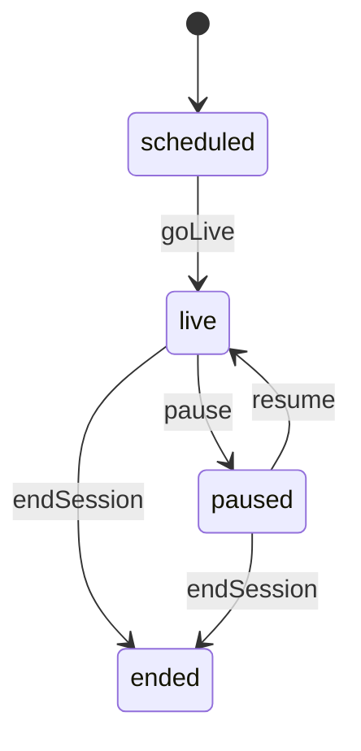
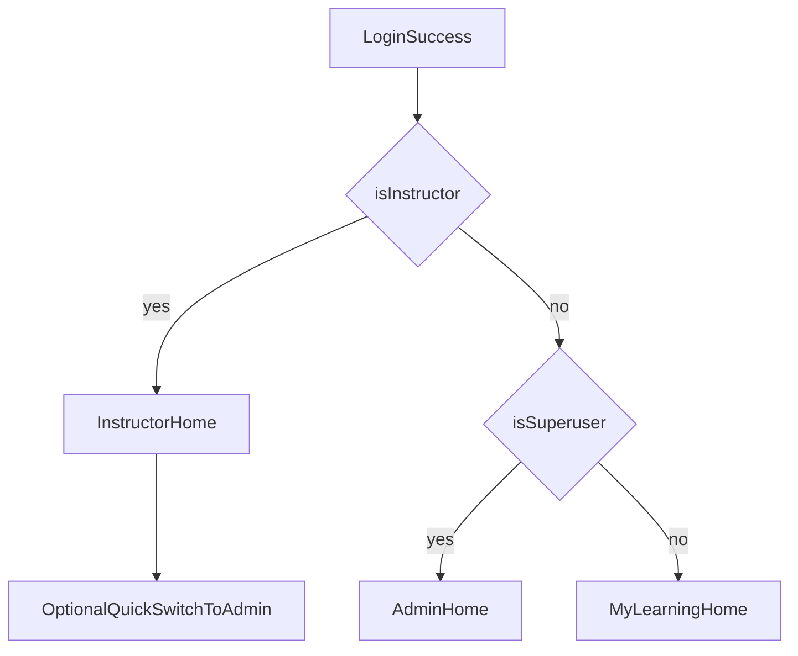
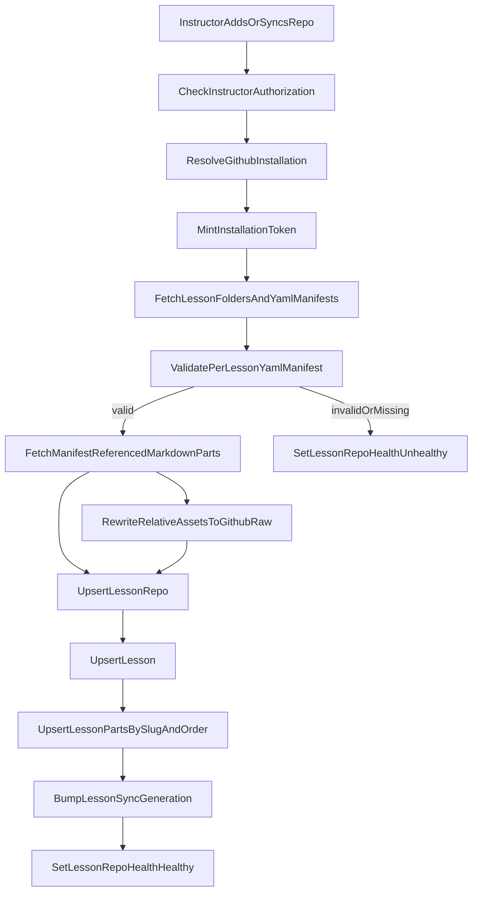
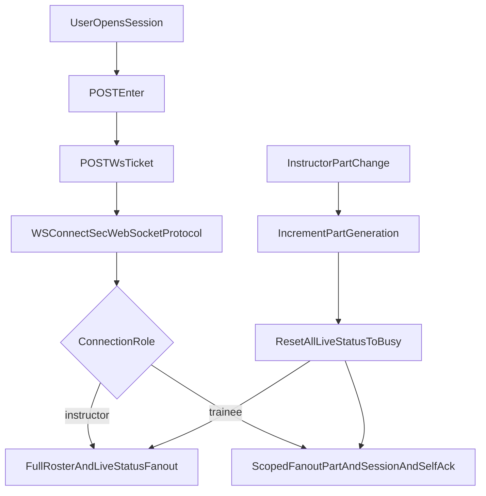
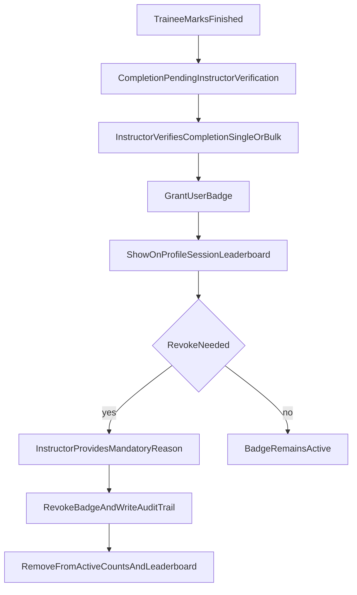
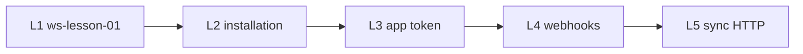
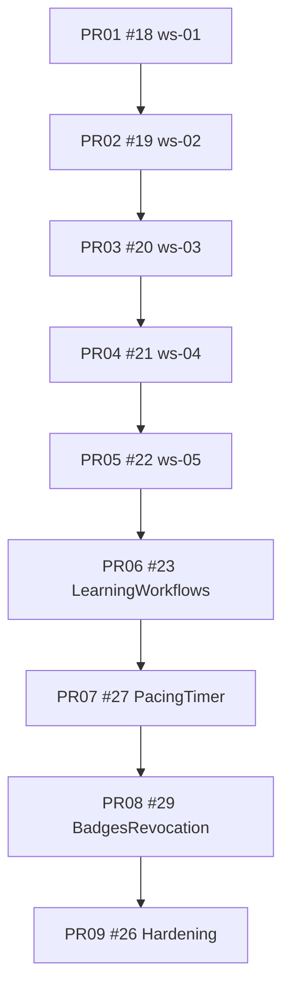

<!-- Document order: (1) Status & backlog → (2) Code map → (3) MVP scope & constraints → (4) Delivery process → (5) Domain contracts & API → (6) Flows & dashboards & UI → (7) Quality → (8) Historical PR process → (9) Appendix. -->

# Workshop training app — lessons + live sessions

## Implementation tracker (canonical — update whenever context would otherwise be lost)

Use this section after a pause or repo switch—do not rely on chat memory alone.

**Maintenance rule:** When behavior or backlog changes materially, refresh **[Remaining work](#remaining-work-authoritative)**, **[Deferred polish backlog](#deferred-polish-backlog-skip-log)**, and **`Last synced`**; for any **future** stacked delivery, reuse **[PR slicing](#pr-slicing-and-branch-strategy-locked)** + **`gh pr checks --watch`** (see [babysitting policy](#pr-babysitting-policy-locked)).

| Field | Value |
| ------ | ------ |
| **Last synced** | **2026-05-07** — Lesson GitHub polling model (install + repo refresh POSTs, periodic poller), webhook removal + migration dropping `github_webhook_delivery`. **Lesson sync UX/API:** `GET …/lesson-repos/installations` best-efforts sync from GitHub App `GET /app/installations`, upserts rows, **prunes installs GitHub no longer returns** (on successful poll + `installations/refresh`; DB cache unchanged if GitHub fails), falls back to DB cache on polling failure (`accessible-repositories`). **Lesson sync UI:** repository choice is a dropdown (`Select`) with optional typed owner/repo; installation selector clears stale picks when GitHub drops an install. |
| **Integration tip** | **`main`** |
| **Not done yet** | See **[Remaining work](#remaining-work-authoritative)** for workshop-runnable functional gaps first; log non-blocking polish in **[Deferred polish backlog](#deferred-polish-backlog-skip-log)** and skip it until core flow is complete. Posture **`security-hardening-new-features`**. |

### Remaining work (authoritative)

**Priority rule:** until the app can run a real workshop end-to-end, do **functionality before polish/test expansion**. If you encounter non-blocking polish, record it in **[Deferred polish backlog](#deferred-polish-backlog-skip-log)** and continue with blocking functionality.

**1. Workshop-runnable functionality (blocking first)**

- Validate the complete instructor-led flow in-product: create/prepare session, roster setup, trainee entry, live part progression, prerequisite gating behavior, completion/status updates, and session closeout. **Baseline serial Playwright flow coverage is now in-flight local; keep treating regressions in this path as P0.**
- Close blocking delivery gaps from **[Workshop HTTP vs realtime - delivery gap (audit)](#workshop-http-vs-realtime---delivery-gap-audit)** before adding new polish slices.
- Treat any bug that breaks workshop execution (auth loops, role redirects, sync failures, missing lesson content, broken part progression, roster mutation regressions) as P0 for current slice.
- Keep tests focused on protecting newly shipped functional behavior; do not expand broad polish-only coverage until blocking flow is complete.

**2. Lesson source pipeline hardening** (core scope shipped on `main`; follow-ups are polish/ops only)

- **Progress (shipped on `main` + in-flight polling pivot):** [`lesson_manifest.py`](backend/app/services/lesson_manifest.py) + [`lesson_repo_sync.py`](backend/app/services/lesson_repo_sync.py) (**L1**). DB **`github_app_installation`** + FK on **`LessonRepo`** (**L2**). [`github_app_tokens.py`](backend/app/services/github_app_tokens.py) (**L3**). [`lesson_github_fetch.py`](backend/app/services/lesson_github_fetch.py) + [`workshop_lesson_repos.py`](backend/app/api/routes/workshop_lesson_repos.py) — **`POST /api/v1/workshop/lesson-repos/sync-from-github`** and manual refresh endpoints (**L5**). Private-safe periodic poller runs from [`github_installation_poller.py`](backend/app/services/github_installation_poller.py).
- **GitHub App mode:** webhook ingestion has been removed. Installation/repository freshness now comes from manual refresh APIs plus optional periodic polling.
- **Sync + models (remaining product work):** **Sync-time rewrite** of relative markdown / simple HTML asset URLs → **`raw.githubusercontent.com`** (+ strip ``<script>`` / ``<iframe>`` outside fenced blocks) via [`lesson_markdown_pipeline.py`](backend/app/services/lesson_markdown_pipeline.py); **`lesson_markdown_to_safe_html`** (CommonMark `html=false` + **nh3**) is now wired in session detail API and workshop SPA current-part rendering. **Shipped in-flight local:** `LessonManifest` SHA rows persisted + surfaced in lesson-repo list metadata (`manifest_count`, `last_manifest_synced_at`) for instructor sync health visibility.
- **Instructor UX**: Repo list, Install/configure CTA (instructor-only — **[Product constraints](#product-constraints)**), Sync, health, parts preview — aligns with **[UI / UX](#ui--ux-specification)** IA. **Shipped in-flight local:** `GET /api/v1/workshop/lesson-repos/{lesson_repo_id}/preview` now returns lesson+part preview payloads and dashboard sync card can toggle per-repo parts previews.

**3. Optional / polish (product + engineering)**

- Expose pacing/timer parity with **[REST sketch](#rest-sketch-under-apiv1)** timer routes if you want symmetry beyond current HTTP surface.
- **[Realtime](#realtime)** multi-instance (**Redis**/shared broker) remains explicitly deferred ([Locked decisions](#locked-decisions) single-process path).
- Richer dashboard cards / trainee–instructor **Playwright** breadth ([Testing](#testing)); deeper prerequisite roster analytics ([Workshop HTTP vs realtime](#workshop-http-vs-realtime--delivery-gap-audit)).
- **Polish stop condition (loop guard):** once a slice has green targeted + full Playwright and at least one analytics/dashboard enhancement landed, pause further optional polish and switch to PR merge-readiness unless a concrete bug/regression is reported.

### Deferred polish backlog (skip log)

Record non-blocking polish items here when discovered during functional work, then continue with functionality-first delivery.

| Date | Area | Polish item deferred | Why skipped now |
| ---- | ---- | -------------------- | --------------- |
| 2026-05-07 | Dashboard / workshop sync card | Expand broader UI/visual polish and additional non-blocking assertions around sync-card controls beyond the current behavior checks. | Functionality-first focus until workshop run flow is fully verified end-to-end. |

### Pause / resume checkpoint (handoff)

Use this section when reopening the project **after intentional stop**. Do **not** rely on chat history beyond what is committed and linked here.

**Current active slice:**

| Item | Value |
| ---- | ----- |
| Branch | **`main`** |
| PR | Lesson follow-up stack [#30](https://github.com/justin-p/testing/pull/30)→[#34](https://github.com/justin-p/testing/pull/34) is merged; no open stack PR required for current state. |
| Latest work | **Shipped on `main`:** session core, realtime/privacy, dashboards/workshops, prerequisites, pacing, badges + hardening, plus complete Lesson GitHub sync stack (manifests, installation persistence, app token flow, webhooks, sync-from-github API/UI). **In-flight local (unmerged):** expanded Playwright dashboard/workshops role-scope coverage, stabilized flaky workshop aggregate assertions, fixed stale-token `/login` redirect looping by validating `/me` before login-route redirect, added regression coverage that stale tokens are cleared, added instructor prerequisite-roster analytics assertions in workshop session E2E, added workshops-hub blocked prerequisite analytics summary card (sessions impacted + most-blocked session), added `lesson_manifest_sync` SHA audit rows persisted during repo sync (model + migration + service tests), surfaced repo-level manifest audit metadata in lesson-repo list API/UI (`manifest_count`, `last_manifest_synced_at`), added lesson-repo parts preview backend route (`GET /workshop/lesson-repos/{lesson_repo_id}/preview`) plus sync-card preview toggle UI, added installation settings deep links from API to sync-card installation options, added installation-scoped repo list filtering (`installationId`) in backend route + sync-card query behavior, added install-CTA app URL (`install_url`) in installations response and wired sync card CTA to prefer it, expanded health filtering from boolean unhealthy-only to explicit API+UI mode (`health=all\|healthy\|unhealthy`), added backend route coverage for installation + health filter behavior, added server-backed repo text filtering (`q`) to lesson-repo list API with dashboard synced-repo search input + backend route tests, added Playwright coverage for install-CTA preference behavior in dashboard routing spec, added a serial Playwright end-to-end instructor-led workshop flow (gate → unblock → pause/resume/advance → closeout), added workshop session detail fallbacks for missing lesson/lesson-repo rows (`lesson_missing`, `lesson_repo_missing`) with targeted API tests, added frontend guardrails + Playwright assertions that disable live instructor/timer controls when lesson content is unavailable, added a workshop-page `Retry lesson check` recovery action with Playwright coverage for degraded->recovered content transitions, added backend start-session guards that reject sessions with unavailable lesson content (`lesson_missing`, `lesson_repo_missing`, `lesson_repo_unhealthy`, `no_parts_synced`) with route tests, added explicit sync-card install/grant prompts that block sync submit when installations or repo entitlements are missing (with Playwright coverage), regenerated frontend OpenAPI client types after route schema expansion, and tightened delivery rules to require feature-branch + PR workflow by default (no implicit direct-to-`main`). [Remaining work](#remaining-work-authoritative) now tracks optional polish. |

**Resume in this order:**

1. `git fetch origin && git checkout main && git pull`.
2. Pick work from **[Remaining work](#remaining-work-authoritative)**; branch from **`main`**, babysit **`gh pr checks`** before merge ([policy](#pr-babysitting-policy-locked)).
3. Update **`Last synced`** here when merges or backlog meaningfully shift.

### GitHub PR stack (archived collapsed chain — historical reference)

Merged into [`main`](https://github.com/justin-p/testing/tree/main) via **[#18](https://github.com/justin-p/testing/pull/18)**. **PR02** branch name anticipated GitHub/sync work; **[Remaining work](#remaining-work-authoritative) §1** tracks what still must be implemented. New features → PRs to **`main`**.

| Slice | Branch (head) | Pull request | Base branch |
| ----- | --------------- | ------------ | ----------- |
| PR01 | `ws-01-foundation-rbac` | [#18](https://github.com/justin-p/testing/pull/18) *(merged)* | `main` |
| PR02 | `ws-02-github-sync-manifest` | [#19](https://github.com/justin-p/testing/pull/19) *(merged)* | `ws-01-foundation-rbac` |
| PR03 | `ws-03-session-core` | [#20](https://github.com/justin-p/testing/pull/20) *(merged)* | `ws-02-github-sync-manifest` |
| PR04 | `ws-04-realtime-privacy` | [#21](https://github.com/justin-p/testing/pull/21) *(merged)* | `ws-03-session-core` |
| PR05 | `ws-05-dashboard-nav` | [#22](https://github.com/justin-p/testing/pull/22) *(merged)* | `ws-04-realtime-privacy` |
| PR06 | `ws-06-learning-workflows` | [#23](https://github.com/justin-p/testing/pull/23) *(merged)* | `ws-05-dashboard-nav` |
| PR07 | `ws-07-pacing-timer-v2` | [#27](https://github.com/justin-p/testing/pull/27) *(merged)* | `ws-06-learning-workflows` |
| PR08 | `ws-08-badges-revocation-v2` | [#29](https://github.com/justin-p/testing/pull/29) *(merged)* | `ws-06-learning-workflows` |
| PR09 | `ws-09-hardening-and-tests` | [#26](https://github.com/justin-p/testing/pull/26) *(merged)* | *(stacked onto `ws-08` branch before PR06→05 collapse; history preserved on integration branches)* |

### Backend code anchors (workshop delivery slices)

| Area | Primary paths |
| ---- | ------------- |
| HTTP + WebSocket routes | [`backend/app/api/routes/workshop_sessions.py`](backend/app/api/routes/workshop_sessions.py) |
| Badges HTTP routes | [`backend/app/api/routes/workshop_badges.py`](backend/app/api/routes/workshop_badges.py) |
| Prerequisites HTTP routes | [`backend/app/api/routes/workshop_lessons.py`](backend/app/api/routes/workshop_lessons.py) |
| Lesson YAML manifest + path-map → DB sync | [`backend/app/services/lesson_manifest.py`](backend/app/services/lesson_manifest.py), [`backend/app/services/lesson_repo_sync.py`](backend/app/services/lesson_repo_sync.py), Markdown URL rewrite / safe HTML [`backend/app/services/lesson_markdown_pipeline.py`](backend/app/services/lesson_markdown_pipeline.py); tests [`backend/tests/services/test_lesson_manifest.py`](backend/tests/services/test_lesson_manifest.py), [`backend/tests/services/test_lesson_repo_sync.py`](backend/tests/services/test_lesson_repo_sync.py), [`backend/tests/services/test_lesson_markdown_pipeline.py`](backend/tests/services/test_lesson_markdown_pipeline.py) |
| GitHub App → lesson HTTP sync | [`backend/app/services/github_app_tokens.py`](backend/app/services/github_app_tokens.py), [`backend/app/services/lesson_github_fetch.py`](backend/app/services/lesson_github_fetch.py), [`backend/app/services/github_installation_polling.py`](backend/app/services/github_installation_polling.py), [`backend/app/services/github_installation_poller.py`](backend/app/services/github_installation_poller.py), [`backend/app/api/routes/workshop_lesson_repos.py`](backend/app/api/routes/workshop_lesson_repos.py); tests [`backend/tests/services/test_github_app_tokens.py`](backend/tests/services/test_github_app_tokens.py), [`backend/tests/api/routes/test_workshop_lesson_repos.py`](backend/tests/api/routes/test_workshop_lesson_repos.py) |
| In-memory fan-out hub | [`backend/app/services/workshop_realtime.py`](backend/app/services/workshop_realtime.py) |
| API tests | [`backend/tests/api/routes/test_workshop_sessions.py`](backend/tests/api/routes/test_workshop_sessions.py) |
| Prerequisites API tests | [`backend/tests/api/routes/test_workshop_lessons.py`](backend/tests/api/routes/test_workshop_lessons.py) |
| Hub unit tests | [`backend/tests/services/test_workshop_realtime.py`](backend/tests/services/test_workshop_realtime.py) |
| Local E2E session bootstrap (`ENVIRONMENT=local` only) | [`backend/app/api/routes/private.py`](backend/app/api/routes/private.py) — `bootstrap_e2e_workshop_live_session` (+ `with_incomplete_required_prerequisite`, distinct-trainee vs `FIRST_SUPERUSER` instructor split); tests in [`backend/tests/api/routes/test_private.py`](backend/tests/api/routes/test_private.py) |
| Trainee workshop UI (enter + ws-ticket + WebSocket) | [`frontend/src/routes/_layout/workshop.$sessionId.tsx`](frontend/src/routes/_layout/workshop.$sessionId.tsx) |
| Workshop Playwright | [`frontend/tests/workshop.spec.ts`](frontend/tests/workshop.spec.ts) |
| Dashboard landing + routing | [`frontend/src/lib/dashboardLanding.ts`](frontend/src/lib/dashboardLanding.ts), stub rails [`frontend/src/components/dashboard/DashboardStubRails.tsx`](frontend/src/components/dashboard/DashboardStubRails.tsx), routes under [`frontend/src/routes/_layout/dashboard/`](frontend/src/routes/_layout/dashboard/), [`frontend/src/routes/_layout/workshops.tsx`](frontend/src/routes/_layout/workshops.tsx), sidebar [`frontend/src/components/Sidebar/AppSidebar.tsx`](frontend/src/components/Sidebar/AppSidebar.tsx), OAuth landing [`frontend/src/routes/auth.callback.tsx`](frontend/src/routes/auth.callback.tsx) |
| Admin users (`is_instructor`) | [`frontend/src/components/Admin/AddUser.tsx`](frontend/src/components/Admin/AddUser.tsx), [`frontend/src/components/Admin/EditUser.tsx`](frontend/src/components/Admin/EditUser.tsx), [`frontend/src/components/Admin/columns.tsx`](frontend/src/components/Admin/columns.tsx); E2E [`frontend/tests/admin.spec.ts`](frontend/tests/admin.spec.ts) |
| Playwright harness (backend reset / env) | [`scripts/e2e-backend-reset.sh`](scripts/e2e-backend-reset.sh), [`frontend/playwright.global-setup.ts`](frontend/playwright.global-setup.ts), [`frontend/playwright.config.ts`](frontend/playwright.config.ts) |

### Workshop HTTP vs realtime — delivery gap (audit)

**Canonical router:** [`backend/app/api/routes/workshop_sessions.py`](backend/app/api/routes/workshop_sessions.py).

| Surface | Implemented today | Still 🔲 vs **REST sketch** (below, *REST sketch under /api/v1/*) |
| ------- | ----------------- | ---------------------------------------------------------------- |
| **HTTP** | `POST …/sessions/{id}/enter`, `/start`, `/end`, `/ws-ticket`; **`GET …/sessions/`** list (`WorkshopSessionsPublic`); **`GET …/sessions/{id}`** scoped detail (**`WorkshopSessionPublicParticipant`** \| **`WorkshopSessionPublicInstructor`**); **`POST …/sessions/{id}/members`** role upsert; **`DELETE …/sessions/{id}/participants/{user_id}`** soft remove; **`PATCH …/sessions/{id}/participants/{user_id}`** instructor overrides (`live_status`/`joined_at`/`finished_at`); **`PATCH …/sessions/{id}`** — optional **`status`** (controlled transitions + realtime fanout on change), **`instructor_seat`** role updates, **`primary_instructor_user_id`** handoff (lead/co normalization), **`remove_instructor_user_id`** soft-remove with **409** when that would orphan a non-ended session; empty **422 `patch_requires_update`**; unknown seat **404**. **Lesson prerequisites** (`/workshop/lessons/{id}/prerequisites…`) ✅ for MVP slices. **Timer parity shipped:** `POST …/timer/start|pause|resume|stop`, `GET …/timer`, `GET …/timer/events`. | No blocking HTTP gaps in current MVP flow; keep multi-instance realtime explicitly deferred. |
| **WebSocket** | `/{id}/ws` — `part.advance`, `session.pause` / `session.resume`, `participant.live_status`, … | Redis / multi-process hub (explicitly deferred) |

**Shipped on `main` (summary):** list/detail + roster + session `PATCH`; prerequisites + pre-work UI (**banner, aggregates, mark complete**); pacing timer; badges + revoke/audit hardening. **Optional polish** — [Remaining work](#remaining-work-authoritative) §2.

On every new HTTP route: regenerate **OpenAPI** + **`frontend/src/client`**.

### Workshop run readiness checklist (functionality gate)

Use this checklist as the source of truth before starting new polish work.

| Capability | Owner surface | Status | Blocking notes |
| ---------- | ------------- | ------ | -------------- |
| Instructor can prepare a session roster and start live delivery | `workshop_sessions` HTTP + workshop route UI | ✅ | Keep validating role/seat transitions when touching session patch logic. |
| Trainee can enter active session and receive realtime progression | `enter` / `ws-ticket` / `/{id}/ws` + workshop route | ✅ | Any regression in auth token handling or ws ticket issuance is P0; client now retries websocket connection when stale part generation is reported. |
| Instructor can pause/resume/end room and advance parts | WebSocket actions + session status patch | ✅ | Preserve state transition guards and broadcasts. |
| Instructor can run pacing timer with audit trail | Timer HTTP routes + timer events UI | ✅ | Countdown validation and status transition guards are covered server-side. |
| Prerequisite gating can block/unblock trainee progression | lesson prerequisite routes + workshop UI banners/analytics | ✅ | Treat inconsistent gate state between HTTP and WS as blocking. |
| Lesson source sync can keep workshop content available | lesson repo sync API/UI + manifest pipeline | ✅ | Session detail now surfaces repo health/last sync plus `lesson_content_available` + `lesson_content_issue`; workshop UI blocks live controls when unavailable, and `POST /workshop/sessions/{id}/start` now rejects unavailable lesson content server-side. |

### Next actions (suggested order)

1. **`git checkout main && git pull`.**
2. **Ship [Remaining work](#remaining-work-authoritative) §1 first** - prioritize workshop-runnable blocking functionality over polish.
3. **Then ship §2 and §3** as needed; log non-blocking polish in **[Deferred polish backlog](#deferred-polish-backlog-skip-log)** when encountered.
4. **Large feature?** Optionally reuse stacked PR model in [PR slicing](#pr-slicing-and-branch-strategy-locked) and extend the archived [stack table](#github-pr-stack-archived-collapsed-chain--historical-reference).
5. **Local E2E:** [playwright-local-gate](.cursor/skills/playwright-local-gate/SKILL.md) — standard workflow includes **`scripts/e2e-backend-reset.sh`** (and host runs typically pick it up again via **`globalSetup`** unless you opt out — see skill). **CI** is the merge gate for green.

**When resuming from pause:** use [checkpoint](#pause--resume-checkpoint-handoff) → **`git pull`** → pick from **Remaining work**.

### Backlog tracking

**Shipped vs backlog** lives in **[Remaining work](#remaining-work-authoritative)**, **[Deferred polish backlog](#deferred-polish-backlog-skip-log)**, and the tracker table above; keep all three in sync when scope changes.

## Template code anchors

| Layer         | Paths |
| ------------- | ----- |
| Backend       | [backend/app/models.py](backend/app/models.py); workshop routes under [backend/app/api/routes/](backend/app/api/routes/) (`workshop_sessions`, `workshop_lessons`, `workshop_badges`, etc.) |
| Frontend      | Dashboard/workshop: [frontend/src/routes/_layout/dashboard/](frontend/src/routes/_layout/dashboard/), [frontend/src/routes/_layout/workshops.tsx](frontend/src/routes/_layout/workshops.tsx), [frontend/src/routes/_layout/workshop.$sessionId.tsx](frontend/src/routes/_layout/workshop.$sessionId.tsx); sidebar [frontend/src/components/Sidebar/AppSidebar.tsx](frontend/src/components/Sidebar/AppSidebar.tsx) |
| Auth.js       | [authjs-service/auth.ts](authjs-service/auth.ts), [authjs-service/app/api/bridge/route.ts](authjs-service/app/api/bridge/route.ts) |
| Bridge crypto | [backend/app/core/security.py](backend/app/core/security.py) |

## Out of scope (MVP)


| Area                       | Decision                                                                                                                                                                                                 |
| -------------------------- | -------------------------------------------------------------------------------------------------------------------------------------------------------------------------------------------------------- |
| Messaging                  | No chat, no DMs, no in-session threads. Only busy/done pacing signals.                                                                                                                                    |
| Guests / magic links       | No. Participants must be existing app users on the session roster.                                                                                                                                       |
| Video / screen-share       | No integrated A/V in the app; use external tools if needed.                                                                                                                                              |
| Attendance analytics       | No instructor-facing attendance/completion analytics dashboards (session or cross-session KPIs, distributions, trends).                                                                                |
| Instructor notes           | No private lesson- or session-scoped instructor note stores or APIs.                                                                                                                                     |
| Attendance exports         | No CSV/XLSX/PDF attendance export endpoints, jobs, or UI.                                                                                                                                                |
| Cohorts / teams            | No cohort/team entities, membership, session assignment, or cohort-filtered roster/analytics.                                                                                                            |
| Reminder automation        | No scheduled or “send now” in-app reminder campaigns beyond generic notifications already listed for roster/session/badge events (no per-session reminder scheduler/worker product).                      |
| Learner feedback           | No end-of-session reflection forms, feedback prompts/responses, or instructor aggregate feedback views.                                                                                                    |

> **Recoverable detail:** Cut scope is summarized again in the [appendix](#appendix--archived-scope-reference-only) (product bullets, entities, REST sketch, security, UX, delivery slices). That appendix is **not** authoritative for MVP; this table and the body of the plan are.

## Product constraints

- **Lesson source**: GitHub via a **GitHub App** (installation tokens from PEM; Contents + Metadata read as tight as practical). **Auth.js / OAuth** is **login and identity only** — not used to carry repo-scoped user tokens for sync.
- **Install prompt visibility**: Only users with **is_instructor=true** are shown GitHub App install/configure prompts. Non-instructors never see install CTAs/routes, and backend install-related endpoints enforce instructor authorization (403 for others).
- **Superuser authority**: Superusers have full instructor-equivalent control for workshop/session management APIs. GitHub App install/config prompts remain hidden unless `is_instructor=true`.
- **Session–lesson binding**: Each **WorkshopSession** uses exactly one **Lesson**. Instructor controls the **current instructional part** (index + **slug** mirror on the session).
- **Roster**: Instructor manages **WorkshopParticipant** rows (add/remove; soft-remove with **removed_at**). GitHub avatars are used across application identity surfaces when available; trainee session payloads still exclude peer identities/avatars.
- **Signals**: **live_status** = busy | done for the **current part**, shown **only to that user and to instructors** — **trainees must not see other trainees’ status**, roster, joined/finished timestamps, or presence (privacy + reduces comparison anxiety). Instructor cockpit remains the aggregate view.
- **Pause**: No participant busy/done writes; **no part navigation** (no **part_generation** bump) until **resume** or **end**.
- **Awards**: Badge grants are issued **only after instructor verification** of completion (not immediately on trainee self-finish), and surfaced across profile, session views, instructor views, and a global leaderboard. Revocation requires auditable reasons and updates active counts/leaderboard views.
- **Prework/prerequisites**: Lessons can define prerequisite tasks; trainee completion is tracked and surfaced before session start.
- **Pacing tools**: Session timer controls (per-part countdown/elapsed and overrun flags) are instructor-facing.
- **Backend delivery method**: Use `/python-tdd-with-uv` workflow across the entire backend implementation (test-first, vertical slices, `uv run pytest` loop).

## Delivery methodology (locked)

Execution methodology and Definition of Done policy are maintained in `AGENTS.md` (canonical source for TDD, test gates, Playwright expectations, and merge readiness workflow). Keep this plan focused on workshop scope/state and roadmap tracking.
- Docs/plan check: update affected plan/testing notes if scope or constraints evolved.

## Locked decisions

| Topic                   | Decision                                                                                                                                                                                                                                                                                                                                |
| ----------------------- | --------------------------------------------------------------------------------------------------------------------------------------------------------------------------------------------------------------------------------------------------------------------------------------------------------------------------------------- |
| Roster vs invite        | Single **WorkshopParticipant** table (**no WorkshopInvite**); **invited_at** when rostered. Instructor-flagged users may also be added here when chosen as trainees.                                                                                                                                                                    |
| joined_at               | **POST …/sessions/{id}/enter** when status is **live** or **paused** only; **not** when **scheduled**. Idempotent. WebSocket does not set joined_at.                                                                                                                                                                                    |
| Session end             | Moves session to **ended** only; **does not** bulk-set **finished_at**.                                                                                                                                                                                                                                                                 |
| Part change             | Bump **part_generation**, then set all participants **live_status** to **busy.**                                                                                                                                                                                                                                                        |
| Lesson content          | Lessons are synced from a **required per-lesson YAML manifest** (manifest is source of truth for part order). On live-session drift, instructor gets a prompt (default selection: **Switch to latest**). Invalid/missing manifest is a hard sync failure and sets repo unhealthy.                                                       |
| Part while paused       | **Frozen** — reject instructor **part_changed** (HTTP **422/409**); disable Prev/Next in UI.                                                                                                                                                                                                                                            |
| Multi-instructor model  | Session uses **SessionInstructor** assignments (one primary optional + zero-or-more co-instructors). At least one active instructor required while status is not ended. Removing/replacing instructors is **blocked (409)** if operation would leave zero active instructors.                                                           |
| Member role exclusivity | A user may be assigned as **either instructor or trainee** per session — never both simultaneously. If role is changed, remove the conflicting assignment in the same transaction.                                                                                                                                                      |
| Repo / entitlement loss | Active sessions keep reading **cached LessonPart** until **ended**; **LessonRepo.health = unhealthy** + banner; block **new** sessions on that repo.                                                                                                                                                                                    |
| Account delete          | **Anonymize** workshop rows: null **user_id**, set **anonymization_ref**, **anonymized_at**; add **UNIQUE (session_id, anonymization_ref)** (or equivalent) because **UNIQUE (session_id, user_id)** is degenerate with multiple NULLs — see Privacy section.                                                                           |
| Trainee peer visibility | **Trainees never see other participants’ identity, busy/done, joined_at, finished_at**, or roster. **Lesson content + session state badge + own controls only.** Enforce in **API response shape** and **WebSocket fanout**, not merely hidden UI.                                                                                      |
| Avatar scope across app | Use GitHub profile image on **all identity surfaces** (sidebar/user menu, settings/profile, admin user tables, instructor rosters, session cards) when linked. Fallback to initials/generic avatar when missing. **Trainee-facing session payloads still omit peers**; trainees may see **only their own** avatar in personal contexts. |
| WS handshake            | WebSocket auth uses **Sec-WebSocket-Protocol** carrying ws-ticket (no first-message auth mode).                                                                                                                                                                                                                                         |
| Member role conflict    | Add-member role conflicts are resolved by **always replace** semantics atomically (no manual conflict endpoint required).                                                                                                                                                                                                               |
| OAuth/App setup         | **Separate OAuth App (login)** + **separate GitHub App (repo sync)** for MVP.                                                                                                                                                                                                                                                           |
| Entitlement scope       | **Instructor-bound** by default; instructors can invite other instructors explicitly.                                                                                                                                                                                                                                                   |
| Realtime scaling path   | **Single-process** WS hub on `main` today; defer Redis/multi-process fan-out until measured scale/concurrency requires it.                                                                                                                                                                                                               |
| Avatar refresh          | Refresh stored avatar_url on each successful GitHub sign-in/link event (no periodic background refresh).                                                                                                                                                                                                                                |
| Avatar unlink           | On GitHub unlink, clear stored avatar_url and fall back to initials/default avatar.                                                                                                                                                                                                                                                     |
| API contract gate       | OpenAPI + TS client regeneration is **required on every API contract change**.                                                                                                                                                                                                                                                          |
| CI branch gate          | Critical workflows (backend tests, docker-compose tests, Playwright, staging deploy checks) must run on default branch **main** and PRs; no `master`-only gaps.                                                                                                                                                                         |
| Installation freshness | Keep GitHub installation + entitlement metadata fresh through manual refresh APIs and optional periodic polling; no public webhook endpoint required. |
| Endpoint throttling     | Apply route-level throttling for auth bridge and login endpoints. |

## GitHub App

- Env: **GITHUB_APP_ID**, **GITHUB_APP_PRIVATE_KEY** (PEM), optional **GITHUB_APP_SLUG** or **GITHUB_APP_INSTALL_URL**.
- Sync freshness uses manual refresh APIs and optional periodic polling (`GITHUB_INSTALLATION_POLL_*`).
- **Entitlement MVP**: **instructor-bound** repository access by default; repos must be tied to an installation the assigning instructor controls. Other instructors may be explicitly invited to a session.
- **OAuth registration (locked)**: Use **separate OAuth App** for login + **separate GitHub App** for repository sync in MVP.
- **Lesson structure contract (locked)**: each lesson folder must include a YAML manifest (for example `lesson.manifest.yaml`) that explicitly defines lesson parts and ordering; no implicit filename ordering in MVP.
- **Manifest failure policy (locked)**: missing/invalid manifest blocks sync updates and marks `LessonRepo.health=unhealthy` (hard fail, no partial sync).

## Lesson manifest format (locked)

Each lesson folder must contain `lesson.manifest.yaml`.

### Required schema

- `version` (integer): manifest schema version; MVP requires `1`.
- `lesson` (object):
  - `slug` (string, kebab-case, unique per repo)
  - `title` (string)
- `parts` (array, min 1):
  - `slug` (string, kebab-case, unique within lesson)
  - `title` (string)
  - `path` (string, relative markdown file path inside the lesson folder, e.g. `01-intro.md`)

### Optional fields

- `lesson.summary` (string)
- `part.estimated_minutes` (integer >= 0)
- `part.objectives` (array of strings)

### Validation rules

- Manifest file must parse as valid YAML.
- Unknown keys are rejected at **all levels** in MVP (top-level, `lesson.`*, and each `parts[*].`*).
- Every `parts[*].path` must exist and be a markdown file (`.md` only in MVP).
- Part order is exactly the array order in `parts`; no filename sorting fallback.
- Duplicate `lesson.slug` in the same repo or duplicate `parts[*].slug` in the same lesson is invalid.
- Path safety is enforced: reject absolute paths, reject any `..` traversal, and reject symlink-resolved targets that escape the lesson folder root.
- Any validation error causes hard sync failure for that repo update and sets repo health to unhealthy.

### Example

```yaml
version: 1
lesson:
  slug: fastapi-workshop-basics
  title: FastAPI Workshop Basics
  summary: Intro workshop for API fundamentals.
parts:
  - slug: setup-and-prereqs
    title: Setup and Prerequisites
    path: 01-setup.md
    estimated_minutes: 10
    objectives:
      - Install dependencies
      - Run the project locally
  - slug: first-endpoint
    title: Build Your First Endpoint
    path: 02-first-endpoint.md
    estimated_minutes: 20
```

### JSON Schema (draft 2020-12)

```json
{
  "$schema": "https://json-schema.org/draft/2020-12/schema",
  "$id": "https://example.com/schemas/lesson-manifest.schema.json",
  "title": "LessonManifestV1",
  "type": "object",
  "additionalProperties": false,
  "required": ["version", "lesson", "parts"],
  "properties": {
    "version": {
      "type": "integer",
      "const": 1
    },
    "lesson": {
      "type": "object",
      "additionalProperties": false,
      "required": ["slug", "title"],
      "properties": {
        "slug": {
          "type": "string",
          "pattern": "^[a-z0-9]+(?:-[a-z0-9]+)*$",
          "minLength": 1
        },
        "title": {
          "type": "string",
          "minLength": 1
        },
        "summary": {
          "type": "string"
        }
      }
    },
    "parts": {
      "type": "array",
      "minItems": 1,
      "items": {
        "type": "object",
        "additionalProperties": false,
        "required": ["slug", "title", "path"],
        "properties": {
          "slug": {
            "type": "string",
            "pattern": "^[a-z0-9]+(?:-[a-z0-9]+)*$",
            "minLength": 1
          },
          "title": {
            "type": "string",
            "minLength": 1
          },
          "path": {
            "type": "string",
            "pattern": "^(?!/)(?!.*\\.\\.)(?!.*\\\\).+\\.md$"
          },
          "estimated_minutes": {
            "type": "integer",
            "minimum": 0
          },
          "objectives": {
            "type": "array",
            "items": {
              "type": "string",
              "minLength": 1
            }
          }
        }
      }
    }
  }
}
```

Implementation note: JSON Schema cannot reliably validate symlink-escape checks; enforce symlink root containment in backend filesystem validation after schema validation.

## Session lifecycle




- **Scheduled**: **POST /enter** rejected. Optional backlog: read-only lesson title on lobby (no joined_at).
- **Live / paused**: **enter** allowed; **paused** blocks participant **live_status** updates and blocks **part_changed**.

## Flow diagrams

### Post-login dashboard routing




### GitHub App sync flow




### Live session event/privacy flow




### Badge grant/revoke lifecycle



## Data model (illustrative)


| Entity                                      | Notes                                                                                                                                                                                                                                                                                                                            |
| ------------------------------------------- | -------------------------------------------------------------------------------------------------------------------------------------------------------------------------------------------------------------------------------------------------------------------------------------------------------------------------------- |
| GithubInstallation (+ optional repo mirror) | Tracks installations and entitled **owner/repo** list.                                                                                                                                                                                                                                                                           |
| LessonRepo                                  | installation_id, full_name, default_branch, sync timestamps, **health** (healthy                                                                                                                                                                                                                                                 |
| Lesson                                      | FK to LessonRepo; optional **lesson_sync_generation** after sync.                                                                                                                                                                                                                                                                |
| LessonPart                                  | lesson_id, ordering, path, **slug** (unique per lesson), title, body_md.                                                                                                                                                                                                                                                         |
| LessonManifest                              | lesson_id, manifest_path, manifest_sha, manifest_format=yaml, parsed_at, validity_state, error_message (nullable).                                                                                                                                                                                                               |
| WorkshopSession                             | lesson_id, status, current_part_index, current_part_slug, **part_generation**, timestamps. (Primary instructor id optional convenience pointer if desired.)                                                                                                                                                                      |
| WorkshopParticipant                         | session_id, user_id (nullable after anonymize); invited_at, joined_at, finished_at, live_status, removed_at; anonymization_ref, anonymized_at; instructor audit columns (adjusted_*, reason).                                                                                                                                    |
| SessionInstructor                           | session_id, user_id (must be **is_instructor=true**), role enum (primary/co_instructor optional), assigned_at, removed_at; unique active (session_id,user_id).                                                                                                                                                                   |
| LessonPrerequisite                          | lesson_id, type (task/link/check), title, details/url, ordering, required_flag.                                                                                                                                                                                                                                                  |
| UserPrerequisiteCompletion                  | user_id, lesson_id, prerequisite_id, completed_at, source (self/instructor).                                                                                                                                                                                                                                                     |
| SessionTimerEvent                           | session_id, part_slug/index, timer_mode (countdown/countup), started_at, paused_at, ended_at, target_seconds.                                                                                                                                                                                                                    |
| User (extend template)                      | Nullable `**avatar_url`** (or `**github_avatar_url`**) — set/updated when GitHub is linked (from GitHub profile `**avatar_url`** at link/approval or periodic refresh on successful GitHub sign-in). Join instructor roster DTO with `**full_name**`, `**email**` (optional policy), `**github_login**` from `**OAuthAccount**`. |
| OAuthAccount (template)                     | Already links **GitHub**; ensure `**avatar_url`** is captured if not present today (may require extending model + bridge payload from Auth.js **profile.image** at link time).                                                                                                                                                   |


**Roster read model (instructor):** `ParticipantRosterRow` = participant session fields + `**avatar_url`**, `**display_name`**, `**github_login**` (nullable). **Anonymized** rows: omit photo or use neutral placeholder.

**Sync**: Single-flight (advisory lock or row lock) around manifest validation + fetch + upsert of **LessonPart**; bump generation so clients can warn on mid-session content change.

## Realtime

- **ws-ticket**: **POST …/ws-ticket** returns a **short-lived** token; do **not** put long-lived JWT in query strings. Use **Sec-WebSocket-Protocol** (locked); first-message auth mode is out of scope.
- **Role-scoped fanout (privacy)**:
  - **Instructor-assigned users (and superuser observers if any)** connection: server may push **full roster snapshots** / per-participant **live_status** deltas for UI cockpit (snapshots may include avatar_url per row — instructor-only channel).
  - **Trainee** connection: payloads **restricted to** session-level `**part_changed`** (slug/index/generation/markdown-or-ref), `**session_status`** (live/paused/ended), and **ack/echo only for their own user_id** (e.g. their **live_status** confirm). **Never** embed other participants’ IDs, names, or statuses. If a single WS room is reused, enforce filter at broadcast; preferable **two channels** (`role=instructor|trainee`) with different message schemas typed in OpenAPI/TS.
- **part_generation**: Increment **before** broadcasting **part_changed** to **all** subscribed clients (**trainees need part sync without peer data**). Trainees send last-known generation + **self-only live_status** updates when live.
- **Pause matrix**: Trainee writers for **live_status** off; instructor **part_changed** off; roster PATCH and progress audit PATCH still allowed; resume/end allowed.

## Persistence rules


| Field                                 | Writer                                                                     |
| ------------------------------------- | -------------------------------------------------------------------------- |
| joined_at                             | First successful **POST …/enter** only.                                    |
| live_status, finished_at (self-serve) | Only when session is **live**, not **paused** (WS or REST per API design). |
| Instructor overrides                  | **PATCH** participant with audit columns.                                  |

## REST sketch (under /api/v1/…)


| Verb   | Route                                           | Notes                                                                                                                                                                                         |
| ------ | ----------------------------------------------- | --------------------------------------------------------------------------------------------------------------------------------------------------------------------------------------------- |
| POST   | …/workshop/sessions/{id}/enter                  | Idempotent joined_at; **403** if scheduled.                                                                                                                                                   |
| POST   | …/workshop/sessions/{id}/ws-ticket              | Ephemeral WS credential.                                                                                                                                                                      |
| POST   | …/workshop/sessions/{id}/members                | Add member with role selection: trainee OR instructor (mutually exclusive). Instructor role requires is_instructor.                                                                           |
| PATCH  | …/workshop/sessions/{id}                        | State transitions; instructor assignment updates (primary/co-instructor) with is_instructor checks. **409** if change leaves no active instructor on non-ended session.                       |
| DELETE | …/workshop/sessions/{id}/participants/{user_id} | Soft **removed_at**.                                                                                                                                                                          |
| PATCH  | …/workshop/sessions/{id}/participants/{user_id} | Instructor audit overrides.                                                                                                                                                                   |
| GET    | …/workshop/sessions/{id} (and related)          | Trainee-visible fields: **scoped DTO** — no roster array; no peer stats. Instructor GET returns full roster + aggregates **including `avatar_url` (and display fields) per participant row**. |


Routes are illustrative; align names with your OpenAPI layout. **Separate response models** (`SessionPublicParticipant` vs `SessionPublicInstructor`) recommended.

Additional endpoint groups to include:

- `GET/POST/PATCH /workshop/lessons/{id}/prerequisites` and `POST /workshop/lessons/{id}/prerequisites/{pid}/complete`
- `POST /workshop/sessions/{id}/timer/start|pause|resume|stop` + `GET /workshop/sessions/{id}/timer`

Role guardrail (consistent with Locked decisions): add-member endpoint applies **always replace** semantics for opposite-role conflicts in a single transaction; dual-role state is forbidden.

Last-instructor guardrail: for sessions with status != ended, instructor remove/demote/handoff requests that would result in **zero active SessionInstructor rows** return **409** with remediation hint (assign another instructor first).

**Avatar loading:** Prefer **HTTPS `avatars.githubusercontent.com`** URLs stored at link/sign-in refresh time. Apply same avatar source helper across all identity UIs (sidebar profile button, settings/profile header, admin users table, instructor roster rows, session cards). Optional hardening: proxy images through FastAPI (cache + strip cookies) if CSP/privacy requires; MVP may use `referrerPolicy="no-referrer"` and framework remote host allowlist for GitHub avatar domains.

## Markdown

**Implemented on backend:** Lesson sync applies **relative markdown link/image targets** and **`src` / `href` attributes on simple HTML tags** outside fenced blocks → **`https://raw.githubusercontent.com/{full_name}/{default_branch}/{path}`**; strips embedded **`<script>`** / **`<iframe>`** outside fences. **`lesson_markdown_to_safe_html`** renders CommonMark (tables enabled, **raw HTML disabled**) then **nh3** allowlists — use when returning part content to the SPA.

**Wired now:** Session detail includes per-part **`body_html`** rendered server-side via `lesson_markdown_to_safe_html`; workshop SPA renders current part content from this sanitized HTML payload.

## Notifications (MVP)

- Notification model is **in-app only** (no email for MVP).
- Delivery surfaces: **toast + notification center**.
- Initial events: added-to-session, session-started, session-paused/resumed, badge-granted, badge-revoked.

## Migration and rollout safety

- **Pre-migration checks:** capture baseline row counts, confirm backup availability, and document rollback posture for each migration.
- **Post-migration checks:** verify constraints/indexes, run integrity checks, and validate seed reads for repos/lessons/sessions.
- **Backfill requirement:** any new non-null/derived field must include a backfill query/job plus a verification query.
- **Destructive change policy:** table/column drops require deprecation staging unless explicitly approved as emergency work.

## API and operational discipline

- **Error envelope:** new workshop endpoints should return a machine-readable error shape (`code`, `message`, optional `details`).
- **Idempotency contracts:** explicitly define idempotency behavior for `enter`, webhook sync handlers, and badge grant/revoke actions.
- **Observability minimum:** add structured logs with request/session IDs and metrics for sync failures, ws connect failures, and badge/revocation actions.
- **Alertability:** define thresholds for repeated webhook verification failures and sustained `LessonRepo.health=unhealthy`.

## Security hardening for added workshop features

- **Field-level RBAC:** enforce instructor/superuser-only access for timer/pacing controls, prerequisite definition mutations, badge grant/revoke actions, and any instructor-only roster/completion surfaces.
- **Scoped data exposure:** trainees can read only their own prerequisite completions; never return peer identity or roster fields in trainee DTOs.
- **Timer integrity:** timer state is server-authoritative; reject client-supplied backdated timestamps and enforce legal state transitions.
- **Timer auditing:** immutable audit trail for timer start/pause/resume/stop with actor and timestamp.
- **Badge actions:** grant only after instructor verification; revoke requires persisted reason + actor/timestamp; leaderboard/profile DTOs exclude revoked grants from active counts per product rules.

## Privacy (user delete)

**Anonymize** linked **WorkshopParticipant** rows (null **user_id**, stable **anonymization_ref** per row, timestamp). Document in privacy copy. Ensure DB constraints allow one anonymized row per original seat (partial unique indexes as needed). Clean up Auth.js linkage per your account-deletion policy.

## Post-login landing dashboards

This section defines exactly where users land **immediately after login**.

### Landing rules (locked)

- **Instructor (`is_instructor=true`)**: land on **Instructor Home** (`/dashboard/instructor`).
- **Trainee-only user**: land on **My Learning Home** (`/dashboard/trainee`).
- **Superuser**:
  - If also instructor, default to **Instructor Home** with quick-switch to admin view.
  - If not instructor, land on **Admin Home** (`/dashboard/admin`) with links to workshop/instructor management.

Persist user's last dashboard tab (optional quality-of-life), but first-login defaults follow the rules above.

### Dashboard pages to include


| Dashboard            | Audience    | Purpose                                                                                                                                                           |
| -------------------- | ----------- | ----------------------------------------------------------------------------------------------------------------------------------------------------------------- |
| **Instructor Home**  | instructors | Today's sessions, active/paused sessions, repo health, pending completion verifications, badge/revocation actions, quick links to lesson repos and sessions |
| **My Learning Home** | trainees    | sessions needing action (live/starting soon), recent completions, earned badges, personal progress summary                                                        |
| **Admin Home**       | superusers  | user/instructor management, system health summaries, policy/role oversight, links into workshop data                                                              |


### Minimal cards for each landing dashboard

- **Instructor Home cards**
  - Live now / paused now sessions
  - Sessions starting today
  - Pending completion verifications
  - Repo health warnings (unhealthy LessonRepo)
  - Badge actions queue (recent grants/revokes)
- **My Learning Home cards**
  - Continue session (if any live/paused where user is trainee)
  - Upcoming sessions where rostered
  - My badges (recently earned)
  - Personal completion trend (no peer metrics)
- **Admin Home cards**
  - Users pending role changes
  - Instructors and active sessions summary
  - Error/warning rollup (sync failures, unhealthy repos)

### Privacy constraints on landing dashboards

- Trainee dashboard must never include peer trainee identities, statuses, counts tied to named peers, or instructor-only roster controls.
- Instructor dashboard may include roster summaries for sessions they are assigned to.
- Admin dashboard may include aggregates and management views according to superuser permissions.

## Dashboard content matrix

The app should present role-specific dashboard content that matches all features in this plan.


| Surface                      | Instructor dashboard                                                                                                                                                            | Trainee dashboard                                                                             |
| ---------------------------- | ------------------------------------------------------------------------------------------------------------------------------------------------------------------------------- | --------------------------------------------------------------------------------------------- |
| **Primary nav**              | Instructor Home, Workshops hub, Lesson repos, Sessions, Badge management/revocations; includes trainee routes only when instructor is separately rostered as trainee | My Learning Home, My sessions, My badges/profile progress (plus standard account settings)    |
| **Session list cards/table** | lesson, status, invited/joined/finished counts, health warnings, open/manage actions                                                                                            | only sessions where user is participant/instructor, personal status; no peer metrics          |
| **Session detail**           | full roster, avatars, busy/done per trainee, joined/finished timestamps, verify completion, revoke badge, pause/resume/end, member role assignment                              | current lesson part, own busy/done + own completion action, status badge; no roster/peer data |
| **Badges**                   | badge grant/revoke actions, per-session badge events, leaderboard moderation context                                                                                            | own earned badges + progress only                                                             |
| **Error/health banners**     | sync failures, unhealthy LessonRepo, entitlement issues                                                                                                                         | session-level read-only/error guidance only; no admin internals                               |


### Dashboard consistency rules

- **Role-gated widgets:** every widget/card/query in dashboards must check role scope server-side and client-side.
- **Single source DTOs:** use separate API response models for instructor and trainee dashboards; never reuse instructor DTOs in trainee routes.
- **Feature propagation checklist:** whenever a new domain feature is added (badges, revocation, prerequisites, pacing/timer, role rules), update both dashboards intentionally: either add relevant widget or explicitly mark "not applicable".
- **No silent gaps:** dashboard pages should not expose empty placeholders for unsupported role actions; hide or replace with contextual copy.

## UI / UX specification

**Layout choices (locked):**

- **Instructor live cockpit (desktop / large tablet): split panel** — roster + presence on one rail; current **LessonPart** Markdown + **Prev / Next** + session controls on the main pane. On narrow viewports, **stack**: roster summary strip (horizontally scroll chips or collapsible drawer) above the lesson card.
- **Participant: full app chrome** — keep the **normal sidebar and global nav** (per template) so trainees can move to settings or other routes; no forced “focus mode” kiosk. Session page still shows **clear session state** (badge: Scheduled / Live / Paused / Ended) so context is obvious when they return.

### Global avatar usage (locked)

- **Apply avatar component consistently** wherever a user identity chip appears: app sidebar/profile trigger, account/settings header, admin user rows, instructor session roster, and workshop/session list cards.
- Source priority: **GitHub avatar URL** (if linked) → user-uploaded avatar (future, if added) → initials placeholder.
- **Participant privacy guard** remains unchanged: on trainee session pages, show only the current user's avatar where relevant; never render peer avatar collections/rows.

---

### Information architecture (sidebar / nav)

Suggested top-level entries (names illustrative; wire to `is_instructor`):


| Route (illustrative)                             | Who         | Purpose                                                                                                                                               |
| ------------------------------------------------ | ----------- | ----------------------------------------------------------------------------------------------------------------------------------------------------- |
| **Instructor Home**                              | Instructor  | Default post-login landing for instructors; cards + quick actions.                                                                                    |
| **Workshops** (or **Lessons**)                   | Instructor  | Hub: links to **Repos** + **Sessions** or sub-routes.                                                                                                 |
| **Lesson repos**                                 | Instructor  | List **LessonRepo**, “Install GitHub App” CTA, **Sync**, health badge, link to preview **parts** list. CTA rendered only for instructor-scoped pages. |
| **Sessions**                                     | Instructor  | Table: title/lesson, status, start time, row → **session detail**.                                                                                    |
| **My Learning Home**                             | Participant | Default post-login landing for trainees; cards for active/upcoming sessions and badges.                                                               |
| **My sessions** (or under generic **Workshops**) | Participant | Rows for sessions they’re **on the roster** for; deep link **Open** → `/sessions/:id`.                                                                |
| **Session live**                                 | Both        | `/sessions/:id` — role renders different panels (below).                                                                                              |
| **Admin Home**                                   | Superuser   | Default post-login landing for non-instructor superusers; user/role/workshop oversight cards.                                                         |


Trainees without instructor flag land on **My Learning Home** and see trainee entries only (+ standard account routes). Instructors land on **Instructor Home** and see instructor entries when assigned as session instructors; they can also appear in trainee pages when enrolled as trainees.

---

### Instructor — key screens

**1) Lesson repos**

- Page title + short copy: “Repo must be granted to the GitHub App.” Primary **Install / configure app** (external). This CTA appears only for instructor-authorized views.
- Table: **repo full name**, last sync time, **health** pill, **Actions**: Sync, View parts (modal or sub-page), optional remove (with confirm if no active sessions).
- **Empty state**: illustration + CTA to add first repo (`owner/repo` field + validation against entitlement API).

**2) Sessions list**

- Filters: status, date, lesson title search.
- Additional filters: prerequisite completion state (roster/session scoped).
- Columns: Lesson name, Status (color chip), Participant count invited / joined, **Open**.

**3) Session detail — scheduled (lobby)**

- Header: lesson title, status **Scheduled**, **Go live** primary button.
- **Members** card: searchable user picker with role selector. If picked user has **is_instructor=true**, selector allows trainee OR instructor (mutually exclusive); otherwise trainee only. Table shows role badges, avatar, invited/assigned times, remove (soft).
- Secondary: **Handoff** (combobox: only **is_instructor** users) — available before or after go-live.
- Optional backlog: read-only **Lesson title** / first part preview (no **enter** until live).

**4) Session detail — live / paused (cockpit)**

- **Top bar (full width):** Session status chip (**Live** green / **Paused** amber / **Ended** gray), **Pause** / **Resume** / **End session** (destructive confirm for End). If **LessonRepo** unhealthy: **inline banner** (“Source unavailable — showing last synced content”) non-blocking.
- **Top bar tools:** session timer widget (countdown/count-up, part target, overrun indicator).
- **Content drift handling:** if sync changes active lesson structure while session is live, show instructor prompt with choices **Switch to latest** (default preselected) or **Keep current snapshot** for this session.
- **Split panel:**
  - **Left rail (≈30–40% min-width 280px):** “Roster” table — **Avatar** (32–40px circle, **GitHub profile image** or **fallback initials**), Name / **GitHub @handle** (optional subline), **Status** pill (**busy** red / **done** green), **Joined** / **Finished** times. Sort by name or status. Row actions: **Adjust…** (opens sheet: edit timestamps + reason for audit). **Add participant** / remove if session not ended.
  - **Right main:** **Current part** title (H2) + **Part N of M** + **Prev** / **Next** (disabled when **paused** or **ended**; disabled **Next** on last part). Below: **rendered Markdown** in a scrollable card (prose width max ~65ch for readability).
- **Pause:** show subtle **“Paused — participant updates frozen”** subtext; Prev/Next visibly disabled; roster still readable; instructor can still edit roster / audits / handoff per API rules.

**5) Session detail — ended**

- Read-only roster + final timestamps; **no** pace controls. Option: **Duplicate session** (backlog) for a future run of the same lesson.

---

### Participant (trainee) — key screens

**Privacy rule:** No UI that reveals **who else is in the room**, **how far along others are**, or **busy/done for anyone but self** in session pages.

**Badges/awards:** Badges are shown on profile, My Sessions, and dedicated leaderboard surfaces (cross-session context).

**1) My sessions**

- List: session/lesson title, **my** status badge (scheduled/live/paused/ended — session-level only), prerequisite completion badge, **Open**. **Do not show** invitee totals or peer progress.

**2) Session page `/sessions/:id`**

- **Header:** lesson title + **session** status badge + instructor attribution if allowed (single name/string — **not** a participant list). Show the trainee's own avatar in personal header/menu contexts only.
- **Scheduled:** “Session hasn’t started” + **no Enter**.
- **Prework card:** prerequisite checklist with completion actions/status before session starts.
- **Live:** **Enter** (sets **joined_at**); then **lesson Markdown** + **your** **Busy/Done** (red/green for **your** row only—instructor UI aligns colors; trainee only ever sees **their** state). Secondary: **I’m finished with this lesson** (**finished_at**, confirm dialog). **No roster rail, leaderboard, or avatar stack.**
- **Paused:** banner; toggles disabled; content frozen.
- **Ended:** closed state; optional last part read-only; no toggles.
- **Reconnect:** toast + resilient **ws-ticket** refresh.

Accessibility: unchanged for **personal** toggles + **aria-live** for **your** view when instructor advances parts (announcement text like “Moved to Part 3” — **no** peer names).

### Badge revocation workflow

- In instructor session detail and badge management views, each badge grant row can be revoked.
- Revocation requires **reason** (mandatory), captures actor/timestamp, and optionally learner-visible note.
- Revoked badges disappear from active counts/leaderboard and are shown as revoked in audit/history views.

### Awards / leaderboard screens

- **Profile/settings:** badge collection grid (earned/unearned optional), grant timestamps, and associated lesson/session context when available.
- **My Sessions:** compact badge chips on completed session cards.
- **Instructor session detail:** verified-completion action includes visible badge grant confirmation per trainee.
- **Global leaderboard page:** rank by total score from **per-badge custom points** (active, non-revoked grants only); clearly separate from live session UI.
- **Badge catalog ownership:** instructors can manage badges only for lessons/repos they control; superusers have global override.

### Visual / design system notes

- Reuse existing template **Card**, **Badge**, **Button**, **Sheet/Dialog**, **Sidebar** patterns from `[frontend/src/components/ui](frontend/src/components/ui)` for consistency dark/light.
- **Status colors — instructor roster:** busy → red-toned pill; done → green-toned pill (**per trainee row**).
- **Status colors — trainee self:** same red/green language for **only their** Busy/Done control (not labelled as copying “the roster column”).
- **No chat UI** anywhere (no empty message panels).

---

### Empty, error, and permission states

- **403** roster not invited: friendly “Ask your instructor to add you.”
- **Enter** rejected (scheduled): “Session not started yet.”
- **Repo sync failed**: instructor sees error on repo row + retry **Sync**.
- Loading skeletons on session open while fetching session + WS ticket.

---

### Time & copy

- Display times in **user locale**; store **UTC** (already planned).
- Microcopy uses “Workshop” / “Session” / “Lesson part” consistently in UI strings.

---

### Post-MVP UI (references only)

- Optional **focus mode** for participants (if UX research shows full chrome is distracting) — **not** in MVP given your choice above.

## Testing

- **Local Playwright:** follow [playwright-local-gate](.cursor/skills/playwright-local-gate/SKILL.md) — **`scripts/e2e-backend-reset.sh`** and the commands there are the authoritative host workflow (CI defines green across the matrix).
- Unit: webhook bad signature; enter when scheduled; stale **part_generation** mutation; sync idempotency; handoff **422** when target not instructor; **last-instructor removal blocked (409)** on non-ended sessions; add-member opposite-role invokes always-replace atomically; badge grant only on instructor verification; badge revocation requires reason.
- Unit: manifest missing/invalid hard-fails sync + marks repo unhealthy; relative asset rewrite to raw GitHub URLs; avatar cleared on unlink; bulk verify can grant for arbitrary selected trainees (no finished-only guardrail).
- Playwright: two trainee profiles **cannot** observe each other's status or avatars in session views; instructor sees both; trainee GET/WS payloads snapshot-tested for absence of peer PII/live_status/avatar fields; badge appears only after instructor verify action; revocation removes badge from learner surfaces + leaderboard.
- Playwright: in-app notifications appear as toast and in notification center for roster/session/badge events; live content drift prompt appears to instructor with default preselection **Switch to latest**.
- Dashboard role-scope tests: trainee dashboard never renders instructor-only cards (roster, peer stats, revocation controls); instructor dashboard shows all applicable management cards.
- Post-login landing tests: route to correct dashboard by role (`is_instructor`, superuser combinations), including fallback when role changes after login.
- UI consistency checks: avatar helper renders GitHub avatars on sidebar/profile/admin table/instructor roster/session cards with fallback initials when missing.
- Contract checks: OpenAPI + generated TS client updated on every API contract change (CI-enforced).
- CI readiness checks: critical workflows trigger on `main` + PR; fail build on OpenAPI/client drift for changed API surfaces.
- Security checks: webhook replay/idempotency tests and route-throttling tests for auth bridge/login/webhook routes.
- Unit/API: prerequisite completion semantics, timer state transitions, badge grant/revoke authorization and audit fields.
- Playwright: trainee prework checklist flow, instructor timer controls + overrun UI.
- Playwright (in-flight local): expanded dashboard/workshops role routing and stub-rail shortcuts (`dashboard-routing.spec.ts`) plus non-instructor `/workshops` redirect and resilient blocked-count assertion (`workshop.spec.ts`); added stale-token regression coverage (`login tolerates stale access token without redirect loop`) and login guard now clears invalid local token instead of ping-ponging `/` ↔ `/login`; added instructor prerequisite-roster analytics coverage on live session view (`workshop-prework-instructor-panel` and gaps summary) and workshops-hub blocked-analytics summary (`workshop-blocked-analytics*`).
- Backend/contracts (in-flight local): added `lesson_manifest_sync` audit table keyed by repo + manifest path with persisted `manifest_sha256` on sync (`backend/app/models.py`, `backend/app/services/lesson_repo_sync.py`, migration `f7a8b9c0d1e2`, service test coverage in `backend/tests/services/test_lesson_repo_sync.py`).
- Backend/contract (in-flight local): `POST /api/v1/private/users/` now accepts `is_instructor` for deterministic E2E role seeding; covered by `backend/tests/api/routes/test_private.py::test_create_user_can_set_instructor_flag`.
- Security tests: RBAC denial tests for all new endpoint families; trainee DTO/WS contract tests for absence of peer PII.

## Risks


| Risk                              | Mitigation                                                                                                                                  |
| --------------------------------- | ------------------------------------------------------------------------------------------------------------------------------------------- |
| Content drift during live session | instructor prompt (switch/latest vs keep snapshot) with safe state transition + audit of selected mode                                      |
| JWT in WS URL                     | ws-ticket                                                                                                                                   |
| Peer status leak via API/WS       | Participant DTO + filtered fanout; contract tests                                                                                           |
| XSS from lessons                  | sanitize                                                                                                                                    |
| Webhook abuse                     | signature + throttle                                                                                                                        |
| Webhook replay/duplication        | replay-window validation + delivery idempotency store                                                                                       |
| Sync races                        | single-flight lock                                                                                                                          |
| Multi-instructor consistency      | SessionInstructor unique-active constraints + role exclusivity tests (never dual-role same user/session) + last-active-instructor 409 guard |
| CI blind spots                    | enforce default-branch (`main`) + PR triggers for critical workflows                                                                        |
| Low incident visibility           | structured logs + metrics + alert thresholds for workshop sync/realtime flows                                                               |


**Scale**: MVP single-node WS broker; later Redis pub/sub or similar for multi-instance.

## Implementation order

**Historical (completed on `main` via stacked PR merge, ~2026-05-06):** original steps **4–11** and related UI (sessions, WS, dashboards, prerequisites, pacing, badges, hardening). **Outstanding from original numbering:** **`2.` GitHub App + webhooks + `LessonRepo` + manual sync** and **`3.` manifest-first ingest + sanitized read path** ([Remaining work](#remaining-work-authoritative) §1). Steps **12–14** (migrations rollout, webhook/throttle audits, observability stretch) remain applicable as you ship sync and tighten ops.

Guardrail unchanged: **`/python-tdd-with-uv`** backend; Playwright + OpenAPI/client regen for slices that touch contracts or UX.

## PR slicing and branch strategy (locked)

Stacked chains are optional; one **successful** archive is in [GitHub PR stack](#github-pr-stack-archived-collapsed-chain--historical-reference).

### Stack model

Execution policy for stacked PR merges is maintained in `AGENTS.md` (see **Stacked PR Merge Safeguard**, **Workshop Delivery Guardrails**, and **PR Babysitting Policy**). This plan tracks branch/PR mapping and project state; use `AGENTS.md` as the operational source of truth.

### Branch/PR chain

Workshop slices **01–06** merged as **[#18](https://github.com/justin-p/testing/pull/18)**–**[#23](https://github.com/justin-p/testing/pull/23)** — see archived **[stack table](#github-pr-stack-archived-collapsed-chain--historical-reference)**. **PR07–PR09**: **[#26](https://github.com/justin-p/testing/pull/26)**, **[#27](https://github.com/justin-p/testing/pull/27)** (supersedes closed **[#28](https://github.com/justin-p/testing/pull/28)**), **[#29](https://github.com/justin-p/testing/pull/29)**. New slices branch from **`main`**.

1. `ws-01-foundation-rbac` ([PR #18](https://github.com/justin-p/testing/pull/18) → `main`) — roles, RBAC groundwork, initial schema scaffolding.
2. `ws-02-github-sync-manifest` ([PR #19](https://github.com/justin-p/testing/pull/19) → `ws-01-*`) — *Branch merged;* **GitHub App + manifest lesson pipeline** still to build ([Remaining work](#remaining-work-authoritative) §1).
3. `ws-03-session-core` ([PR #20](https://github.com/justin-p/testing/pull/20) → `ws-02-*`) — session lifecycle, rostering, enter semantics, role exclusivity.
4. `ws-04-realtime-privacy` ([PR #21](https://github.com/justin-p/testing/pull/21) → `ws-03-*`) — ws-ticket flow, role-scoped fanout, privacy-safe DTO behavior.
5. `ws-05-dashboard-nav` ([PR #22](https://github.com/justin-p/testing/pull/22) → `ws-04-*`) — post-login routing, instructor/trainee/admin homes, nav replacement.
6. `ws-06-learning-workflows` ([PR #23](https://github.com/justin-p/testing/pull/23) → `ws-05-*`) — prerequisites/prework APIs + UI, E2E bootstrap, Playwright workshop suite, living plan scope alignment.
7. `ws-07-pacing-timer-v2` — pacing/timer merged via **[#27](https://github.com/justin-p/testing/pull/27)** *(into stack before `#23` collapsed)*.
8. `ws-08-badges-revocation-v2` — badges merged via **[#29](https://github.com/justin-p/testing/pull/29)**.
9. `ws-09-hardening-and-tests` — hardened via **[#26](https://github.com/justin-p/testing/pull/26)**.

### Lesson source follow-up stack

After the historical stack above, **`ws-02` lesson sync** stayed product-incomplete. Land the GitHub App lesson pipeline as a **new** stacked chain from the current integration tip (**`main`** once caught up, or the active workshop branch — each PR targets the previous head):

| # | Branch | PR | Scope |
| --- | --- | --- | --- |
| **L1** | `ws-lesson-01-path-sync` | **[#30](https://github.com/justin-p/testing/pull/30)** | Strict manifest parse + `sync_lesson_repo_from_path_map` (in-memory path maps) + tests + plan refresh. |
| **L2** | `ws-lesson-02-github-installation` | **[#31](https://github.com/justin-p/testing/pull/31)** | Alembic **`github_app_installation`**, **`LessonRepo.github_installation_id`**, env **`GITHUB_APP_ID` / `GITHUB_APP_PRIVATE_KEY` / `GITHUB_WEBHOOK_SECRET`**. |
| **L3** | `ws-lesson-03-github-app-token` | **[#32](https://github.com/justin-p/testing/pull/32)** | App JWT + **`POST …/app/installations/{id}/access_tokens`** client + unit tests. |
| **L4** | `ws-lesson-04-github-webhooks` | **[#33](https://github.com/justin-p/testing/pull/33)** | **`POST /api/v1/github/webhooks`** (signature verify, `installation` lifecycle) + OpenAPI/TS client bump. |
| **L5** | `ws-lesson-05-lesson-repo-sync-http` | **[#34](https://github.com/justin-p/testing/pull/34)** | GitHub Contents fetch for **`lessons/*`** + **`POST /api/v1/workshop/lesson-repos/sync-from-github`** (instructor/superuser) + tests. |



**Still deferred vs full §1:** no functional blockers; follow-up is refinement/ops. Recent `ws-lesson-05` polish shipped on branch/PR #34: selected-installation repo filtering, one-click **Use installation + repo**, **Copy ID** with feedback, per-row **last sync** timestamp, and post-sync cache refresh hint. Core controls are in place: webhook **delivery ledger + IP throttle + Date-skew guard**, **`installation_repositories` entitlement checks**, sync-time **relative → `raw.githubusercontent.com` rewrite**, and **API/UI part HTML rendering**.

### PR scope and quality policy

Follow `AGENTS.md` for enforceable PR scope, testing, merge, and CI babysitting rules. Keep this plan focused on workshop roadmap/state and branch history.

### Stacked dependency graph


*(PR06–PR09 numbers above merged as part of the collapsed stack; **`main`** is the integration tip.)*

### `/split-to-prs` and babysitting

`/split-to-prs` execution is governed by `AGENTS.md`. After any split/stack work, update this plan's branch/PR tables and current checkpoint so delivery state remains accurate.

## PR babysitting policy (locked)

Execution loop, stop conditions, and safety constraints are maintained in `AGENTS.md` (canonical workflow policy). Use this plan only to track project/stack state and PR mapping.

---

## Appendix — archived scope (reference only)

**Purpose:** Preserve **recoverable** product, data-model, API, UX, and delivery notes for workshop items **removed from MVP** (trimmed from this plan). **Do not** treat this appendix as in-scope work; use [Out of scope (MVP)](#out-of-scope-mvp) and the main sections for authoritative decisions.

**Removed roadmap todo ids (historical):** `attendance-analytics`, `instructor-notes`, `attendance-exports`, `cohorts-teams`, `reminders-automation`, `learner-feedback`.

### Former product-constraint bullets (intent)

- **Analytics:** Instructor-facing attendance analytics (session + aggregate metrics).
- **Instructor notes:** Private instructor-only notes at **lesson** and **session** level; never exposed to trainees.
- **Cohorts/teams:** Participants grouped for roster filtering and analytics breakdowns.
- **Reminder automation:** In-app reminders automatically sent for upcoming starts and pause/resume changes.
- **Feedback:** End-of-session learner reflection captured for instructors in aggregate and per-session views.

### Former data model entities (illustrative)

| Entity | Notes (archived) |
| ------ | ---------------- |
| InstructorNote | scope (lesson/session), scope_id, author_user_id, note_md/text, created_at, updated_at; instructor/superuser visible only. |
| Cohort | name, slug, description, owner_instructor_id, archived_at. |
| CohortMembership | cohort_id, user_id, role (member/lead optional), added_at, removed_at. |
| SessionCohortAssignment | session_id, cohort_id (optional for cohort-targeted sessions and filtering). |
| SessionReminder | session_id, reminder_type (start_24h/start_1h/pause/resume/custom), scheduled_for, sent_at, channel=in_app. |
| SessionFeedbackPrompt | lesson_id or session_template_id, question_text, question_type (rating/text/multi), required_flag, ordering. |
| SessionFeedbackResponse | session_id, user_id, prompt_id, response_value/text, submitted_at (trainee self-visible; instructor aggregate + authorized drill-down). |

### Former REST sketch additions (illustrative)

- `GET/POST/PATCH /workshop/sessions/{id}/notes` (private instructor notes)
- `GET/POST/PATCH /workshop/cohorts` + membership endpoints; optional `POST /workshop/sessions/{id}/cohorts/{cohort_id}`
- `POST /workshop/sessions/{id}/reminders/schedule` + worker-driven send/status endpoints
- `GET /workshop/sessions/{id}/feedback/prompts` + `POST /workshop/sessions/{id}/feedback/responses` + instructor aggregate read endpoint
- `GET /workshop/attendance/exports` + `POST /workshop/attendance/exports` (CSV generation, scoped filters)

### Former security / compliance themes (archived)

- RBAC for notes, cohort management, export endpoints, reminder controls, feedback aggregate drill-down.
- Trainee-scoped prerequisite + **feedback response** reads; no peer response payloads in trainee DTOs.
- CSV injection defenses and export minimization / PII expansion flags.
- Reminder anti-abuse (cooldown, dedup, caps); feedback aggregate **minimum respondent** threshold; idempotent reminder/export workers; retention for notes, feedback text, reminder logs, export artifacts.

### Former UX / dashboard highlights (archived)

- Instructor Home / nav: links to **analytics**; primary nav **Analytics** entry; dashboard matrix **Analytics** row (session + cross-session trends; trainees personal progress only, no cohort analytics).
- Sessions list: filters for **cohort/team**, **reminder state** (alongside prerequisite state).
- Live cockpit: **reminder controls** (send now / schedule); **private notes** drawer.
- Trainee session: **end-of-session feedback** (rating + free text per prompts).
- **Instructor analytics screens:** session analytics tab (KPIs, join delay, time-to-finish, pause duration, badge summary, cohort/prerequisite correlation, feedback summary); cross-session analytics by lesson/cohort; visibility scoped to rostered sessions.
- **Cohorts / teams and exports:** cohort CRUD + session assignment; cohort filter / team-level pacing on roster; CSV export columns (cohort, joined_at, finished_at, join_delay, verification/badge, prerequisites).
- Post-MVP UI note: XLSX/PDF export templates and scheduled report delivery.

### Former stacked PR / implementation slices (pre–9-PR trim)

- `ws-07-cohorts-exports` — cohorts/teams model and attendance exports.
- `ws-08-notes-reminders-timer` — private notes, reminders, timer/pacing tools (timer kept in current plan under `ws-07-pacing-timer` only).
- `ws-09-badges-analytics-feedback` — badges/revocation bundled with analytics + learner feedback (current plan splits badges to `ws-08-badges-revocation` without analytics/feedback).
- Mermaid labels formerly chained: `PR07 CohortsExports` → `PR08 NotesRemindersTimer` → `PR09 BadgesAnalyticsFeedback` → `PR10 HardeningAndTests`.

### Former implementation-order themes (archived)

- Cohort CRUD/membership + session assignment + **CSV export** UI/API with RBAC and formula-injection protections.
- Session add-ons: **private instructor notes**, **reminder automation**, and timer/pacing (timer portion retained separately in current plan).
- **Analytics + feedback + revocation** slice: session/cross-session analytics, learner reflection summaries, revoke UX with feedback privacy thresholds.

### Former testing / risks (examples)

- Analytics API/UI tests; private notes visibility; cohort membership; reminder idempotency; feedback prompt/response validation; cohort-filtered roster analytics; CSV export success path; end-of-session reflection; CSV injection / reminder abuse / export PII / feedback leakage / reminder fatigue risk rows.

*If this appendix is revived into MVP, reconcile explicitly with [Notifications (MVP)](#notifications-mvp) and current badge/prerequisite/timer scope to avoid duplicate or conflicting product definitions.*
