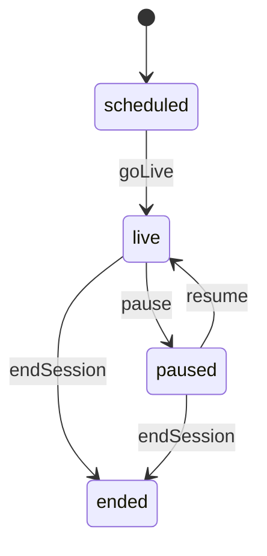
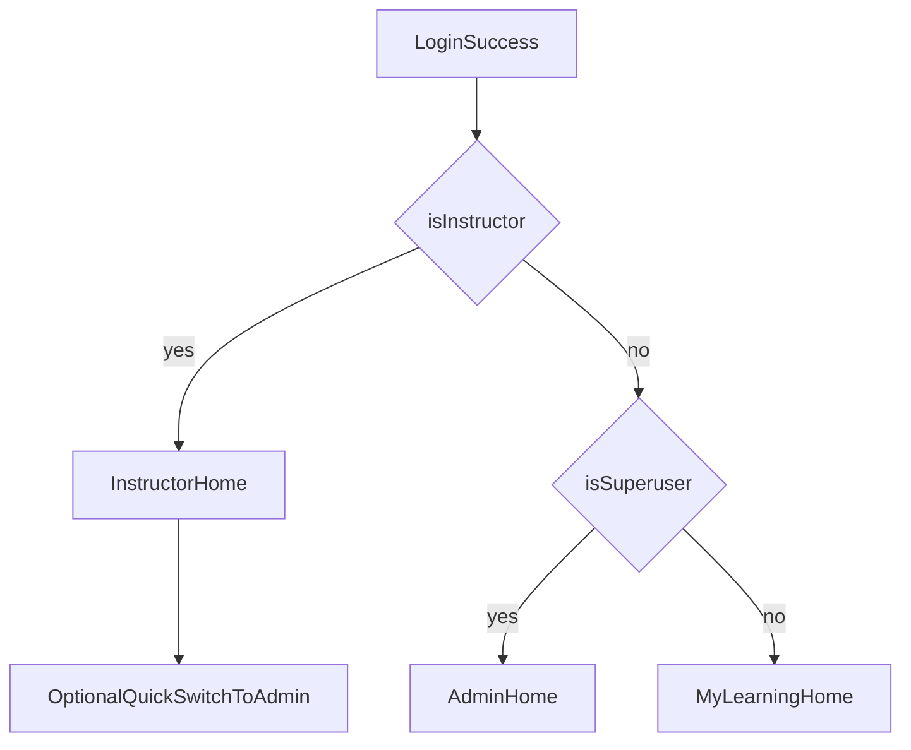
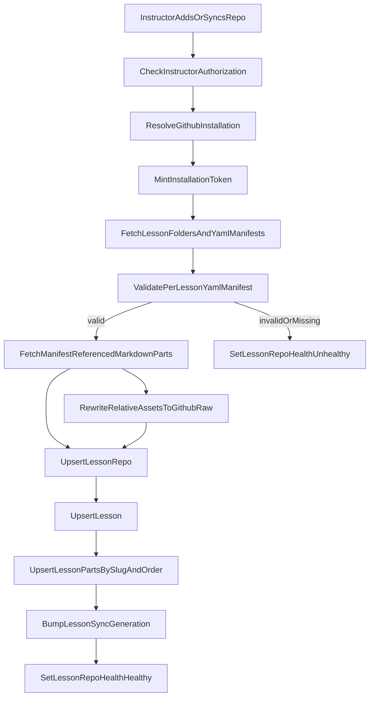
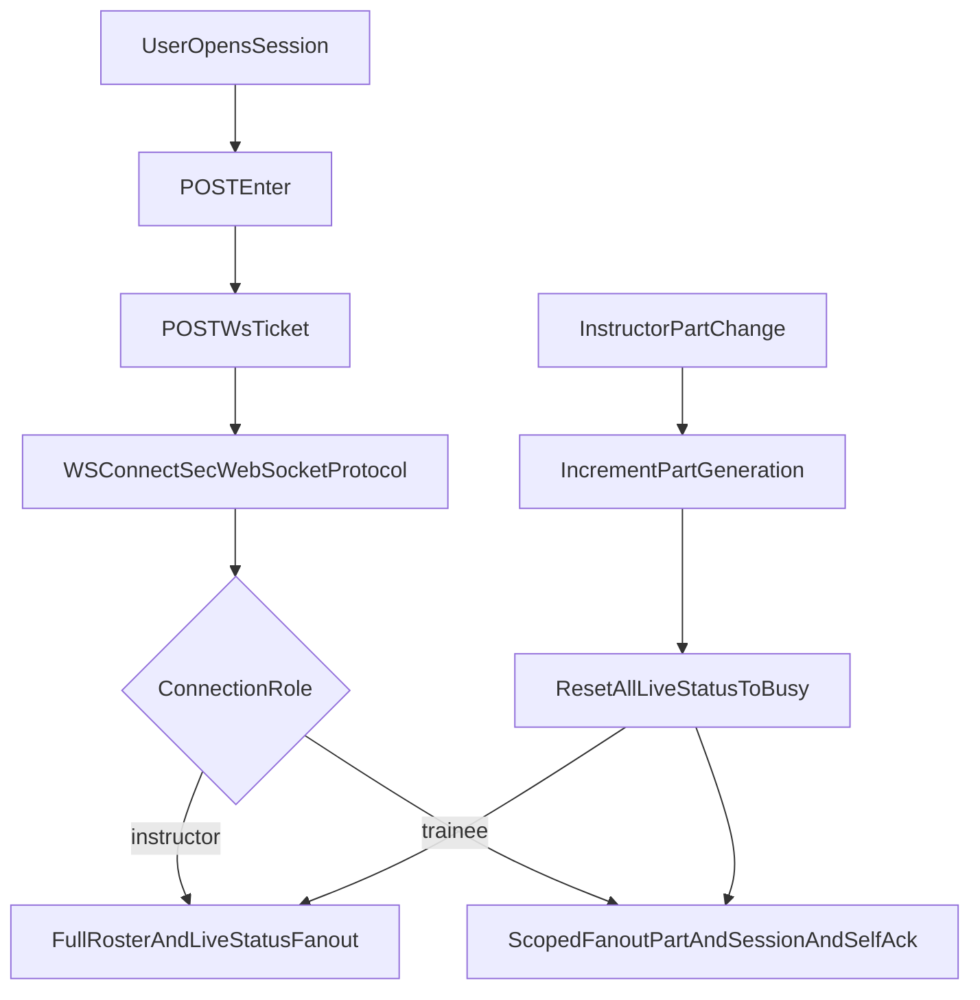
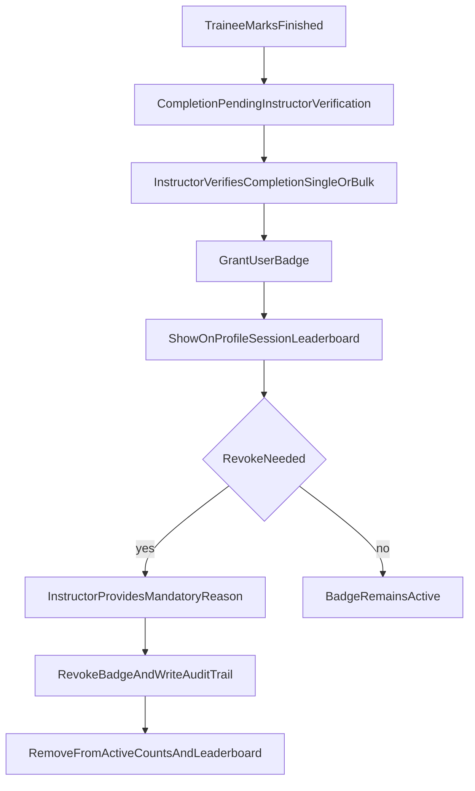
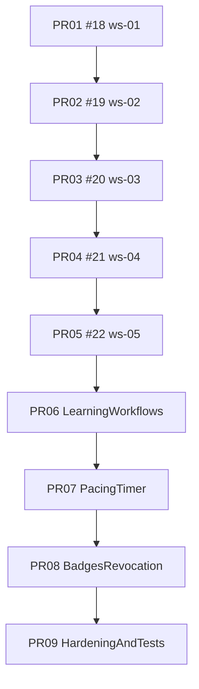

# Workshop training app — lessons + live sessions

## Out of scope (MVP)


| Area                       | Decision                                                                                                                                                                                                 |
| -------------------------- | -------------------------------------------------------------------------------------------------------------------------------------------------------------------------------------------------------- |
| Messaging                  | No chat, no DMs, no in-session threads. Only busy/done pacing signals.                                                                                                                                    |
| Guests / magic links       | No. Participants must be existing app users on the session roster.                                                                                                                                       |
| Video / screen-share       | No integrated A/V in the app; use external tools if needed.                                                                                                                                              |
| Attendance analytics       | No instructor-facing attendance/completion analytics dashboards (session or cross-session KPIs, distributions, trends).                                                                                |
| Instructor notes           | No private lesson- or session-scoped instructor note stores or APIs.                                                                                                                                     |
| Attendance exports         | No CSV/XLSX/PDF attendance export endpoints, jobs, or UI.                                                                                                                                                |
| Cohorts / teams            | No cohort/team entities, membership, session assignment, or cohort-filtered roster/analytics.                                                                                                            |
| Reminder automation        | No scheduled or “send now” in-app reminder campaigns beyond generic notifications already listed for roster/session/badge events (no per-session reminder scheduler/worker product).                      |
| Learner feedback           | No end-of-session reflection forms, feedback prompts/responses, or instructor aggregate feedback views.                                                                                                    |

> **Recoverable detail:** Cut scope is summarized again in the [appendix](#appendix--archived-scope-reference-only) (product bullets, entities, REST sketch, security, UX, delivery slices). That appendix is **not** authoritative for MVP; this table and the body of the plan are.

## Product constraints

- **Lesson source**: GitHub via a **GitHub App** (installation tokens from PEM; Contents + Metadata read as tight as practical). **Auth.js / OAuth** is **login and identity only** — not used to carry repo-scoped user tokens for sync.
- **Install prompt visibility**: Only users with **is_instructor=true** are shown GitHub App install/configure prompts. Non-instructors never see install CTAs/routes, and backend install-related endpoints enforce instructor authorization (403 for others).
- **Superuser authority**: Superusers have full instructor-equivalent control for workshop/session management APIs. GitHub App install/config prompts remain hidden unless `is_instructor=true`.
- **Session–lesson binding**: Each **WorkshopSession** uses exactly one **Lesson**. Instructor controls the **current instructional part** (index + **slug** mirror on the session).
- **Roster**: Instructor manages **WorkshopParticipant** rows (add/remove; soft-remove with **removed_at**). GitHub avatars are used across application identity surfaces when available; trainee session payloads still exclude peer identities/avatars.
- **Signals**: **live_status** = busy | done for the **current part**, shown **only to that user and to instructors** — **trainees must not see other trainees’ status**, roster, joined/finished timestamps, or presence (privacy + reduces comparison anxiety). Instructor cockpit remains the aggregate view.
- **Pause**: No participant busy/done writes; **no part navigation** (no **part_generation** bump) until **resume** or **end**.
- **Awards**: Badge grants are issued **only after instructor verification** of completion (not immediately on trainee self-finish), and surfaced across profile, session views, instructor views, and a global leaderboard. Revocation requires auditable reasons and updates active counts/leaderboard views.
- **Prework/prerequisites**: Lessons can define prerequisite tasks; trainee completion is tracked and surfaced before session start.
- **Pacing tools**: Session timer controls (per-part countdown/elapsed and overrun flags) are instructor-facing.
- **Backend delivery method**: Use `/python-tdd-with-uv` workflow across the entire backend implementation (test-first, vertical slices, `uv run pytest` loop).

## Delivery methodology (locked)

Apply `/python-tdd-with-uv` for all Python backend changes in this plan:

- **TDD cycle required:** RED (one failing test) -> GREEN (minimum code) -> REFACTOR.
- **One behavior at a time:** never implement a backend behavior without a failing test first.
- **Execution command standard:** use `uv run` for Python commands; do not rely on manual venv activation.
- **Test gate per slice:** run relevant tests after each slice (`uv run pytest ...`) before moving to the next slice.
- **Dependency/tooling standard:** manage Python deps/test tools with `uv` (`pyproject.toml` + `uv.lock` kept in sync).
- **Scope note:** this methodology is mandatory for backend Python code; frontend follows existing TS/Playwright workflow.
- **E2E quality gate:** maintain full Playwright end-to-end coverage for implemented user journeys (instructor + trainee + admin paths where applicable).

### Definition of Done per implementation slice

- A single next behavior is defined and covered by a new failing test first (RED).
- Minimal code is added to satisfy only that behavior (GREEN).
- Relevant tests are run with `uv run pytest` and pass before proceeding.
- Refactor is completed without behavior change (tests remain green).
- Security/rbac/privacy assertions for that slice are included where applicable.
- API slice changes include updated OpenAPI and regenerated TS client artifacts when contract changed.
- New or changed user flows have corresponding Playwright E2E coverage (happy path + key permission/privacy guards).
- Critical role/privacy/security behavior is validated in E2E before the slice is considered complete.
- Docs/plan check: update affected plan/testing notes if scope or constraints evolved.

## Implementation tracker (canonical — update whenever context would otherwise be lost)

This section is the **recoverable checklist** when chat history or IDE session is gone. Prefer editing here over relying on conversational memory.

**Maintenance rule:** After each meaningful backend/frontend/E2E slice, update **Last synced**, the **Active branch / PR**, toggle ✅ / 🔲 in the matrices below, and keep **[GitHub PR stack](#github-pr-stack-open--update-when-retargetedmerged)** in sync (new PR, merge, or base-branch change). For the open **tip** PR, run a **babysit loop** (see [Next actions](#next-actions-suggested-order)): `gh pr checks` / `gh pr checks --watch`, `gh run view --log-failed` on failures, fix + push on that PR’s head branch (≤3 remediation rounds per **babysitting-pr** Cursor skill — or an equivalent **Task** subagent mirroring `gh pr checks` → fix → push).

| Field | Value |
| ------ | ------ |
| **Last synced** | **2026-05-06** — **PR07 `ws-07-pacing-timer`** now includes DB-backed timer lifecycle + event-history + countdown-remaining slice: timer state persisted in `workshop_session_timer`, timer actions logged in `workshop_session_timer_event`, instructor endpoint `GET /workshop/sessions/{session_id}/timer/events`, and timer payload now includes `remaining_seconds` for countdown mode with pause/resume drift correction (resume shifts `started_at` by paused duration). Frontend instructor timer status now shows remaining seconds and recent event history. |
| **Branch tip (2026-05-06)** | **`ws-07-pacing-timer`** (new branch, PR not opened yet) contains persisted timer lifecycle + audit-event groundwork. Base for upcoming PR should be `ws-06-learning-workflows`. |
| **Active integration branch** | `ws-07-pacing-timer` → *(PR pending; expected base `ws-06-learning-workflows`)* |
| **Stack PR label** | **PR07 — PacingTimer** 🚧 in progress (DB-backed timer state + audit events first slice landed locally) |

### Pause / resume checkpoint (handoff)

Use this section when reopening the project **after intentional stop**. Do **not** rely on chat history beyond what is committed and linked here.

**Current active slice:**

| Item | Value |
| ---- | ----- |
| Branch | `ws-07-pacing-timer` |
| PR | *(not opened yet; will target `ws-06-learning-workflows`)* |
| Latest work | **PR07 slice 6 (2026-05-06):** improved timer-events instructor UX with periodic refresh while timer is running and readable event timestamps in the panel, so pacing history stays current without manual button interactions. |

**Resume in this order:**

1. `git checkout ws-07-pacing-timer`, then run backend migration/test loop (`uv run alembic upgrade head`, `uv run pytest tests/api/routes/test_workshop_sessions.py -k timer_`) while PR07 is local-only.
2. Open PR07 against `ws-06-learning-workflows`, then continue **[Next actions](#next-actions-suggested-order)** with pacing-focused API/UI slices (timer drift handling, instructor pacing controls, session-facing countdown polish).
3. Keep [GitHub PR stack](#github-pr-stack-open--update-when-retargetedmerged), **Implementation tracker / Last synced / Stop-handoff**, and this checkpoint synced whenever PR/base/branch state changes — **especially after each intentional stop or resume.**

**Open gaps (not blocking pause):**

- Local Playwright **`auth.setup`** can time out without backend/`scripts/e2e-backend-reset.sh` — CI remains source of truth for E2E until env is reproduced locally.
- **Dockerized frontend/backend** used by host Playwright (`:5173` / `:8000`): **rebuild images** after code changes (`docker compose build frontend` / `backend`); `compose` does not bind-mount app source for those services by default.
- **`.github/workflows/playwright.yml`**: intentionally not bundled with recent PR06 UI/API slices; verify `git diff` vs remote before merging any local workflow experiments.
- **Prerequisite** stack is **mostly implemented** for MVP (HTTP + workshop session UI); richer dashboard cards and timer/pacing HTTP may still be 🔲.
- **Instructor onboarding:** admins can set **`is_instructor`** via **Users** admin (API already supported); no separate instructor-only onboarding flow assumed.
- Optional: expand Playwright coverage for trainee/instructor **dashboard list** widgets (beyond current admin assertion in `dashboard-routing.spec.ts`).

### GitHub PR stack (open — update when retargeted/merged)

Canonical mapping for [`justin-p/testing`](https://github.com/justin-p/testing). **Head → base** matches the locked stack model. When a PR merges, remove or mark it merged here and add the next open PR for that slice if you split/reopen.

| Slice | Branch (head) | Pull request | Base branch |
| ----- | --------------- | ------------ | ----------- |
| PR01 | `ws-01-foundation-rbac` | [#18](https://github.com/justin-p/testing/pull/18) | `main` |
| PR02 | `ws-02-github-sync-manifest` | [#19](https://github.com/justin-p/testing/pull/19) | `ws-01-foundation-rbac` |
| PR03 | `ws-03-session-core` | [#20](https://github.com/justin-p/testing/pull/20) | `ws-02-github-sync-manifest` |
| PR04 | `ws-04-realtime-privacy` | [#21](https://github.com/justin-p/testing/pull/21) | `ws-03-session-core` |
| PR05 | `ws-05-dashboard-nav` | [#22](https://github.com/justin-p/testing/pull/22) | `ws-04-realtime-privacy` |
| PR06 | `ws-06-learning-workflows` | [#23](https://github.com/justin-p/testing/pull/23) | `ws-05-dashboard-nav` |
| PR07 | `ws-07-pacing-timer` | *not opened yet* | `ws-06-learning-workflows` |
| PR08–PR09 | `ws-08-*` … `ws-09-*` | *not opened yet* | *(next PR targets prior branch when created)* |

### Backend code anchors (workshop delivery slices)

| Area | Primary paths |
| ---- | ------------- |
| HTTP + WebSocket routes | [`backend/app/api/routes/workshop_sessions.py`](backend/app/api/routes/workshop_sessions.py) |
| Prerequisites HTTP routes (PR06) | [`backend/app/api/routes/workshop_lessons.py`](backend/app/api/routes/workshop_lessons.py) |
| In-memory fan-out hub | [`backend/app/services/workshop_realtime.py`](backend/app/services/workshop_realtime.py) |
| API tests | [`backend/tests/api/routes/test_workshop_sessions.py`](backend/tests/api/routes/test_workshop_sessions.py) |
| Prerequisites API tests (PR06) | [`backend/tests/api/routes/test_workshop_lessons.py`](backend/tests/api/routes/test_workshop_lessons.py) |
| Hub unit tests | [`backend/tests/services/test_workshop_realtime.py`](backend/tests/services/test_workshop_realtime.py) |
| Local E2E session bootstrap (`ENVIRONMENT=local` only) | [`backend/app/api/routes/private.py`](backend/app/api/routes/private.py) — `bootstrap_e2e_workshop_live_session` (+ `with_incomplete_required_prerequisite`, distinct-trainee vs `FIRST_SUPERUSER` instructor split); tests in [`backend/tests/api/routes/test_private.py`](backend/tests/api/routes/test_private.py) |
| Trainee workshop UI (enter + ws-ticket + WebSocket) | [`frontend/src/routes/_layout/workshop.$sessionId.tsx`](frontend/src/routes/_layout/workshop.$sessionId.tsx) |
| Workshop Playwright | [`frontend/tests/workshop.spec.ts`](frontend/tests/workshop.spec.ts) |
| Dashboard landing + routing | [`frontend/src/lib/dashboardLanding.ts`](frontend/src/lib/dashboardLanding.ts), stub rails [`frontend/src/components/dashboard/DashboardStubRails.tsx`](frontend/src/components/dashboard/DashboardStubRails.tsx), routes under [`frontend/src/routes/_layout/dashboard/`](frontend/src/routes/_layout/dashboard/), [`frontend/src/routes/_layout/workshops.tsx`](frontend/src/routes/_layout/workshops.tsx), sidebar [`frontend/src/components/Sidebar/AppSidebar.tsx`](frontend/src/components/Sidebar/AppSidebar.tsx), OAuth landing [`frontend/src/routes/auth.callback.tsx`](frontend/src/routes/auth.callback.tsx) |
| Admin users (`is_instructor`) | [`frontend/src/components/Admin/AddUser.tsx`](frontend/src/components/Admin/AddUser.tsx), [`frontend/src/components/Admin/EditUser.tsx`](frontend/src/components/Admin/EditUser.tsx), [`frontend/src/components/Admin/columns.tsx`](frontend/src/components/Admin/columns.tsx); E2E [`frontend/tests/admin.spec.ts`](frontend/tests/admin.spec.ts) |
| Playwright harness (backend reset / env) | [`scripts/e2e-backend-reset.sh`](scripts/e2e-backend-reset.sh), [`frontend/playwright.global-setup.ts`](frontend/playwright.global-setup.ts), [`frontend/playwright.config.ts`](frontend/playwright.config.ts) |

### Workshop HTTP vs realtime — delivery gap (audit)

**Canonical router:** [`backend/app/api/routes/workshop_sessions.py`](backend/app/api/routes/workshop_sessions.py).

| Surface | Implemented today | Still 🔲 vs **REST sketch** (below, *REST sketch under /api/v1/*) |
| ------- | ----------------- | ---------------------------------------------------------------- |
| **HTTP** | `POST …/sessions/{id}/enter`, `/start`, `/end`, `/ws-ticket`; **`GET …/sessions/`** list (`WorkshopSessionsPublic`); **`GET …/sessions/{id}`** scoped detail (**`WorkshopSessionPublicParticipant`** \| **`WorkshopSessionPublicInstructor`**); **`POST …/sessions/{id}/members`** role upsert; **`DELETE …/sessions/{id}/participants/{user_id}`** soft remove; **`PATCH …/sessions/{id}/participants/{user_id}`** instructor overrides (`live_status`/`joined_at`/`finished_at`); **`PATCH …/sessions/{id}`** — optional **`status`** (controlled transitions + realtime fanout on change), **`instructor_seat`** role updates, **`primary_instructor_user_id`** handoff (lead/co normalization), **`remove_instructor_user_id`** soft-remove with **409** when that would orphan a non-ended session; empty **422 `patch_requires_update`**; unknown seat **404**. **Lesson prerequisites** (`/workshop/lessons/{id}/prerequisites…`) ✅ for MVP slices. | Part-timer HTTP sketch (see below) still 🔲 |
| **WebSocket** | `/{id}/ws` — `part.advance`, `session.pause` / `session.resume`, `participant.live_status`, … | Redis / multi-process hub (explicitly deferred) |

**Remaining vs dashboard/product polish:** session list/detail + roster + session `PATCH` are ✅; prerequisites + workshop pre-work UI (**banner, aggregates, inline complete**) are ✅; **host Playwright** workshop file stabilized (serial + bootstrap). Dashboard cards + broader pre-work/dashboard Playwright may still be 🔲.

**Suggested PR06 vertical slices (backend `/python-tdd-with-uv` first):**

1. **Prerequisite read enhancements** — per-user completion status in lesson prerequisite reads (self vs instructor-scoped views).
2. **Prerequisite mutation breadth** — ✅ PATCH/update/delete prerequisite definitions with instructor/superuser guards.
3. **Prework surfaces** — ✅ workshop session page + aggregates/gaps APIs + **inline mark-complete** + Playwright coverage (`workshop.spec.ts` serial block); optional: harder gating, dashboard list Playwright.

Gate: regenerate **OpenAPI** + **`frontend/src/client`** on every new HTTP route.

### PR06 (`ws-06-learning-workflows`) — current slice ([#23](https://github.com/justin-p/testing/pull/23))

Forked from **`ws-05-dashboard-nav`** and tracked on [#23](https://github.com/justin-p/testing/pull/23). Aligns with [Branch/PR chain](#branchpr-chain) item 6 and roadmap id **`prework-prerequisites`**. **HTTP gap slices (1)-(2)** (list + session detail **`GET`s**) remain on **`ws-05-dashboard-nav`**; PR06 now advances prerequisites/prework APIs and downstream UX.

| Planned capability | Notes |
| ------------------ | ----- |
| **Session list + detail GETs** | List + **`GET …/{id}`** ✅ on **`ws-05-dashboard-nav`** per [delivery gap audit](#workshop-http-vs-realtime--delivery-gap-audit); prerequisites + richer dashboard cards remain PR06. |
| **Prerequisite / prework** data model | ✅ Landed: `LessonPrerequisite`, `UserPrerequisiteCompletion` (+ migration `4f6e7d8c9a01`); HTTP: create/list/patch/delete/complete, **`/me`**, **`/gaps`**, **`/aggregates`**; admin can grant **`is_instructor`** for roster/instructor UX. |
| Trainee UX | ✅ Session page shows **required** incomplete pre-work banner (**`/prerequisites/me`**) + **Mark complete** per item; participant enter/ws-ticket now hard-gated (403) until required pre-work is complete, with dedicated gated UI state in workshop view. |
| Instructor visibility | 🟨 Session page shows roster **aggregates** + gaps headline (same `session_id`); workshops dashboard now includes blocked counts, blocked-only filter, and blocked-session drilldown links. Deeper roster analytics remain optional. |
| Tests | **`/python-tdd-with-uv`** backend + **`test_private`** E2E bootstrap cases; **Playwright** [`workshop.spec.ts`](frontend/tests/workshop.spec.ts) (serial workshop `describe`, pre-work + fan-out + live flows). |
| Stack hygiene | ✅ PR open: [#23](https://github.com/justin-p/testing/pull/23) (base `ws-05-dashboard-nav`); keep stack table + dependency graph in sync on retarget/merge. |

### Stacked PRs — coarse roll-up

Use ✅ when the slice is merged to **`main`** (or materially complete on its integration branch if pre-merge). Use 🟨 for partial. **GitHub:** see [PR stack table](#github-pr-stack-open--update-when-retargetedmerged) for current numbers and bases.

| # | Branch (plan name) | GitHub PR | Status | Notes |
| - | ------------------ | --------- | ------ | ----- |
| 01 | `ws-01-foundation-rbac` | [#18](https://github.com/justin-p/testing/pull/18) | 🟨 | `User.is_instructor` + migrations; confirm against `main` |
| 02 | `ws-02-github-sync-manifest` | [#19](https://github.com/justin-p/testing/pull/19) | 🔲 | GitHub App + manifest sync not tracked here yet |
| 03 | `ws-03-session-core` | [#20](https://github.com/justin-p/testing/pull/20) | 🟨 | Tables + enter semantics overlap with current branch; roster APIs may still be incomplete |
| 04 | `ws-04-realtime-privacy` | [#21](https://github.com/justin-p/testing/pull/21) | 🟨 | Bounded realtime/privacy + `/workshop` E2E ✅ |
| 05 | `ws-05-dashboard-nav` | [#22](https://github.com/justin-p/testing/pull/22) | 🟨 | PR05 scope complete on branch (dashboard/nav + list/detail widgets + roster member add/remove/patch APIs); stacked merge + CI completion pending. |
| 06 | `ws-06-learning-workflows` | [#23](https://github.com/justin-p/testing/pull/23) | 🟨 | Prerequisites + **`/me` `/gaps` `/aggregates`**, pre-work UI + **mark complete**, **distinct-trainee E2E bootstrap**, **Playwright workshop suite** serial/stability (**`1633910`**); **admin `is_instructor`**; merges/dashboard polish still 🔲 |
| 07–09 | `ws-07-*` … `ws-09-*` | — | 🔲 | Branches/PRs in [Branch/PR chain](#branchpr-chain); open PRs when slicing |

### Next actions (suggested order)

1. **Confirm tip CI (PR06):** `gh pr checks 23` — if anything regresses, run **babysitting-pr** / Task fix loop on `ws-06-learning-workflows`.
2. **Continue PR06 verticals:** dashboard **tiles** / list polish, **stricter pre-work gating** if product wants it, remaining REST sketch gaps (e.g. timer HTTP) — admin can already grant **instructor** from **Users**; **mark complete** is already in session UI (**`1633910`**).
3. **Stack hygiene:** keep [#23](https://github.com/justin-p/testing/pull/23) rebased/retargeted as upstream stack PRs merge; update [GitHub PR stack](#github-pr-stack-open--update-when-retargetedmerged) after each shift.
4. **Cross-slice gate:** regenerate OpenAPI + `frontend/src/client` on each API contract change; keep `/python-tdd-with-uv` discipline and focused regression runs.
5. **E2E discipline:** `scripts/e2e-backend-reset.sh` before full local Playwright when diagnosing drift; Sonner-aware toasts ([playwright-local-gate](.cursor/skills/playwright-local-gate/SKILL.md)).

**When resuming from pause:** step through [Pause / resume checkpoint](#pause--resume-checkpoint-handoff) first.

### YAML todos above

The YAML `todos` list in the frontmatter is a **high-level roadmap** for Cursor/project tooling; it is not automatically synchronized with commits. **`Implementation tracker`** is the authoritative narrative for shipped vs remaining behavior.

## Locked decisions


| Topic                   | Decision                                                                                                                                                                                                                                                                                                                                |
| ----------------------- | --------------------------------------------------------------------------------------------------------------------------------------------------------------------------------------------------------------------------------------------------------------------------------------------------------------------------------------- |
| Roster vs invite        | Single **WorkshopParticipant** table (**no WorkshopInvite**); **invited_at** when rostered. Instructor-flagged users may also be added here when chosen as trainees.                                                                                                                                                                    |
| joined_at               | **POST …/sessions/{id}/enter** when status is **live** or **paused** only; **not** when **scheduled**. Idempotent. WebSocket does not set joined_at.                                                                                                                                                                                    |
| Session end             | Moves session to **ended** only; **does not** bulk-set **finished_at**.                                                                                                                                                                                                                                                                 |
| Part change             | Bump **part_generation**, then set all participants **live_status** to **busy.**                                                                                                                                                                                                                                                        |
| Lesson content          | Lessons are synced from a **required per-lesson YAML manifest** (manifest is source of truth for part order). On live-session drift, instructor gets a prompt (default selection: **Switch to latest**). Invalid/missing manifest is a hard sync failure and sets repo unhealthy.                                                       |
| Part while paused       | **Frozen** — reject instructor **part_changed** (HTTP **422/409**); disable Prev/Next in UI.                                                                                                                                                                                                                                            |
| Multi-instructor model  | Session uses **SessionInstructor** assignments (one primary optional + zero-or-more co-instructors). At least one active instructor required while status is not ended. Removing/replacing instructors is **blocked (409)** if operation would leave zero active instructors.                                                           |
| Member role exclusivity | A user may be assigned as **either instructor or trainee** per session — never both simultaneously. If role is changed, remove the conflicting assignment in the same transaction.                                                                                                                                                      |
| Repo / entitlement loss | Active sessions keep reading **cached LessonPart** until **ended**; **LessonRepo.health = unhealthy** + banner; block **new** sessions on that repo.                                                                                                                                                                                    |
| Account delete          | **Anonymize** workshop rows: null **user_id**, set **anonymization_ref**, **anonymized_at**; add **UNIQUE (session_id, anonymization_ref)** (or equivalent) because **UNIQUE (session_id, user_id)** is degenerate with multiple NULLs — see Privacy section.                                                                           |
| Trainee peer visibility | **Trainees never see other participants’ identity, busy/done, joined_at, finished_at**, or roster. **Lesson content + session state badge + own controls only.** Enforce in **API response shape** and **WebSocket fanout**, not merely hidden UI.                                                                                      |
| Avatar scope across app | Use GitHub profile image on **all identity surfaces** (sidebar/user menu, settings/profile, admin user tables, instructor rosters, session cards) when linked. Fallback to initials/generic avatar when missing. **Trainee-facing session payloads still omit peers**; trainees may see **only their own** avatar in personal contexts. |
| WS handshake            | WebSocket auth uses **Sec-WebSocket-Protocol** carrying ws-ticket (no first-message auth mode).                                                                                                                                                                                                                                         |
| Member role conflict    | Add-member role conflicts are resolved by **always replace** semantics atomically (no manual conflict endpoint required).                                                                                                                                                                                                               |
| OAuth/App setup         | **Separate OAuth App (login)** + **separate GitHub App (repo sync)** for MVP.                                                                                                                                                                                                                                                           |
| Entitlement scope       | **Instructor-bound** by default; instructors can invite other instructors explicitly.                                                                                                                                                                                                                                                   |
| Realtime scaling path   | **Stay single-process** hub in PR04; defer Redis/multi-process fan-out until measured scale/concurrency requires it.                                                                                                                                                                                                                   |
| Avatar refresh          | Refresh stored avatar_url on each successful GitHub sign-in/link event (no periodic background refresh).                                                                                                                                                                                                                                |
| Avatar unlink           | On GitHub unlink, clear stored avatar_url and fall back to initials/default avatar.                                                                                                                                                                                                                                                     |
| API contract gate       | OpenAPI + TS client regeneration is **required on every API contract change**.                                                                                                                                                                                                                                                          |
| CI branch gate          | Critical workflows (backend tests, docker-compose tests, Playwright, staging deploy checks) must run on default branch **main** and PRs; no `master`-only gaps.                                                                                                                                                                         |
| Webhook replay safety   | Webhook processing requires signature verification + replay-window checks + delivery idempotency before side effects.                                                                                                                                                                                                                   |
| Endpoint throttling     | Apply route-level throttling for auth bridge, login, and webhook endpoints.                                                                                                                                                                                                                                                             |


## Template code anchors


| Layer         | Paths                                                                                                                                                                                                     |
| ------------- | --------------------------------------------------------------------------------------------------------------------------------------------------------------------------------------------------------- |
| Backend       | [backend/app/models.py](backend/app/models.py), extend API next to [backend/app/api/routes/oauth.py](backend/app/api/routes/oauth.py)                                                                     |
| Frontend      | Replace/supplant [frontend/src/routes/_layout/items.tsx](frontend/src/routes/_layout/items.tsx); sidebar [frontend/src/components/Sidebar/AppSidebar.tsx](frontend/src/components/Sidebar/AppSidebar.tsx) |
| Auth.js       | [authjs-service/auth.ts](authjs-service/auth.ts), [authjs-service/app/api/bridge/route.ts](authjs-service/app/api/bridge/route.ts) (login path unchanged)                                                 |
| Bridge crypto | [backend/app/core/security.py](backend/app/core/security.py)                                                                                                                                              |


## GitHub App

- Env: **GITHUB_APP_ID**, **GITHUB_PRIVATE_KEY** (PEM), **GITHUB_WEBHOOK_SECRET**, public HTTPS webhook URL.
- **Webhooks**: Verify **X-Hub-Signature-256**; rate-limit the endpoint; optionally dedupe using **X-GitHub-Delivery** when present.
- **Entitlement MVP**: **instructor-bound** repository access by default; repos must be tied to an installation the assigning instructor controls. Other instructors may be explicitly invited to a session.
- **OAuth registration (locked)**: Use **separate OAuth App** for login + **separate GitHub App** for repository sync in MVP.
- **Lesson structure contract (locked)**: each lesson folder must include a YAML manifest (for example `lesson.manifest.yaml`) that explicitly defines lesson parts and ordering; no implicit filename ordering in MVP.
- **Manifest failure policy (locked)**: missing/invalid manifest blocks sync updates and marks `LessonRepo.health=unhealthy` (hard fail, no partial sync).

## Lesson manifest format (locked)

Each lesson folder must contain `lesson.manifest.yaml`.

### Required schema

- `version` (integer): manifest schema version; MVP requires `1`.
- `lesson` (object):
  - `slug` (string, kebab-case, unique per repo)
  - `title` (string)
- `parts` (array, min 1):
  - `slug` (string, kebab-case, unique within lesson)
  - `title` (string)
  - `path` (string, relative markdown file path inside the lesson folder, e.g. `01-intro.md`)

### Optional fields

- `lesson.summary` (string)
- `part.estimated_minutes` (integer >= 0)
- `part.objectives` (array of strings)

### Validation rules

- Manifest file must parse as valid YAML.
- Unknown keys are rejected at **all levels** in MVP (top-level, `lesson.`*, and each `parts[*].`*).
- Every `parts[*].path` must exist and be a markdown file (`.md` only in MVP).
- Part order is exactly the array order in `parts`; no filename sorting fallback.
- Duplicate `lesson.slug` in the same repo or duplicate `parts[*].slug` in the same lesson is invalid.
- Path safety is enforced: reject absolute paths, reject any `..` traversal, and reject symlink-resolved targets that escape the lesson folder root.
- Any validation error causes hard sync failure for that repo update and sets repo health to unhealthy.

### Example

```yaml
version: 1
lesson:
  slug: fastapi-workshop-basics
  title: FastAPI Workshop Basics
  summary: Intro workshop for API fundamentals.
parts:
  - slug: setup-and-prereqs
    title: Setup and Prerequisites
    path: 01-setup.md
    estimated_minutes: 10
    objectives:
      - Install dependencies
      - Run the project locally
  - slug: first-endpoint
    title: Build Your First Endpoint
    path: 02-first-endpoint.md
    estimated_minutes: 20
```

### JSON Schema (draft 2020-12)

```json
{
  "$schema": "https://json-schema.org/draft/2020-12/schema",
  "$id": "https://example.com/schemas/lesson-manifest.schema.json",
  "title": "LessonManifestV1",
  "type": "object",
  "additionalProperties": false,
  "required": ["version", "lesson", "parts"],
  "properties": {
    "version": {
      "type": "integer",
      "const": 1
    },
    "lesson": {
      "type": "object",
      "additionalProperties": false,
      "required": ["slug", "title"],
      "properties": {
        "slug": {
          "type": "string",
          "pattern": "^[a-z0-9]+(?:-[a-z0-9]+)*$",
          "minLength": 1
        },
        "title": {
          "type": "string",
          "minLength": 1
        },
        "summary": {
          "type": "string"
        }
      }
    },
    "parts": {
      "type": "array",
      "minItems": 1,
      "items": {
        "type": "object",
        "additionalProperties": false,
        "required": ["slug", "title", "path"],
        "properties": {
          "slug": {
            "type": "string",
            "pattern": "^[a-z0-9]+(?:-[a-z0-9]+)*$",
            "minLength": 1
          },
          "title": {
            "type": "string",
            "minLength": 1
          },
          "path": {
            "type": "string",
            "pattern": "^(?!/)(?!.*\\.\\.)(?!.*\\\\).+\\.md$"
          },
          "estimated_minutes": {
            "type": "integer",
            "minimum": 0
          },
          "objectives": {
            "type": "array",
            "items": {
              "type": "string",
              "minLength": 1
            }
          }
        }
      }
    }
  }
}
```

Implementation note: JSON Schema cannot reliably validate symlink-escape checks; enforce symlink root containment in backend filesystem validation after schema validation.

## Session lifecycle




- **Scheduled**: **POST /enter** rejected. Optional backlog: read-only lesson title on lobby (no joined_at).
- **Live / paused**: **enter** allowed; **paused** blocks participant **live_status** updates and blocks **part_changed**.

## Flow diagrams

### Post-login dashboard routing




### GitHub App sync flow




### Live session event/privacy flow




### Badge grant/revoke lifecycle




## Data model (illustrative)


| Entity                                      | Notes                                                                                                                                                                                                                                                                                                                            |
| ------------------------------------------- | -------------------------------------------------------------------------------------------------------------------------------------------------------------------------------------------------------------------------------------------------------------------------------------------------------------------------------- |
| GithubInstallation (+ optional repo mirror) | Tracks installations and entitled **owner/repo** list.                                                                                                                                                                                                                                                                           |
| LessonRepo                                  | installation_id, full_name, default_branch, sync timestamps, **health** (healthy                                                                                                                                                                                                                                                 |
| Lesson                                      | FK to LessonRepo; optional **lesson_sync_generation** after sync.                                                                                                                                                                                                                                                                |
| LessonPart                                  | lesson_id, ordering, path, **slug** (unique per lesson), title, body_md.                                                                                                                                                                                                                                                         |
| LessonManifest                              | lesson_id, manifest_path, manifest_sha, manifest_format=yaml, parsed_at, validity_state, error_message (nullable).                                                                                                                                                                                                               |
| WorkshopSession                             | lesson_id, status, current_part_index, current_part_slug, **part_generation**, timestamps. (Primary instructor id optional convenience pointer if desired.)                                                                                                                                                                      |
| WorkshopParticipant                         | session_id, user_id (nullable after anonymize); invited_at, joined_at, finished_at, live_status, removed_at; anonymization_ref, anonymized_at; instructor audit columns (adjusted_*, reason).                                                                                                                                    |
| SessionInstructor                           | session_id, user_id (must be **is_instructor=true**), role enum (primary/co_instructor optional), assigned_at, removed_at; unique active (session_id,user_id).                                                                                                                                                                   |
| LessonPrerequisite                          | lesson_id, type (task/link/check), title, details/url, ordering, required_flag.                                                                                                                                                                                                                                                  |
| UserPrerequisiteCompletion                  | user_id, lesson_id, prerequisite_id, completed_at, source (self/instructor).                                                                                                                                                                                                                                                     |
| SessionTimerEvent                           | session_id, part_slug/index, timer_mode (countdown/countup), started_at, paused_at, ended_at, target_seconds.                                                                                                                                                                                                                    |
| User (extend template)                      | Nullable `**avatar_url`** (or `**github_avatar_url`**) — set/updated when GitHub is linked (from GitHub profile `**avatar_url`** at link/approval or periodic refresh on successful GitHub sign-in). Join instructor roster DTO with `**full_name**`, `**email**` (optional policy), `**github_login**` from `**OAuthAccount**`. |
| OAuthAccount (template)                     | Already links **GitHub**; ensure `**avatar_url`** is captured if not present today (may require extending model + bridge payload from Auth.js **profile.image** at link time).                                                                                                                                                   |


**Roster read model (instructor):** `ParticipantRosterRow` = participant session fields + `**avatar_url`**, `**display_name`**, `**github_login**` (nullable). **Anonymized** rows: omit photo or use neutral placeholder.

**Sync**: Single-flight (advisory lock or row lock) around manifest validation + fetch + upsert of **LessonPart**; bump generation so clients can warn on mid-session content change.

## Realtime

- **ws-ticket**: **POST …/ws-ticket** returns a **short-lived** token; do **not** put long-lived JWT in query strings. Use **Sec-WebSocket-Protocol** (locked); first-message auth mode is out of scope.
- **Role-scoped fanout (privacy)**:
  - **Instructor-assigned users (and superuser observers if any)** connection: server may push **full roster snapshots** / per-participant **live_status** deltas for UI cockpit (snapshots may include avatar_url per row — instructor-only channel).
  - **Trainee** connection: payloads **restricted to** session-level `**part_changed`** (slug/index/generation/markdown-or-ref), `**session_status`** (live/paused/ended), and **ack/echo only for their own user_id** (e.g. their **live_status** confirm). **Never** embed other participants’ IDs, names, or statuses. If a single WS room is reused, enforce filter at broadcast; preferable **two channels** (`role=instructor|trainee`) with different message schemas typed in OpenAPI/TS.
- **part_generation**: Increment **before** broadcasting **part_changed** to **all** subscribed clients (**trainees need part sync without peer data**). Trainees send last-known generation + **self-only live_status** updates when live.
- **Pause matrix**: Trainee writers for **live_status** off; instructor **part_changed** off; roster PATCH and progress audit PATCH still allowed; resume/end allowed.

## Persistence rules


| Field                                 | Writer                                                                     |
| ------------------------------------- | -------------------------------------------------------------------------- |
| joined_at                             | First successful **POST …/enter** only.                                    |
| live_status, finished_at (self-serve) | Only when session is **live**, not **paused** (WS or REST per API design). |
| Instructor overrides                  | **PATCH** participant with audit columns.                                  |


## REST sketch (under /api/v1/…)


| Verb   | Route                                           | Notes                                                                                                                                                                                         |
| ------ | ----------------------------------------------- | --------------------------------------------------------------------------------------------------------------------------------------------------------------------------------------------- |
| POST   | …/workshop/sessions/{id}/enter                  | Idempotent joined_at; **403** if scheduled.                                                                                                                                                   |
| POST   | …/workshop/sessions/{id}/ws-ticket              | Ephemeral WS credential.                                                                                                                                                                      |
| POST   | …/workshop/sessions/{id}/members                | Add member with role selection: trainee OR instructor (mutually exclusive). Instructor role requires is_instructor.                                                                           |
| PATCH  | …/workshop/sessions/{id}                        | State transitions; instructor assignment updates (primary/co-instructor) with is_instructor checks. **409** if change leaves no active instructor on non-ended session.                       |
| DELETE | …/workshop/sessions/{id}/participants/{user_id} | Soft **removed_at**.                                                                                                                                                                          |
| PATCH  | …/workshop/sessions/{id}/participants/{user_id} | Instructor audit overrides.                                                                                                                                                                   |
| GET    | …/workshop/sessions/{id} (and related)          | Trainee-visible fields: **scoped DTO** — no roster array; no peer stats. Instructor GET returns full roster + aggregates **including `avatar_url` (and display fields) per participant row**. |


Routes are illustrative; align names with your OpenAPI layout. **Separate response models** (`SessionPublicParticipant` vs `SessionPublicInstructor`) recommended.

Additional endpoint groups to include:

- `GET/POST/PATCH /workshop/lessons/{id}/prerequisites` and `POST /workshop/lessons/{id}/prerequisites/{pid}/complete`
- `POST /workshop/sessions/{id}/timer/start|pause|resume|stop` + `GET /workshop/sessions/{id}/timer`

Role guardrail (consistent with Locked decisions): add-member endpoint applies **always replace** semantics for opposite-role conflicts in a single transaction; dual-role state is forbidden.

Last-instructor guardrail: for sessions with status != ended, instructor remove/demote/handoff requests that would result in **zero active SessionInstructor rows** return **409** with remediation hint (assign another instructor first).

**Avatar loading:** Prefer **HTTPS `avatars.githubusercontent.com`** URLs stored at link/sign-in refresh time. Apply same avatar source helper across all identity UIs (sidebar profile button, settings/profile header, admin users table, instructor roster rows, session cards). Optional hardening: proxy images through FastAPI (cache + strip cookies) if CSP/privacy requires; MVP may use `referrerPolicy="no-referrer"` and framework remote host allowlist for GitHub avatar domains.

## Markdown

Render GFM → HTML through a **sanitize** allowlist (**bleach**, **nh3**, or equivalent) before the SPA.
Rewrite relative markdown asset links/images to `raw.githubusercontent.com` URLs at sync/read-model build time for stable rendering.

## Notifications (MVP)

- Notification model is **in-app only** (no email for MVP).
- Delivery surfaces: **toast + notification center**.
- Initial events: added-to-session, session-started, session-paused/resumed, badge-granted, badge-revoked.

## Migration and rollout safety

- **Pre-migration checks:** capture baseline row counts, confirm backup availability, and document rollback posture for each migration.
- **Post-migration checks:** verify constraints/indexes, run integrity checks, and validate seed reads for repos/lessons/sessions.
- **Backfill requirement:** any new non-null/derived field must include a backfill query/job plus a verification query.
- **Destructive change policy:** table/column drops require deprecation staging unless explicitly approved as emergency work.

## API and operational discipline

- **Error envelope:** new workshop endpoints should return a machine-readable error shape (`code`, `message`, optional `details`).
- **Idempotency contracts:** explicitly define idempotency behavior for `enter`, webhook sync handlers, and badge grant/revoke actions.
- **Observability minimum:** add structured logs with request/session IDs and metrics for sync failures, ws connect failures, and badge/revocation actions.
- **Alertability:** define thresholds for repeated webhook verification failures and sustained `LessonRepo.health=unhealthy`.

## Security hardening for added workshop features

- **Field-level RBAC:** enforce instructor/superuser-only access for timer/pacing controls, prerequisite definition mutations, badge grant/revoke actions, and any instructor-only roster/completion surfaces.
- **Scoped data exposure:** trainees can read only their own prerequisite completions; never return peer identity or roster fields in trainee DTOs.
- **Timer integrity:** timer state is server-authoritative; reject client-supplied backdated timestamps and enforce legal state transitions.
- **Timer auditing:** immutable audit trail for timer start/pause/resume/stop with actor and timestamp.
- **Badge actions:** grant only after instructor verification; revoke requires persisted reason + actor/timestamp; leaderboard/profile DTOs exclude revoked grants from active counts per product rules.

## Privacy (user delete)

**Anonymize** linked **WorkshopParticipant** rows (null **user_id**, stable **anonymization_ref** per row, timestamp). Document in privacy copy. Ensure DB constraints allow one anonymized row per original seat (partial unique indexes as needed). Clean up Auth.js linkage per your account-deletion policy.

## Post-login landing dashboards

This section defines exactly where users land **immediately after login**.

### Landing rules (locked)

- **Instructor (`is_instructor=true`)**: land on **Instructor Home** (`/dashboard/instructor`).
- **Trainee-only user**: land on **My Learning Home** (`/dashboard/trainee`).
- **Superuser**:
  - If also instructor, default to **Instructor Home** with quick-switch to admin view.
  - If not instructor, land on **Admin Home** (`/dashboard/admin`) with links to workshop/instructor management.

Persist user's last dashboard tab (optional quality-of-life), but first-login defaults follow the rules above.

### Dashboard pages to include


| Dashboard            | Audience    | Purpose                                                                                                                                                           |
| -------------------- | ----------- | ----------------------------------------------------------------------------------------------------------------------------------------------------------------- |
| **Instructor Home**  | instructors | Today's sessions, active/paused sessions, repo health, pending completion verifications, badge/revocation actions, quick links to lesson repos and sessions |
| **My Learning Home** | trainees    | sessions needing action (live/starting soon), recent completions, earned badges, personal progress summary                                                        |
| **Admin Home**       | superusers  | user/instructor management, system health summaries, policy/role oversight, links into workshop data                                                              |


### Minimal cards for each landing dashboard

- **Instructor Home cards**
  - Live now / paused now sessions
  - Sessions starting today
  - Pending completion verifications
  - Repo health warnings (unhealthy LessonRepo)
  - Badge actions queue (recent grants/revokes)
- **My Learning Home cards**
  - Continue session (if any live/paused where user is trainee)
  - Upcoming sessions where rostered
  - My badges (recently earned)
  - Personal completion trend (no peer metrics)
- **Admin Home cards**
  - Users pending role changes
  - Instructors and active sessions summary
  - Error/warning rollup (sync failures, unhealthy repos)

### Privacy constraints on landing dashboards

- Trainee dashboard must never include peer trainee identities, statuses, counts tied to named peers, or instructor-only roster controls.
- Instructor dashboard may include roster summaries for sessions they are assigned to.
- Admin dashboard may include aggregates and management views according to superuser permissions.

## Dashboard content matrix

The app should present role-specific dashboard content that matches all features in this plan.


| Surface                      | Instructor dashboard                                                                                                                                                            | Trainee dashboard                                                                             |
| ---------------------------- | ------------------------------------------------------------------------------------------------------------------------------------------------------------------------------- | --------------------------------------------------------------------------------------------- |
| **Primary nav**              | Instructor Home, Workshops hub, Lesson repos, Sessions, Badge management/revocations; includes trainee routes only when instructor is separately rostered as trainee | My Learning Home, My sessions, My badges/profile progress (plus standard account settings)    |
| **Session list cards/table** | lesson, status, invited/joined/finished counts, health warnings, open/manage actions                                                                                            | only sessions where user is participant/instructor, personal status; no peer metrics          |
| **Session detail**           | full roster, avatars, busy/done per trainee, joined/finished timestamps, verify completion, revoke badge, pause/resume/end, member role assignment                              | current lesson part, own busy/done + own completion action, status badge; no roster/peer data |
| **Badges**                   | badge grant/revoke actions, per-session badge events, leaderboard moderation context                                                                                            | own earned badges + progress only                                                             |
| **Error/health banners**     | sync failures, unhealthy LessonRepo, entitlement issues                                                                                                                         | session-level read-only/error guidance only; no admin internals                               |


### Dashboard consistency rules

- **Role-gated widgets:** every widget/card/query in dashboards must check role scope server-side and client-side.
- **Single source DTOs:** use separate API response models for instructor and trainee dashboards; never reuse instructor DTOs in trainee routes.
- **Feature propagation checklist:** whenever a new domain feature is added (badges, revocation, prerequisites, pacing/timer, role rules), update both dashboards intentionally: either add relevant widget or explicitly mark "not applicable".
- **No silent gaps:** dashboard pages should not expose empty placeholders for unsupported role actions; hide or replace with contextual copy.

## UI / UX specification

**Layout choices (locked):**

- **Instructor live cockpit (desktop / large tablet): split panel** — roster + presence on one rail; current **LessonPart** Markdown + **Prev / Next** + session controls on the main pane. On narrow viewports, **stack**: roster summary strip (horizontally scroll chips or collapsible drawer) above the lesson card.
- **Participant: full app chrome** — keep the **normal sidebar and global nav** (per template) so trainees can move to settings or other routes; no forced “focus mode” kiosk. Session page still shows **clear session state** (badge: Scheduled / Live / Paused / Ended) so context is obvious when they return.

### Global avatar usage (locked)

- **Apply avatar component consistently** wherever a user identity chip appears: app sidebar/profile trigger, account/settings header, admin user rows, instructor session roster, and workshop/session list cards.
- Source priority: **GitHub avatar URL** (if linked) → user-uploaded avatar (future, if added) → initials placeholder.
- **Participant privacy guard** remains unchanged: on trainee session pages, show only the current user's avatar where relevant; never render peer avatar collections/rows.

---

### Information architecture (sidebar / nav)

Suggested top-level entries (names illustrative; wire to `is_instructor`):


| Route (illustrative)                             | Who         | Purpose                                                                                                                                               |
| ------------------------------------------------ | ----------- | ----------------------------------------------------------------------------------------------------------------------------------------------------- |
| **Instructor Home**                              | Instructor  | Default post-login landing for instructors; cards + quick actions.                                                                                    |
| **Workshops** (or **Lessons**)                   | Instructor  | Hub: links to **Repos** + **Sessions** or sub-routes.                                                                                                 |
| **Lesson repos**                                 | Instructor  | List **LessonRepo**, “Install GitHub App” CTA, **Sync**, health badge, link to preview **parts** list. CTA rendered only for instructor-scoped pages. |
| **Sessions**                                     | Instructor  | Table: title/lesson, status, start time, row → **session detail**.                                                                                    |
| **My Learning Home**                             | Participant | Default post-login landing for trainees; cards for active/upcoming sessions and badges.                                                               |
| **My sessions** (or under generic **Workshops**) | Participant | Rows for sessions they’re **on the roster** for; deep link **Open** → `/sessions/:id`.                                                                |
| **Session live**                                 | Both        | `/sessions/:id` — role renders different panels (below).                                                                                              |
| **Admin Home**                                   | Superuser   | Default post-login landing for non-instructor superusers; user/role/workshop oversight cards.                                                         |


Trainees without instructor flag land on **My Learning Home** and see trainee entries only (+ standard account routes). Instructors land on **Instructor Home** and see instructor entries when assigned as session instructors; they can also appear in trainee pages when enrolled as trainees.

---

### Instructor — key screens

**1) Lesson repos**

- Page title + short copy: “Repo must be granted to the GitHub App.” Primary **Install / configure app** (external). This CTA appears only for instructor-authorized views.
- Table: **repo full name**, last sync time, **health** pill, **Actions**: Sync, View parts (modal or sub-page), optional remove (with confirm if no active sessions).
- **Empty state**: illustration + CTA to add first repo (`owner/repo` field + validation against entitlement API).

**2) Sessions list**

- Filters: status, date, lesson title search.
- Additional filters: prerequisite completion state (roster/session scoped).
- Columns: Lesson name, Status (color chip), Participant count invited / joined, **Open**.

**3) Session detail — scheduled (lobby)**

- Header: lesson title, status **Scheduled**, **Go live** primary button.
- **Members** card: searchable user picker with role selector. If picked user has **is_instructor=true**, selector allows trainee OR instructor (mutually exclusive); otherwise trainee only. Table shows role badges, avatar, invited/assigned times, remove (soft).
- Secondary: **Handoff** (combobox: only **is_instructor** users) — available before or after go-live.
- Optional backlog: read-only **Lesson title** / first part preview (no **enter** until live).

**4) Session detail — live / paused (cockpit)**

- **Top bar (full width):** Session status chip (**Live** green / **Paused** amber / **Ended** gray), **Pause** / **Resume** / **End session** (destructive confirm for End). If **LessonRepo** unhealthy: **inline banner** (“Source unavailable — showing last synced content”) non-blocking.
- **Top bar tools:** session timer widget (countdown/count-up, part target, overrun indicator).
- **Content drift handling:** if sync changes active lesson structure while session is live, show instructor prompt with choices **Switch to latest** (default preselected) or **Keep current snapshot** for this session.
- **Split panel:**
  - **Left rail (≈30–40% min-width 280px):** “Roster” table — **Avatar** (32–40px circle, **GitHub profile image** or **fallback initials**), Name / **GitHub @handle** (optional subline), **Status** pill (**busy** red / **done** green), **Joined** / **Finished** times. Sort by name or status. Row actions: **Adjust…** (opens sheet: edit timestamps + reason for audit). **Add participant** / remove if session not ended.
  - **Right main:** **Current part** title (H2) + **Part N of M** + **Prev** / **Next** (disabled when **paused** or **ended**; disabled **Next** on last part). Below: **rendered Markdown** in a scrollable card (prose width max ~65ch for readability).
- **Pause:** show subtle **“Paused — participant updates frozen”** subtext; Prev/Next visibly disabled; roster still readable; instructor can still edit roster / audits / handoff per API rules.

**5) Session detail — ended**

- Read-only roster + final timestamps; **no** pace controls. Option: **Duplicate session** (backlog) for a future run of the same lesson.

---

### Participant (trainee) — key screens

**Privacy rule:** No UI that reveals **who else is in the room**, **how far along others are**, or **busy/done for anyone but self** in session pages.

**Badges/awards:** Badges are shown on profile, My Sessions, and dedicated leaderboard surfaces (cross-session context).

**1) My sessions**

- List: session/lesson title, **my** status badge (scheduled/live/paused/ended — session-level only), prerequisite completion badge, **Open**. **Do not show** invitee totals or peer progress.

**2) Session page `/sessions/:id`**

- **Header:** lesson title + **session** status badge + instructor attribution if allowed (single name/string — **not** a participant list). Show the trainee's own avatar in personal header/menu contexts only.
- **Scheduled:** “Session hasn’t started” + **no Enter**.
- **Prework card:** prerequisite checklist with completion actions/status before session starts.
- **Live:** **Enter** (sets **joined_at**); then **lesson Markdown** + **your** **Busy/Done** (red/green for **your** row only—instructor UI aligns colors; trainee only ever sees **their** state). Secondary: **I’m finished with this lesson** (**finished_at**, confirm dialog). **No roster rail, leaderboard, or avatar stack.**
- **Paused:** banner; toggles disabled; content frozen.
- **Ended:** closed state; optional last part read-only; no toggles.
- **Reconnect:** toast + resilient **ws-ticket** refresh.

Accessibility: unchanged for **personal** toggles + **aria-live** for **your** view when instructor advances parts (announcement text like “Moved to Part 3” — **no** peer names).

### Badge revocation workflow

- In instructor session detail and badge management views, each badge grant row can be revoked.
- Revocation requires **reason** (mandatory), captures actor/timestamp, and optionally learner-visible note.
- Revoked badges disappear from active counts/leaderboard and are shown as revoked in audit/history views.

### Awards / leaderboard screens

- **Profile/settings:** badge collection grid (earned/unearned optional), grant timestamps, and associated lesson/session context when available.
- **My Sessions:** compact badge chips on completed session cards.
- **Instructor session detail:** verified-completion action includes visible badge grant confirmation per trainee.
- **Global leaderboard page:** rank by total score from **per-badge custom points** (active, non-revoked grants only); clearly separate from live session UI.
- **Badge catalog ownership:** instructors can manage badges only for lessons/repos they control; superusers have global override.

### Visual / design system notes

- Reuse existing template **Card**, **Badge**, **Button**, **Sheet/Dialog**, **Sidebar** patterns from `[frontend/src/components/ui](frontend/src/components/ui)` for consistency dark/light.
- **Status colors — instructor roster:** busy → red-toned pill; done → green-toned pill (**per trainee row**).
- **Status colors — trainee self:** same red/green language for **only their** Busy/Done control (not labelled as copying “the roster column”).
- **No chat UI** anywhere (no empty message panels).

---

### Empty, error, and permission states

- **403** roster not invited: friendly “Ask your instructor to add you.”
- **Enter** rejected (scheduled): “Session not started yet.”
- **Repo sync failed**: instructor sees error on repo row + retry **Sync**.
- Loading skeletons on session open while fetching session + WS ticket.

---

### Time & copy

- Display times in **user locale**; store **UTC** (already planned).
- Microcopy uses “Workshop” / “Session” / “Lesson part” consistently in UI strings.

---

### Post-MVP UI (references only)

- Optional **focus mode** for participants (if UX research shows full chrome is distracting) — **not** in MVP given your choice above.

## Testing

- Unit: webhook bad signature; enter when scheduled; stale **part_generation** mutation; sync idempotency; handoff **422** when target not instructor; **last-instructor removal blocked (409)** on non-ended sessions; add-member opposite-role invokes always-replace atomically; badge grant only on instructor verification; badge revocation requires reason.
- Unit: manifest missing/invalid hard-fails sync + marks repo unhealthy; relative asset rewrite to raw GitHub URLs; avatar cleared on unlink; bulk verify can grant for arbitrary selected trainees (no finished-only guardrail).
- Playwright: two trainee profiles **cannot** observe each other's status or avatars in session views; instructor sees both; trainee GET/WS payloads snapshot-tested for absence of peer PII/live_status/avatar fields; badge appears only after instructor verify action; revocation removes badge from learner surfaces + leaderboard.
- Playwright: in-app notifications appear as toast and in notification center for roster/session/badge events; live content drift prompt appears to instructor with default preselection **Switch to latest**.
- Dashboard role-scope tests: trainee dashboard never renders instructor-only cards (roster, peer stats, revocation controls); instructor dashboard shows all applicable management cards.
- Post-login landing tests: route to correct dashboard by role (`is_instructor`, superuser combinations), including fallback when role changes after login.
- UI consistency checks: avatar helper renders GitHub avatars on sidebar/profile/admin table/instructor roster/session cards with fallback initials when missing.
- Contract checks: OpenAPI + generated TS client updated on every API contract change (CI-enforced).
- CI readiness checks: critical workflows trigger on `main` + PR; fail build on OpenAPI/client drift for changed API surfaces.
- Security checks: webhook replay/idempotency tests and route-throttling tests for auth bridge/login/webhook routes.
- Unit/API: prerequisite completion semantics, timer state transitions, badge grant/revoke authorization and audit fields.
- Playwright: trainee prework checklist flow, instructor timer controls + overrun UI.
- Security tests: RBAC denial tests for all new endpoint families; trainee DTO/WS contract tests for absence of peer PII.

## Risks


| Risk                              | Mitigation                                                                                                                                  |
| --------------------------------- | ------------------------------------------------------------------------------------------------------------------------------------------- |
| Content drift during live session | instructor prompt (switch/latest vs keep snapshot) with safe state transition + audit of selected mode                                      |
| JWT in WS URL                     | ws-ticket                                                                                                                                   |
| Peer status leak via API/WS       | Participant DTO + filtered fanout; contract tests                                                                                           |
| XSS from lessons                  | sanitize                                                                                                                                    |
| Webhook abuse                     | signature + throttle                                                                                                                        |
| Webhook replay/duplication        | replay-window validation + delivery idempotency store                                                                                       |
| Sync races                        | single-flight lock                                                                                                                          |
| Multi-instructor consistency      | SessionInstructor unique-active constraints + role exclusivity tests (never dual-role same user/session) + last-active-instructor 409 guard |
| CI blind spots                    | enforce default-branch (`main`) + PR triggers for critical workflows                                                                        |
| Low incident visibility           | structured logs + metrics + alert thresholds for workshop sync/realtime flows                                                               |


**Scale**: MVP single-node WS broker; later Redis pub/sub or similar for multi-instance.

## Implementation order

1. **is_instructor** + RBAC (superuser full management APIs; instructor scoped as above), including strict UI/API gating so only instructors see/install GitHub App prompts.
2. GitHub App + webhooks + entitlement + **LessonRepo** + manual sync.
3. Manifest-first lesson sync: per-lesson YAML manifest validation + **Lesson** / **LessonPart** ordering + relative-asset rewriting + sanitized read API.
4. **WorkshopSession** + **SessionInstructor** + **WorkshopParticipant** + state machine + **enter** + exclusive member-role assignment API (no bulk finished_at on end).
5. **ws-ticket** + WS + **part_generation** + pause rules.
6. Instructor + participant UIs; replace **Items** navigation.
7. Integrations: LessonRepo tombstone + handoff negatives.
8. Learning workflow add-ons (**secure-by-default**): prerequisites/prework model + trainee checklist UX + instructor visibility, with scoped DTOs and prerequisite completion authorization checks.
9. Session timer/pacing (**secure-by-default**): server-authoritative timer state, instructor controls, overrun indicators, immutable audit trail for timer transitions, and rate limits where abuse is plausible.
10. Badge system (**secure-by-default**): catalog ownership rules + per-badge points + single/bulk verify-completion flow + mandatory-reason revocation + audit trail + profile/session/leaderboard UI with strict role checks.
11. Dashboard parity pass: verify instructor and trainee dashboards include all applicable new modules and exclude non-applicable content by role/privacy.
12. Migration rollout hardening: pre/post migration checks, backfill scripts, and destructive-change guardrails.
13. Final cross-cutting hardening pass: default-branch workflow trigger audit, webhook replay/idempotency checks, throttling coverage validation, monitoring/alert calibration, and threat-model sanity review.
14. Tests + env docs + strict OpenAPI/TS regen verification on each API slice; include dedicated security regression suite and full Playwright E2E coverage for implemented journeys.
15. File post-MVP tickets (focus mode and other backlog items deferred from this plan).
16. Ongoing PR operations lane: after each PR open/update in the stack, run `/babysitting-pr` until CI/checks are green or escalation is required for product/design decisions.

Implementation guardrail for steps 1-15: for every backend Python slice, follow `/python-tdd-with-uv` (failing test first, minimal implementation, `uv run pytest` before advancing), and for every user-facing slice ensure corresponding Playwright E2E tests are added/updated before advancing.

## PR slicing and branch strategy (locked)

Use a fully stacked PR chain for implementation delivery.

### Stack model

- Base branch: `main`
- PRs are strictly stacked (`ws-02` targets `ws-01`, `ws-03` targets `ws-02`, and so on).
- Each PR must remain reviewable and testable against its immediate base branch.

### Branch/PR chain

Open GitHub PRs for workshop slices **01–06**: see [GitHub PR stack](#github-pr-stack-open--update-when-retargetedmerged). PR07+ use the branch names below when opened.

1. `ws-01-foundation-rbac` ([PR #18](https://github.com/justin-p/testing/pull/18) → `main`) — roles, RBAC groundwork, initial schema scaffolding.
2. `ws-02-github-sync-manifest` ([PR #19](https://github.com/justin-p/testing/pull/19) → `ws-01-*`) — GitHub App sync and manifest-first lesson ingestion.
3. `ws-03-session-core` ([PR #20](https://github.com/justin-p/testing/pull/20) → `ws-02-*`) — session lifecycle, rostering, enter semantics, role exclusivity.
4. `ws-04-realtime-privacy` ([PR #21](https://github.com/justin-p/testing/pull/21) → `ws-03-*`) — ws-ticket flow, role-scoped fanout, privacy-safe DTO behavior.
5. `ws-05-dashboard-nav` ([PR #22](https://github.com/justin-p/testing/pull/22) → `ws-04-*`) — post-login routing, instructor/trainee/admin homes, nav replacement.
6. `ws-06-learning-workflows` ([PR #23](https://github.com/justin-p/testing/pull/23) → `ws-05-*`) — prerequisites/prework APIs + UI, E2E bootstrap, Playwright workshop suite, living plan scope alignment.
7. `ws-07-pacing-timer` — session timer and pacing tools (part timers, overrun, instructor controls). *PR TBD*
8. `ws-08-badges-revocation` — badge catalog, grants, revocation, leaderboard surfaces. *PR TBD*
9. `ws-09-hardening-and-tests` — cross-cutting hardening, stabilization, and final test consolidation. *PR TBD*

### PR scope guardrails

- Keep changes inside the active slice; avoid cross-slice drift unless required by dependency.
- Apply security-by-default inside each feature PR (do not defer core controls).
- Update OpenAPI/TS client only in PRs that change API contracts.
- Add/adjust Playwright coverage in the same PR as user-facing behavior changes.

### Merge/quality gates per PR

- Backend Python changes follow `/python-tdd-with-uv` (RED -> GREEN -> REFACTOR).
- Targeted `uv run pytest` and relevant Playwright specs pass for the slice.
- No known role/privacy regressions in trainee-facing API/WS payloads.
- PR cannot merge until `/babysitting-pr` loop confirms green checks and merge-ready status.

### Stacked dependency graph


*(PR numbers for PR06–PR09 appear when those PRs are opened; update diagram with the stack table.)*

### `/split-to-prs` readiness checklist

- Approve the split map before any branch/commit/push/PR operations.
- Save a recoverable backup ref before moving work between slices.
- Stage only named files/hunks for each slice (`no git add .` / `no git add -A`).
- Report PR titles/URLs and remaining working-tree status after execution, and refresh **[GitHub PR stack](#github-pr-stack-open--update-when-retargetedmerged)** plus mermaid labels for opened slices.

## PR babysitting policy (locked)

`/babysitting-pr` is mandatory for **every PR** in the 9-PR stacked chain before merge.

### Execution loop

- Loop model: `check -> fix -> push -> re-check`.
- Commands used during loop:
  - `gh pr view --json number,title,state,mergeable,reviewDecision,statusCheckRollup,comments,reviews`
  - `gh pr checks`
  - `gh run view <run-id> --log-failed`
  - `gh pr checks --watch`
- Loop is **unlimited** until one of the stop conditions is met.

### Stop conditions

- All checks pass, review/conflict status is acceptable, and PR is merge-ready.
- A blocker needs product/design clarification; escalate to user and pause automated fixing.

### Safeguards

- Never force-push to shared PR branches.
- Never use destructive git operations (no hard reset/clean/history rewrite).
- Do not weaken tests/assertions merely to make CI pass unless behavior change is intentional and approved.

### Testing flow note

CI-failure triage and remediation is part of the normal per-PR execution flow, not a final end-of-project phase.

---

## Appendix — archived scope (reference only)

**Purpose:** Preserve **recoverable** product, data-model, API, UX, and delivery notes for workshop items **removed from MVP** (trimmed from this plan). **Do not** treat this appendix as in-scope work; use [Out of scope (MVP)](#out-of-scope-mvp) and the main sections for authoritative decisions.

**Removed roadmap todo ids (historical):** `attendance-analytics`, `instructor-notes`, `attendance-exports`, `cohorts-teams`, `reminders-automation`, `learner-feedback`.

### Former product-constraint bullets (intent)

- **Analytics:** Instructor-facing attendance analytics (session + aggregate metrics).
- **Instructor notes:** Private instructor-only notes at **lesson** and **session** level; never exposed to trainees.
- **Cohorts/teams:** Participants grouped for roster filtering and analytics breakdowns.
- **Reminder automation:** In-app reminders automatically sent for upcoming starts and pause/resume changes.
- **Feedback:** End-of-session learner reflection captured for instructors in aggregate and per-session views.

### Former data model entities (illustrative)

| Entity | Notes (archived) |
| ------ | ---------------- |
| InstructorNote | scope (lesson/session), scope_id, author_user_id, note_md/text, created_at, updated_at; instructor/superuser visible only. |
| Cohort | name, slug, description, owner_instructor_id, archived_at. |
| CohortMembership | cohort_id, user_id, role (member/lead optional), added_at, removed_at. |
| SessionCohortAssignment | session_id, cohort_id (optional for cohort-targeted sessions and filtering). |
| SessionReminder | session_id, reminder_type (start_24h/start_1h/pause/resume/custom), scheduled_for, sent_at, channel=in_app. |
| SessionFeedbackPrompt | lesson_id or session_template_id, question_text, question_type (rating/text/multi), required_flag, ordering. |
| SessionFeedbackResponse | session_id, user_id, prompt_id, response_value/text, submitted_at (trainee self-visible; instructor aggregate + authorized drill-down). |

### Former REST sketch additions (illustrative)

- `GET/POST/PATCH /workshop/sessions/{id}/notes` (private instructor notes)
- `GET/POST/PATCH /workshop/cohorts` + membership endpoints; optional `POST /workshop/sessions/{id}/cohorts/{cohort_id}`
- `POST /workshop/sessions/{id}/reminders/schedule` + worker-driven send/status endpoints
- `GET /workshop/sessions/{id}/feedback/prompts` + `POST /workshop/sessions/{id}/feedback/responses` + instructor aggregate read endpoint
- `GET /workshop/attendance/exports` + `POST /workshop/attendance/exports` (CSV generation, scoped filters)

### Former security / compliance themes (archived)

- RBAC for notes, cohort management, export endpoints, reminder controls, feedback aggregate drill-down.
- Trainee-scoped prerequisite + **feedback response** reads; no peer response payloads in trainee DTOs.
- CSV injection defenses and export minimization / PII expansion flags.
- Reminder anti-abuse (cooldown, dedup, caps); feedback aggregate **minimum respondent** threshold; idempotent reminder/export workers; retention for notes, feedback text, reminder logs, export artifacts.

### Former UX / dashboard highlights (archived)

- Instructor Home / nav: links to **analytics**; primary nav **Analytics** entry; dashboard matrix **Analytics** row (session + cross-session trends; trainees personal progress only, no cohort analytics).
- Sessions list: filters for **cohort/team**, **reminder state** (alongside prerequisite state).
- Live cockpit: **reminder controls** (send now / schedule); **private notes** drawer.
- Trainee session: **end-of-session feedback** (rating + free text per prompts).
- **Instructor analytics screens:** session analytics tab (KPIs, join delay, time-to-finish, pause duration, badge summary, cohort/prerequisite correlation, feedback summary); cross-session analytics by lesson/cohort; visibility scoped to rostered sessions.
- **Cohorts / teams and exports:** cohort CRUD + session assignment; cohort filter / team-level pacing on roster; CSV export columns (cohort, joined_at, finished_at, join_delay, verification/badge, prerequisites).
- Post-MVP UI note: XLSX/PDF export templates and scheduled report delivery.

### Former stacked PR / implementation slices (pre–9-PR trim)

- `ws-07-cohorts-exports` — cohorts/teams model and attendance exports.
- `ws-08-notes-reminders-timer` — private notes, reminders, timer/pacing tools (timer kept in current plan under `ws-07-pacing-timer` only).
- `ws-09-badges-analytics-feedback` — badges/revocation bundled with analytics + learner feedback (current plan splits badges to `ws-08-badges-revocation` without analytics/feedback).
- Mermaid labels formerly chained: `PR07 CohortsExports` → `PR08 NotesRemindersTimer` → `PR09 BadgesAnalyticsFeedback` → `PR10 HardeningAndTests`.

### Former implementation-order themes (archived)

- Cohort CRUD/membership + session assignment + **CSV export** UI/API with RBAC and formula-injection protections.
- Session add-ons: **private instructor notes**, **reminder automation**, and timer/pacing (timer portion retained separately in current plan).
- **Analytics + feedback + revocation** slice: session/cross-session analytics, learner reflection summaries, revoke UX with feedback privacy thresholds.

### Former testing / risks (examples)

- Analytics API/UI tests; private notes visibility; cohort membership; reminder idempotency; feedback prompt/response validation; cohort-filtered roster analytics; CSV export success path; end-of-session reflection; CSV injection / reminder abuse / export PII / feedback leakage / reminder fatigue risk rows.

*If this appendix is revived into MVP, reconcile explicitly with [Notifications (MVP)](#notifications-mvp) and current badge/prerequisite/timer scope to avoid duplicate or conflicting product definitions.*
